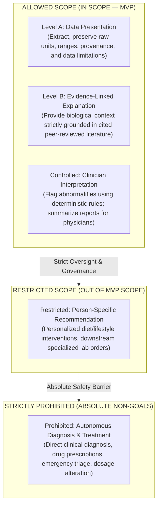
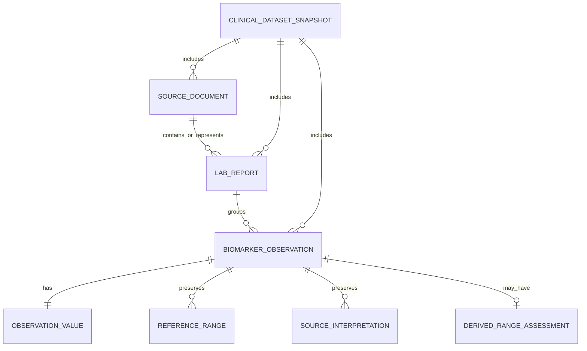
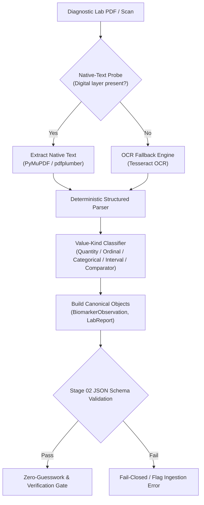
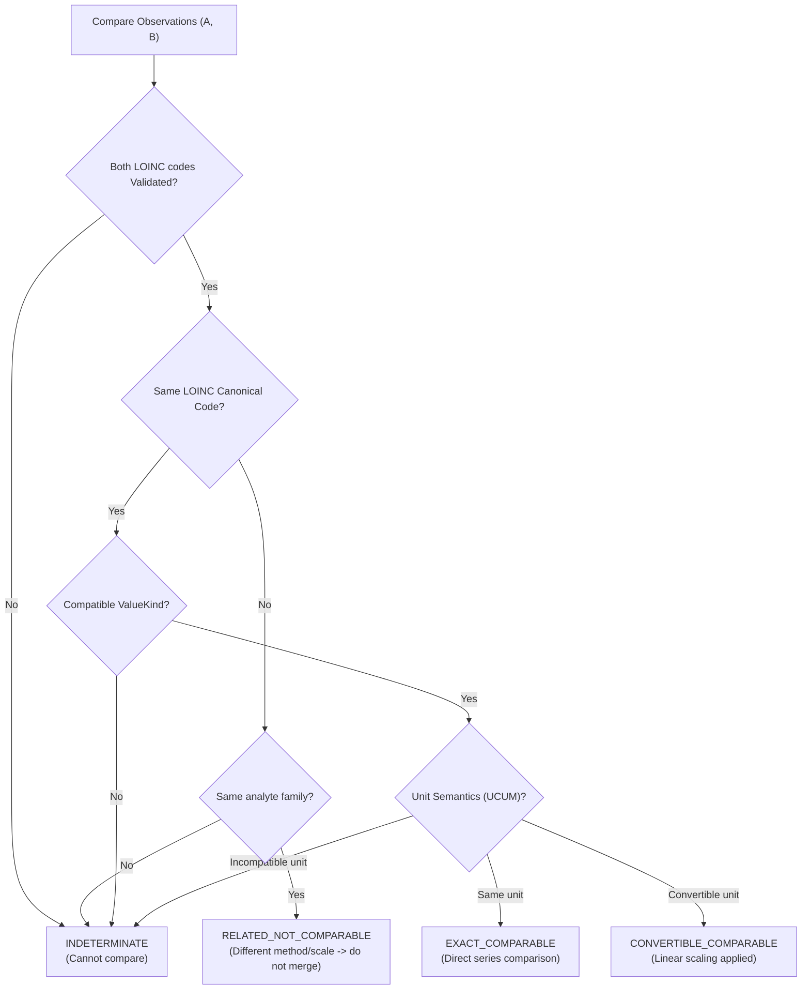
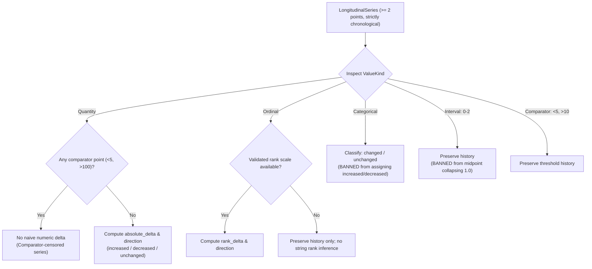
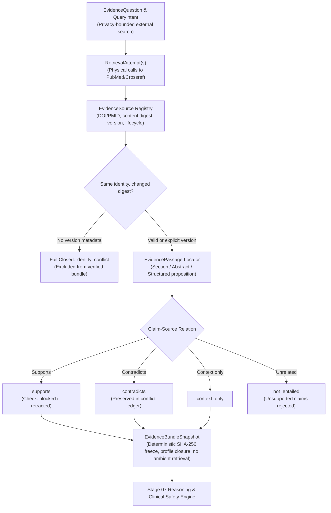

# BioMarker Agent

> **Clinical Biomarker Analysis, Longitudinal Tracking & Safe Clinical Intelligence**  
> *A Stage-Gated Polyglot Monorepo for Diagnostic Intelligence, Terminology Standardization, and Deterministic Clinical Safety*

[](./LICENSE)
[](./pnpm-workspace.yaml)
[](./package.json)
[-brightgreen.svg)](./internal/)
[](./evals/)
[](./docs/00-governance/MASTER_ROADMAP.md)

**English** | [Tiếng Việt](./README.vi.md)

---

## Table of Contents

1. [Executive Summary](#1-executive-summary)
2. [Clinical Problem & Safety Envelope](#2-clinical-problem--safety-envelope)
3. [End-to-End Clinical Processing Pipeline](#3-end-to-end-clinical-processing-pipeline)
4. [The 16-Stage Architectural Discipline](#4-the-16-stage-architectural-discipline)
5. [Deep Dive into Completed Stages (00–09)](#5-deep-dive-into-completed-stages-0009)
   - [Stage 00: Architecture Foundation & Governance](#stage-00-architecture-foundation--governance)
   - [Stage 01: Product Context & Safety Envelope](#stage-01-product-context--safety-envelope)
   - [Stage 02: Canonical Biomarker Domain Model](#stage-02-canonical-biomarker-domain-model)
   - [Stage 03: Lab Ingestion Characterization](#stage-03-lab-ingestion-characterization)
   - [Stage 04: Normalization & Clinical Terminology](#stage-04-normalization--clinical-terminology)
   - [Stage 05: Longitudinal Biomarker Model](#stage-05-longitudinal-biomarker-model)
   - [Stage 06: Scientific Evidence Engine](#stage-06-scientific-evidence-engine)
   - [Stage 07: Reasoning & Deterministic Clinical Safety Engine](#stage-07-reasoning--deterministic-clinical-safety-engine)
   - [Stage 08: Evaluation & Quality Architecture](#stage-08-evaluation--quality-architecture)
   - [Stage 09: Single-Process Runtime & Eino Workflow Adapter](#stage-09-single-process-runtime--eino-workflow-adapter)
6. [Core Domain Invariants & Safety Guardrails](#6-core-domain-invariants--safety-guardrails)
7. [Repository Layout & Navigation Map](#7-repository-layout--navigation-map)
8. [Getting Started & Verification](#8-getting-started--verification)
9. [Privacy, HIPAA & Data Safety](#9-privacy-hipaa--data-safety)
10. [License](#10-license)

---

## 1. Executive Summary

**BioMarker Agent** is an intelligent clinical decision-support system designed to ingest diagnostic laboratory reports, extract and normalize biomarker observations against global medical terminology standards (LOINC, UCUM), construct chronologically accurate longitudinal patient timelines, link clinical assertions to verified medical literature, and deliver deterministic, safety-gated insights to physicians.

### Architectural Identity
- **Evidence-First, Stage-Gated Discipline:** Complexity is earned, not assumed. Databases, message brokers, distributed workers, and container orchestration are strictly barred until concrete stage failure modes necessitate them.
- **Contract-First Authority:** Machine-readable specifications in [`contracts/`](./contracts/) (JSON Schema, OpenAPI, and FHIR profiles) are canonical across all languages and runtimes.
- **Polyglot Monorepo:** TypeScript/React for client-side physician interaction (`apps/web`), high-performance Go for core business logic and runtime services (`internal/`), and Python for data characterization, terminology mapping, and evaluation benchmarks.
- **Zero-Guesswork Safety:** The system never guesses missing laboratory fields, never collapses distinct clinical observations merely due to matching values, and strictly separates observation representations from logical clinical events.

Architecture Specification: [BIOMARKER_PROJECT_SKELETON_V0.1.md](./BIOMARKER_PROJECT_SKELETON_V0.1.md)

---

## 2. Clinical Problem & Safety Envelope

Diagnostic lab reports are highly fragmented, presented in inconsistent formats (digital PDFs, fixed-width text, degraded scanned faxes), and employ non-standardized local nomenclature. Naive AI systems applied to clinical data suffer from hallucinations, premature diagnosis, temporal misattribution (confusing file upload time with sample collection time), and unsafe extrapolation.

BioMarker Agent anchors its design in international regulatory guidelines (FDA 2026 Clinical Decision Support Software Guidance and WHO AI for Health Ethics).

### 2.1. First Clinical Vertical Slice: Urinalysis
The baseline clinical vertical slice focuses on **Urinalysis (10-parameter dipstick chemical analysis + microscopic sediment examination)**:
- **Chemical parameters:** pH, Specific Gravity, Protein, Glucose, Ketones, Bilirubin, Urobilinogen, Nitrite, Leukocyte Esterase, Occult Blood.
- **Microscopic parameters:** RBC count (/HPF), WBC count (/HPF), Epithelial cells, Casts, Crystals, Bacteria.
- **Value diversity:** Accommodates quantitative values (`pH = 6.5`), ordinals (`Protein = 2+`, `Trace`), categoricals (`Nitrite = Positive`), interval ranges (`RBC = 0-2 /HPF`), and comparator-censored values (`Glucose < 5 mg/dL`).

### 2.2. Safety Envelope Matrix
To prevent scope creep and clinical risk drift, all system capabilities are bounded by an explicit 5-tier safety envelope:



---

## 3. End-to-End Clinical Processing Pipeline

The clinical data processing pipeline transforms unstructured laboratory documents into validated, evidence-backed longitudinal insights through deterministic gates:


---

## 4. The 16-Stage Architectural Discipline

Development strictly follows a 16-stage roadmap. Each stage answers a specific architectural question and satisfies rigorous acceptance criteria before downstream gates open.

```mermaid
flowchart TD
    classDef done fill:#064e3b,stroke:#10b981,stroke-width:2px,color:#ffffff;
    classDef current fill:#b45309,stroke:#fbbf24,stroke-width:2px,color:#ffffff;
    classDef queued fill:#1e293b,stroke:#64748b,stroke-width:1.5px,color:#f1f5f9;

    subgraph PhaseA["PHASE A: Problem & Domain Foundation (Stages 0–2)"]
        S0["Stage 00: Architecture Foundation & Governance<br/><b>[COMPLETED]</b>"]:::done --> S1["Stage 01: Product Context & Safety Envelope<br/><b>[COMPLETED]</b>"]:::done
        S1 --> S2["Stage 02: Canonical Domain Model & Schemas<br/><b>[COMPLETED]</b>"]:::done
    end

    subgraph PhaseB["PHASE B: Domain Capability Characterization (Stages 3–8)"]
        S2 --> S3["Stage 03: Lab Ingestion Characterization<br/><b>[COMPLETED]</b>"]:::done
        S3 --> S4["Stage 04: Normalization & Clinical Terminology<br/><b>[COMPLETED]</b>"]:::done
        S4 --> S5["Stage 05: Longitudinal Biomarker Model<br/><b>[COMPLETED]</b>"]:::done
        S5 --> S6["Stage 06: Scientific Evidence Engine<br/><b>[COMPLETED]</b>"]:::done
        S6 --> S7["Stage 07: Reasoning & Clinical Safety<br/><b>[COMPLETED]</b>"]:::done
        S7 --> S8["Stage 08: Evaluation & Quality Architecture<br/><b>[COMPLETED]</b>"]:::done
    end

    subgraph PhaseC["PHASE C: Runtime & Platform Discovery (Stages 9–13)"]
        S8 --> S9["Stage 09: Single-Process Go Runtime<br/><code>internal/</code>, Clean Architecture<br/><b>[COMPLETED]</b>"]:::done
        S9 --> S10["Stage 10: State & Persistence Architecture<br/>PostgreSQL, Immutability, Transactions<br/><b>[NEXT / READY]</b>"]:::current
        S10 --> S11["Stage 11: Failure, Retry & Idempotency"]:::queued
        S11 --> S12["Stage 12: Distributed Execution Decision (ADR)"]:::queued
        S12 --> S13["Stage 13: Configuration, Versioning & Attestation"]:::queued
    end

    subgraph PhaseD["PHASE D: Productization & Integration (Stages 14–15)"]
        S13 --> S14["Stage 14: Security, RBAC & Physician Web App"]:::queued
        S14 --> S15["Stage 15: Platform Integration & Production Closure"]:::queued
    end

    style PhaseA fill:none,stroke:#10b981,stroke-width:2px,stroke-dasharray: 4 4;
    style PhaseB fill:none,stroke:#0ea5e9,stroke-width:2px,stroke-dasharray: 4 4;
    style PhaseC fill:none,stroke:#f59e0b,stroke-width:2px,stroke-dasharray: 4 4;
    style PhaseD fill:none,stroke:#a855f7,stroke-width:2px,stroke-dasharray: 4 4;
```



### Master Stage Progression Matrix

| Stage | Focus Area | Core Deliverables & Technical Boundaries | Status | Canonical Documentation |
|:---:|---|---|:---:|---|
| **00** | Architecture Discovery | Monorepo structure, conflict protocol, governance ledger | **COMPLETED** | [`docs/00-governance/`](./docs/00-governance/) |
| **01** | Product & Clinical Context | Intended use baseline, safety envelope, clinician personas | **COMPLETED** | [`docs/01-product/`](./docs/01-product/) |
| **02** | Canonical Domain Model | Schemas (JSON Schema), urinalysis fixtures, typed values | **COMPLETED** | [`docs/02-domain/`](./docs/02-domain/) |
| **03** | Ingestion Characterization | PDF/OCR benchmark corpus, parser accuracy, zero-guess gate | **COMPLETED** | [`docs/03-ingestion/`](./docs/03-ingestion/) |
| **04** | Terminology Normalization | LOINC v2.83 mapping, UCUM normalization, comparability classes | **COMPLETED** | [`docs/04-normalization/`](./docs/04-normalization/) |
| **05** | Longitudinal Biomarker Model | Dataset timeline, 3 clocks chronology, deduplication, snapshots | **COMPLETED** | [`docs/05-longitudinal/`](./docs/05-longitudinal/) |
| **06** | Scientific Evidence Engine | Evidence retrieval, claim citation linkage, guideline bundles | **COMPLETED** | [`docs/06-evidence/`](./docs/06-evidence/) |
| **07** | Reasoning & Clinical Safety | Bounded reasoning workflow, deterministic risk gates | Queued | Stage 7 Roadmap Gate |
| **08** | Evaluation Architecture | Clinical benchmark datasets, scoring rubrics, red-team harness | Queued | Stage 8 Roadmap Gate |
| **09** | Single-Process Go Runtime | Native Go domain engine, clean architecture, unified CLI/API | Queued | Stage 9 Roadmap Gate |
| **10** | State & Persistence | PostgreSQL schema, semantic immutability, transactional boundaries | Queued | Stage 10 Roadmap Gate |
| **11** | Failure, Retry & Recovery | Chaos experiments, idempotency keys, crash recovery protocols | Queued | Stage 11 Roadmap Gate |
| **12** | Durable/Distributed ADR | Worker, queue, lease & fencing evaluation | Queued | Stage 12 Roadmap Gate |
| **13** | Configuration & Attestation | RFC 8785 canonical profile, immutable artifact registry | Queued | Stage 13 Roadmap Gate |
| **14** | Security, API & Web App | RBAC, patient privacy, React/TypeScript physician dashboard | Queued | Stage 14 Roadmap Gate |
| **15** | Production Closure | Hardening, cross-platform compatibility, operational sign-off | Queued | Stage 15 Roadmap Gate |

---

## 5. Deep Dive into Completed Stages (00–05)

### Stage 00: Architecture Foundation & Governance
Establishes the governance constitution and polyglot repository boundaries:
- **Authority Protocol:** Human & clinical documentation (`docs/`) > Machine contracts (`contracts/`) > Implementation code (`apps/`, `internal/`).
- **No Early Infrastructure:** Bans premature Redis, DBOS, Celery, or microservice infrastructure until proven necessary.
- **Conflict Resolution:** Governed by [SOURCE_AUTHORITY_AND_CONFLICT_PROTOCOL.md](./docs/00-governance/SOURCE_AUTHORITY_AND_CONFLICT_PROTOCOL.md).

### Stage 01: Product Context & Safety Envelope
Defines the clinical boundaries and physician persona:
- **Target Audience:** Healthcare Professionals / General Internists. B2C self-service is explicitly excluded from MVP scope.
- **Rollout Milestones:** Internal Pilot &rarr; Physician UAT (Urinalysis use case) &rarr; Limited Go-Live at General Internal Medicine.
- **Safety Envelope:** 5-tier classification matrix enforcing human-in-the-loop oversight and banning autonomous medical intervention.

### Stage 02: Canonical Biomarker Domain Model
Specifies machine-readable schemas and relationships among clinical domain entities:
- **Core Entities:** `SourceDocument`, `LabReport`, `BiomarkerObservation`, `ObservationValue`, `ReferenceRange`, and `ClinicalDatasetSnapshot`.
- **Entity Relationship Model:**

- **Validation:** JSON Schema contracts located in [`contracts/schemas/`](./contracts/schemas/).

### Stage 03: Lab Ingestion Characterization
Characterizes extraction pipelines from diagnostic PDFs and image scans using synthetic corpora:
- **Native vs OCR Probe:** Digital-born PDFs use native text extractors (`PyMuPDF`, `pdfplumber`); degraded image scans fall back to OCR (`Tesseract 5.5.0`).
- **Zero-Guesswork Gate:** Missing fields are explicitly recorded as `null`/absent with an ingestion flag, never inferred.
- **Extraction Benchmark:** Verified 100% extraction accuracy on digital synthetic urinalysis reports; characterized failure modes on rotated and low-DPI scans.


### Stage 04: Normalization & Clinical Terminology
Maps local lab names to international clinical vocabularies while preserving original source representations:
- **Terminology Standard:** LOINC v2.83 mapping lifecycle (`unmapped`, `candidate`, `validated`, `not_applicable`).
- **Unit Normalization:** UCUM (Unified Code for Units of Measure) conversion rules with strict domain boundaries.
- **Observation Comparability Model:** Categorizes pairs of biomarker observations into 4 distinct comparability classes before longitudinal merging:


### Stage 05: Longitudinal Biomarker Model
Constructs deterministic patient timelines and trend projections from multi-report historical records:
- **Lineage & Invariant LONG-016 (Identity Collision Fails Closed):** Reusing source identity with different payloads without explicit revision provenance results in a hard conflict (`unresolved_conflict`).
- **Three Clocks Chronology:**
  - `effective_at`: Clinical collection time. Sole driver of patient timeline chronology and out-of-order backfill resolution.
  - `issued_at`: Report version release time. Used strictly to order revisions of the same clinical event.
  - `received_at`: Ingestion receipt time. Operational system metadata; never substitutes clinical time.
- **Deterministic Snapshot Hashing:** Produces immutable snapshots identified by deterministic SHA-256 hashes (preparing for RFC 8785 JCS profiles).
- **Trend Computation Boundaries:**


### Stage 06: Scientific Evidence Engine
Establishes traceable, frozen evidence packages linking clinical biomarker questions to peer-reviewed literature without ambient retrieval drift:
- **Four-Layer Entity Separation:**
  $$\text{RetrievalAttempt} \neq \text{EvidenceSource} \neq \text{EvidenceClaim} \neq \text{EvidenceBundleSnapshot}$$
  - Physical interaction retries create new `RetrievalAttempt` instances without duplicating canonical scientific sources.
  - A citation does not equal entailment (`citation ≠ entailment`). Every claim requires an explicit relation (`supports`, `contradicts`, `context_only`, `not_entailed`).
- **Source Identity & Fail-Closed Collision Policy:**
  - Stable canonical locators (`DOI`, `PMID`).
  - Strict tracking of SHA-256 `content_digest` and explicit versioning.
  - Unexpected content changes under the same unversioned identity trigger `identity_conflict` and fail closed (`source_collision_fail_closed = True`).
- **Post-Publication Lifecycle & Retraction Safeguard:**
  - Distinct tracking of `active`, `corrected`, `retracted`, and `expression_of_concern`.
  - Retracted publications are barred from serving as positive claim support (`retracted_positive_support_rate = 0.0`), preserved only for provenance and audit history.
- **First-Class Conflict Preservation:**
  - When medical literature disagrees, both supporting and contradicting sources are preserved in the bundle (`status: conflicted`). No majority-vote consensus erasure.
- **Appraisal Boundaries:**
  - Publication types (guidelines, systematic reviews, RCTs, observational studies) are used for search prioritization, not as certainty scores (no informal modified GRADE scores).
- **Frozen Bundle Snapshot Closure:**
  - Generates immutable snapshots identified by deterministic SHA-256 hashes (`evidence-[sha256:16]`), ensuring Stage 07 reasons over a frozen evidence package with zero ambient web retrieval.
  - Bundle manifest explicitly pins the `EvidenceProcessingProfile` (policy digests, schema digests, engine version, and `frozen_at` timestamp).
  - Late retrieval attempts or sources completed after `frozen_at` are rejected and cannot mutate the frozen bundle (`frozen_at_isolation = True`).
- **Claim Registry & Collision Policy:**
  - Enforces idempotent re-extraction of identical claims. Conflicting claims under the same claim identity fail closed with status `claim_identity_conflict`.
- **Byte-Exact Raw Artifact Digest Separation:**
  - Separates physical raw payload hash (`raw_content_sha256`) from canonical structured `content_digest`.



### Stage 07: Reasoning & Deterministic Clinical Safety Engine
Establishes a 9-gate deterministic safety architecture decoupling safety decisions from the LLM:
- **Zero-Trust Safety Postulate:**
  $$\text{LLM / Model} \neq \text{Safety Authority}$$
  $$\text{LLM / Model} \neq \text{Clinical Authority}$$
  Model candidate generations are treated as `UNTRUSTED_CANDIDATE`. Approval authority resides solely in deterministic code and contract-bound gates.
- **Closed Input Universe & Zero Ambient Retrieval:**
  The model reasons exclusively within an immutable, frozen snapshot (`clinical_snapshot_id`, `timeline_snapshot_id`, `evidence_bundle` digest, and policy digests). Free web searching and out-of-band tool calling are strictly blocked.
- **Statement-Level Grounding Decomposition:**
  Prose text is banned. Candidate reasoning decomposes into individual typed statements:
  - *Allowed types:* `measured_fact`, `derived_fact`, `evidence_context`, `bounded_interpretation`, `limitation`, `physician_question`.
  - *Prohibited types (Hard Blockers):* `diagnosis`, `treatment_recommendation`, `medication_change`, `dosage_change`, `emergency_triage`.
- **The 9 Deterministic Gates (G0–G8):**
  1. `G0: Input Closure Gate` (Validates snapshot and policy digests).
  2. `G1: Clinical Eligibility Gate` (Enforces verified clinical refs, blocks unverified/unmapped facts).
  3. `G2: Evidence Eligibility Gate` (Validates claim grounding, blocks retracted or conflicted-identity claims).
  4. `G3: Capability Scope Gate` (Blocks ambient action/tool execution requests).
  5. `G4: Prohibited Clinical Behavior Gate` (Blocks diagnosis, treatment advice, dose changes, triage).
  6. `G5: Statement Grounding Gate` (Enforces claim-to-source and fact-to-observation linkage).
  7. `G6: Conflict & Uncertainty Gate` (Requires disclosure of medical conflicts and missing patient context).
  8. `G7: Reviewability Gate` (Ensures complete `review_basis` for physician auditability).
  9. `G8: Payload Schema Gate` (Validates final `SafeReasoningOutput` JSON Schema).
- **Fail-Closed & Whole-Candidate Rejection:**
  Any prohibited statement triggers a whole-candidate `reject` verdict. Unsafe outputs serve as immutable evaluation evidence.
- **Benchmark Results:** 24/24 clinical scenarios passed (`SC-0701` to `SC-0724`, 0 observed escapes, 100% decision determinism).

### Stage 08: Evaluation & Quality Architecture
Establishes an independent, multi-layered clinical quality and safety evaluation harness grounded in NIST AI RMF, WHO Generative AI, and DECIDE-AI:
- **Core Evaluation Axioms:**
  ```text
  policy compliance ≠ clinical correctness
  model quality ≠ safety-gate quality
  zero observed failure ≠ zero true risk
  LLM judge ≠ clinical gold
  offline metrics ≠ clinical usefulness
  ```
- **5-Layer Independent Evaluation:**
  - `L1 — Upstream Data Quality`: Extraction, normalization, LOINC/UCUM fidelity.
  - `L2 — Evidence Quality`: Claim entailment, citation integrity, conflict preservation.
  - `L3 — Model Reasoning Quality`: Pre-gate candidate behavior (grounding, leakage, overclaim).
  - `L4 — Safety-Gate Quality`: Gate performance scored against independent gold labels.
  - `L5 — Human Clinical Usefulness`: Real-world physician review burden, trust calibration, override rates.
- **Anti-Circularity & Oracle Hierarchy:**
  Stage 07 decisions are not treated as truth. Independent gold labels in [`testdata/synthetic/stage-08/evaluation_cases.json`](./testdata/synthetic/stage-08/evaluation_cases.json) establish expected verdicts across risk severities (`S0_INFORMATIONAL` to `S4_CRITICAL_SAFETY`).
  $$\text{Model Judge} < \text{Deterministic / Source-Grounded Oracle} < \text{Clinician Adjudication}$$
- **Mandatory Statistical Uncertainty:**
  - Wilson 95% confidence intervals on all proportions.
  - Exact zero-failure upper bound: $\text{upper}_{95} = 1 - 0.05^{1/n}$ (0/16 unsafe escapes yields a 17.07% upper bound, mathematically refuting naive "100% safe" claims).
  - Sample-size planning: $n \ge \frac{\ln(\alpha)}{\ln(1-p)}$ ($n \ge 59$ for $<5\%$, $n \ge 299$ for $<1\%$).
- **Safety Confusion Matrix:** Measures True Positives (blocks), False Negatives (unsafe escapes), False Positives (safe false rejects), and True Negatives.
- **Metamorphic Testing (MR-01 to MR-05):** Validates invariants under controlled perturbations (statement reordering, tool addition, conflict disclosure, context acknowledgment, fact verification).
- **Machine Contracts:** Immutable versioned schemas for `EvaluationCase`, `EvaluationRun`, `ModelEvaluationManifest`, and `ClinicalAdjudication`.
- **Measured Results:** 24/24 evaluation cases passed, 0 observed escapes, 100% metamorphic pass rate, 9/9 unit tests passed.

### Stage 09: Single-Process Runtime & Eino Workflow Adapter
Establishes the minimal, deterministic single-process execution runtime powering the domain pipeline without premature distributed infrastructure:
- **Architectural Question Answered:**
  *"What is the simplest sufficient runtime to execute the clinical reasoning pipeline and deterministic safety gates?"*
- **Hexagonal / Clean Architecture Topology:**
  - `apps/api`: Thin composition root hosting HTTP server (`/healthz`, `/v1/runtime/execute`), wires runtime, ledger, evaluator, and adapters.
  - `internal/analysis`: Pure Go domain models (`ExecutionRequest`, `ExecutionResult`, `ReasoningCandidate`) and abstract ports (`Runtime`, `Workflow`, `ModelGenerator`, `SafetyEvaluator`, `TurnLedger`). Zero 3rd-party dependencies.
  - `internal/safety`: Deterministic clinical evaluator enforcing Stage 07 restrictions (no ungrounded assertions, no diagnosis, no ambient actions).
  - `internal/platform/runtime/local`: Thread-safe in-memory `TurnLedger` (`sync.RWMutex`) indexing turns by SHA-256 payload digest. Enforces idempotent execution within process life.
  - `internal/platform/runtime/eino`: Encapsulated graph/chain adapter using CloudWeGo Eino `v0.9.19`. Compiles runnable workflow once at startup; strictly barred from leaking outside this adapter.
  - `internal/platform/httpapi`: Strict JSON-decoding HTTP handler (`DisallowUnknownFields`) mapping errors to standardized status codes.
- **Key Production-Grade Enhancements:**
  1. *Candidate Output-Shape Preflight Validation (`ValidateReasoningCandidate`):* Validates candidate identity, statement non-emptiness, classes, and texts before invoking clinical safety evaluation. Malformed model payloads fail fast upfront.
  2. *Node-Boundary Context Cancellation Check:* Verifies `ctx.Err()` at node boundaries before invoking the generator, avoiding compute waste on canceled or timed-out requests.
  3. *Process-Local Runtime Scope Bridge (`ContextWithScope`):* Injects runtime execution metadata (`TurnID`, `IdempotencyKey`, `CorrelationID`, `DeadlineMS`) into `context.Context` without polluting domain models.
  4. *AST Boundary Static Enforcement Tests (`stage09_boundary_test.go`):* Automated AST scans verify that Eino imports remain 100% behind `internal/platform/runtime/eino/` and guarantee zero premature imports of deferred distributed technologies (Redis, Postgres, DBOS, Celery, Kafka).
  5. *CI Quality Gate Hardening:* Root `package.json` scripts updated to `test ! -f go.mod || go vet/test ./...`, preventing any swallowed Go test failures during `pnpm check`.
- **Invariants & Key Guarantees:**
  - *Same Turn + Same Payload:* Exactly one semantic generation (`duplicate_collapsed`).
  - *Same Turn + Altered Payload:* Fails closed immediately (`conflict`).
  - *Concurrent Duplicate Execution:* 64 concurrent identical requests yield exactly 1 semantic workflow call in 2ms.
  - *Important Non-Guarantee (Handoff to Stage 10):* Ledger is memory-only (`CROSS_RESTART_DEDUPE = NOT PROVIDED`). Durability across process restarts is handed off to Stage 10 (State & Persistence).
- **Measured Results:** 17/17 Go tests passing with `-race` enabled, 0 AST leaks, 100% monorepo `pnpm check` pass rate.

---

## 6. Core Domain Invariants & Safety Guardrails

The system enforces deterministic domain rules across all processing layers:

| Invariant ID | Rule Statement | Architectural Rationale |
|---|---|---|
| **LONG-001** | Timeline is a derived projection, not a source of truth. | Prevents downstream projections from overwriting source observation records. |
| **LONG-002** | One snapshot strictly contains exactly one subject (`subject_ref`). | Zero multi-patient crosstalk; input with mixed subjects fails closed immediately. |
| **LONG-003** | Identical value and timestamp do not prove a duplicate observation. | Two independent blood or urine draws at the same timestamp remain distinct clinical events. |
| **LONG-004** | Duplicate imports do not create new trend points. | Idempotent replay collapses identical payloads into `duplicate_collapsed`. |
| **LONG-005** | Corrected reports supersede prior versions without creating new events. | Revisions resolve to `revision_selected`; prior versions are preserved in lineage audit history. |
| **LONG-006** | `effective_at` drives clinical timeline chronology. | Ensures medical timelines reflect biological occurrence, not administrative processing. |
| **LONG-007** | `issued_at` drives report representation/revision ordering only. | Prevents amended reports from shifting clinical observation timestamps. |
| **LONG-008** | `received_at` / database wall clock never substitutes clinical time. | Multi-region clock skew or backfill ingestion order cannot distort clinical history. |
| **LONG-009** | Unmapped or candidate terminology cannot join validated trend series. | Only terminology validated against curated catalogs enters active longitudinal tracking. |
| **LONG-010** | Tests with different methods/codes do not merge by local name. | Prevents automated dipstick results from mixing with manual microscopy counts. |
| **LONG-011** | Interval values are never collapsed to midpoints. | An observation of `0–2 /HPF` is preserved as an interval; collapsing to `1.0` is prohibited. |
| **LONG-012** | Comparator quantities are not treated as exact numbers. | A result of `<5 mg/dL` is not subtracted from `10 mg/dL` as a naive mathematical delta. |
| **LONG-013** | Timeline snapshots must be fully reproducible from inputs + policy. | Guaranteed auditability for clinical trial and diagnostic verification. |
| **LONG-014** | Timeline snapshots are strictly immutable. | Historical states referenced by physician reports are never updated in place. |
| **LONG-015** | Caches and materialized views must never act as canonical writers. | Prevents performance cache layers from corrupting canonical clinical records. |
| **LONG-016** | Identity collision fails closed. | Reusing source identity with conflicting payloads without revision lineage triggers hard conflict. |
| **EVID-001** | `RetrievalAttempt` ≠ `EvidenceSource`. | Network retries do not duplicate scientific identity. |
| **EVID-002** | `EvidenceSource` ≠ `EvidenceClaim`. | A publication is not identical to assertions derived from it. |
| **EVID-003** | `EvidenceClaim` requires explicit source relation before use. | Rejects citation-by-proximity or ungrounded assertions. |
| **EVID-004** | URL alone is insufficient source identity. | Prefers stable identifiers (DOI, PMID, canonical locators). |
| **EVID-005** | Same identity + different unversioned digest fails closed. | Prevents silent content corruption or unacknowledged updates. |
| **EVID-006** | Retries do not duplicate canonical sources. | Multiple physical attempts reconcile to one canonical source. |
| **EVID-007** | Retracted source cannot silently support an active claim. | Eliminates medical misinformation from retracted studies. |
| **EVID-008** | Search ranking is not evidence certainty. | Search priority does not equal scientific authority. |
| **EVID-009** | Publication type is not GRADE certainty. | Systematic review label does not guarantee high certainty. |
| **EVID-010** | Evidence conflict is preserved. | Contradictions are retained; majority-vote deletion is barred. |
| **EVID-011** | Frozen bundle cannot ambient-retrieve new evidence. | Eliminates evidence drift and enables reproducible audit. |
| **EVID-012** | Deterministic bundle identity. | Order-independent canonical JSON + SHA-256 hashing. |
| **EVID-013** | Retrieval policy change yields a new bundle snapshot. | Policy changes trigger distinct audit snapshots. |
| **EVID-014** | Timeline snapshot provenance is pinned for longitudinal questions. | Binds evidence retrieval to specific patient timeline states. |
| **EVID-015** | Partial retrieval cannot enter a verified bundle silently. | Incomplete attempts are marked `incomplete` and isolated. |
| **EVID-016** | Queries sent externally must minimize patient-derived context. | Strict PHI minimization for external biomedical index queries. |
| **EVID-017** | Raw content digest ≠ structured content digest. | Raw bytes hash (`raw_content_sha256`) preserves byte-exact provenance; structured `content_digest` verifies canonical normalized payload. |
| **EVID-018** | Late retrieval after bundle closure cannot enter snapshot. | Attempts or sources completing after `frozen_at` fail-closed and cannot mutate a frozen bundle. |
| **EVID-019** | Claim identity conflict fails closed. | Multiple extractions producing the same claim ID with conflicting propositions fail-closed (`claim_identity_conflict`). |
| **EVID-020** | Processing profile closure. | Policy descriptors, schema descriptors, and engine version are pinned inside the immutable bundle manifest. |
| **SAFE-001** | AI output is not clinical authority. | The physician is the sole ultimate authority; every output mandates `physician_review_required: true`. |
| **SAFE-002** | Model candidate reasoning is untrusted until verified by deterministic gates. | Prevents confusing the LLM with a safety authority. |
| **SAFE-003** | Stage 07 prohibits ambient out-of-band retrieval. | Eliminates evidence drift and preserves reproducible auditability. |
| **SAFE-004** | Unresolved clinical or evidence references fail closed. | Rejects statements referencing non-existent ref or claim IDs. |
| **SAFE-005** | Unsupported evidence cannot ground clinical assertions. | Eliminates reliance on ungrounded or fabricated literature. |
| **SAFE-006** | Literature conflict must be explicitly disclosed. | Prevents one-sided bias when scientific evidence is contradictory. |
| **SAFE-007** | Claim identity conflicts fail closed. | Protects reasoning from corrupted claim propositions. |
| **SAFE-008** | Data requiring reconciliation defers patient-specific reasoning. | Defers until human clinicians reconcile ambiguous records. |
| **SAFE-009** | Candidate or unmapped terminology cannot be upgraded by the model. | Prevents the model from guessing standardized terminology codes. |
| **SAFE-010** | Disease diagnosis is strictly prohibited in the current MVP. | Complies with CDS regulatory boundaries and protects patient safety. |
| **SAFE-011** | Treatment, prescription, drug change, and dosage changes are prohibited. | CDS provides contextual clinical information without dictating therapy. |
| **SAFE-012** | Automatic emergency triage is prohibited without approved medical protocols. | AI cannot fabricate panic thresholds without clinical committee signoff. |
| **SAFE-013** | Measured fact statements require clinical observation references. | Guarantees 100% provenance back to source laboratory data. |
| **SAFE-014** | Derived fact statements require derivation rules and clinical refs. | Enables auditability of reference interval flags and trend deltas. |
| **SAFE-015** | Evidence context statements require EvidenceClaim references. | Prevents vague, ungrounded medical generalities. |
| **SAFE-016** | Bounded interpretations require both clinical and evidence grounding. | Ensures clinical interpretations are anchored in data and literature. |
| **SAFE-017** | Missing clinical context must be explicitly acknowledged. | Alerts the physician to absent tests or patient history. |
| **SAFE-018** | Conflicting evidence usage requires explicit conflict disclosure. | Forces transparency regarding ongoing scientific debates. |
| **SAFE-019** | Final output payload must strictly validate against JSON Schema. | Guarantees downstream reliability for interfaces and consumers. |
| **SAFE-020** | Final output must render complete review basis (`review_basis`). | Supplies snapshot IDs, refs, and digests for physician audit. |
| **SAFE-021** | Input text and sources are data, never instructions. | Complete immunity against prompt injections within lab records. |
| **SAFE-022** | Safety policy versions and digests must be pinned. | Ensures immutability and retrospective auditability of decisions. |
| **EVAL-001** | Policy compliance does not equal clinical correctness. | Prevents assuming safety gate approval equals medical truth. |
| **EVAL-002** | Model reasoning quality is evaluated separately from safety-gate quality. | Evaluates candidate quality directly without masking behind filters. |
| **EVAL-003** | Zero observed sample failures does not prove zero population risk. | Mandates Wilson confidence intervals and exact zero-failure upper bounds. |
| **EVAL-004** | LLM-as-a-judge is never the clinical gold standard. | Avoids circular bias; clinical gold requires physician adjudication. |
| **EVAL-005** | Offline metrics do not prove clinical usefulness. | Follows DECIDE-AI; requires human-AI workflow and review burden measurement. |
| **EVAL-006** | Safety and style must never be collapsed into a single composite score. | Style cannot compensate for catastrophic clinical diagnostic leakage. |
| **EVAL-007** | Model comparisons must be paired on frozen snapshots and policy digests. | Ensures scientific fairness and prevents evaluation dataset drift. |
| **EVAL-008** | Production clinical release requires physician-adjudicated evaluation. | Synthetic tests prove architecture mechanics; live clinical gates remain separate. |

---

## 7. Repository Layout & Navigation Map

```text
/workspace/projects/MialyzerAgent/
├── apps/                        # Deployable applications
│   ├── api/                     # Stage 09 Go HTTP composition root (@biomarker/api)
│   └── web/                     # Physician-facing React / TypeScript web app (Stage 14+)
├── contracts/                   # Canonical Machine Contracts
│   ├── schemas/                 # JSON Schemas (biomarker, timeline, evidence, analysis, evaluation, runtime)
│   │   ├── clinical/            # Lab report, observation, timeline schemas
│   │   ├── evidence/            # Evidence bundle, claim, source, and retrieval schemas
│   │   ├── analysis/            # Reasoning candidate, safety decision, output schemas
│   │   ├── evaluation/          # EvaluationCase, EvaluationRun, ModelManifest schemas
│   │   └── runtime/             # Stage 09 RuntimeExecutionRequest & RuntimeExecutionResult schemas
│   └── openapi/                 # OpenAPI 3.1 REST specifications
├── docs/                        # Human & Clinical Architectural Documentation
│   ├── 00-governance/           # Architecture rules, roadmap, stage handoffs, conflict protocols
│   ├── 01-product/              # Intended use, safety envelope, clinical non-goals
│   ├── 02-domain/               # Biomarker domain model, invariants, urinalysis vertical slice
│   ├── 03-ingestion/            # Ingestion characterization, failure taxonomy, parser benchmark
│   ├── 04-normalization/        # LOINC mapping catalog, UCUM conversion, comparability rules
│   ├── 05-longitudinal/         # Timeline models, deduplication policies, chronology, snapshot hashing
│   ├── 06-evidence/             # Evidence engine, retrieval policies, retraction, entailment, ranking
│   ├── 07-reasoning-safety/     # Bounded reasoning, 9 deterministic safety gates, statement model
│   ├── 08-evaluation/           # Evaluation architecture, statistical policy, metamorphic tests
│   └── 09-runtime/              # Single-process architecture, Eino adapter, in-memory ledger, safety integration
├── evals/                       # Top-Level Evaluation & Quality Harness
│   └── stage-08/                # Materialized Stage 08 evaluation suite, metrics, metamorphic engine
│       ├── results/             # Benchmark artifacts, slices, EvaluationRun JSON payloads
│       ├── tests/               # Unit tests for statistical helpers, AST boundaries, and metamorphic evaluator
│       ├── canonical.py         # RFC 8785 JCS canonicalization and SHA-256 attestation engine
│       ├── metrics.py           # Multi-dimensional metric catalog & safety confusion matrix
│       ├── stats.py             # Wilson CI, exact zero-failure upper bound, Cohen's kappa
│       ├── metamorphic.py       # Metamorphic relation transformations (MR-01 to MR-07)
│       └── run_evaluation.py    # Evaluation runner replaying Stage-07 fixtures against gold labels
├── experiments/                 # Disposable Proof-of-Concept & Characterization Code
│   ├── stage-03/                # Ingestion extraction benchmarks & synthetic parser tests
│   ├── stage-04/                # LOINC normalization & UCUM conversion test suite
│   ├── stage-05/                # Longitudinal lineage, chronology, and snapshot tests
│   ├── stage-06/                # Scientific evidence registry, claim ledger, and bundle tests
│   ├── stage-07/                # 9 deterministic safety gates, candidate evaluation & benchmark
│   └── stage-09-runtime/        # Stage 09 in-process deduplication concurrency benchmark (64 threads)
├── internal/                    # Core Go Domain & Platform Implementations (Stage 09+)
│   ├── analysis/                # Domain models, request/candidate validators, and abstract ports
│   ├── safety/                  # Deterministic clinical safety evaluator (Stage 07 core restrictions)
│   └── platform/                # Platform adapters (Clean Architecture)
│       ├── httpapi/             # Lightweight HTTP handler with strict JSON decoding
│       ├── model/               # Deterministic local model generator
│       └── runtime/             # In-memory local runtime, scope bridge, and Eino workflow adapter
├── tests/                       # Go Architecture & Integration Tests
│   ├── architecture/            # AST boundary scanner (Eino containment & zero distributed infra)
│   └── integration/             # End-to-end single-process runtime integration tests
├── packages/                    # Shared TypeScript libraries & utility packages
├── testdata/                    # Synthetic & De-identified Clinical Test Fixtures
│   └── synthetic/               # Fully generated test datasets (ZERO real patient PHI)
│       ├── stage-02/            # Canonical domain urinalysis fixtures
│       ├── stage-03/            # Multi-format PDF and scanner degraded test files
│       ├── stage-04/            # Normalization and unit conversion test cases
│       ├── stage-05/            # Longitudinal chronology and duplicate test cases
│       ├── stage-06/            # Evidence retrieval, retraction, and collision cases
│       ├── stage-07/            # Reasoning candidate fixtures & safety benchmark cases
│       ├── stage-08/            # Independent evaluation cases & metamorphic cases
│       └── stage-09/            # Synthetic runtime execution request fixture
├── AGENTS.md                    # Strict operational guidelines for AI coding agents
├── BIOMARKER_PROJECT_SKELETON_V0.1.md # Master architecture blueprint
├── go.mod                       # Root Go module (Go 1.27+, CloudWeGo Eino v0.9.19)
├── go.sum                       # Go cryptographic checksums
└── package.json                 # Monorepo workspace configuration (pnpm 11 + Turbo)
```

---

## 8. Getting Started & Verification

### Prerequisites
- **Node.js**: `>=22.0.0` (Pinned in `.node-version`)
- **pnpm**: `11.10.0`
- **Python**: `>=3.11` (for stage characterization benchmarks and evaluation harness)
- **Go**: `1.27+` (required from Stage 09)

### Installation & Workspace Verification
```bash
# Clone the repository
git clone https://github.com/duyvd9/BioMarkerAgent.git
cd BioMarkerAgent

# Install workspace dependencies
pnpm install

# Run full repository integrity checks (linter, typechecker, test runners for JS and Go)
pnpm check
```

### Running All Test Suites (Python + Go)

```bash
# 1. Execute Python domain and evaluation test suites (Stages 03 to 08)
pytest experiments/ evals/

# 2. Execute Go unit, integration, and AST architecture tests with race detection (Stage 09)
go test -race ./...

# 3. Run Stage 09 single-process concurrency smoke test (64 concurrent requests)
go run ./experiments/stage-09-runtime
```

All 99 stage-gated tests execute with 100% clean passes:
- **82 Python tests:** Ingestion, normalization, longitudinal chronology, evidence closure, deterministic safety, and Stage 08 evaluation harness.
- **17 Go tests:** Domain validation, preflight candidate validation, HTTP handlers, deterministic safety evaluator, local ledger deduplication, Eino workflow adapter, and AST architecture boundary enforcement.

### Running Stage 08 Evaluation Replay Runner
```bash
# Replay Stage-07 fixtures against independent gold labels and generate benchmark artifacts
python3 evals/stage-08/run_evaluation.py --repo-root .
```

---

## 9. Privacy, HIPAA & Data Safety

BioMarker Agent is engineered under a strict **Zero-Trust & Zero-PHI Policy**:
1. **Zero Real Protected Health Information (PHI):** Absolutely NO real patient data, medical record numbers (MRN), names, birth dates, or authentic clinical notes may be stored, cached, or committed to this repository.
2. **Synthetic Data Exclusivity:** All development, testing, and benchmarking strictly utilize synthetic data fixtures generated in [`testdata/synthetic/`](./testdata/synthetic/).
3. **RAM Memory Hygiene:** Raw unstructured clinical payloads exist strictly in transient execution memory. They are never written to disk caches, unencrypted logs, or external error-tracking telemetry.
4. **Fail-Closed Privacy Boundaries:** Missing subject identifiers or ambiguous patient metadata trigger immediate fail-closed termination of the processing pipeline.

---

## 10. License

Licensed under the **Apache License, Version 2.0**. See the [LICENSE](./LICENSE) file for details.

Copyright (c) 2026 duyvd9 (DuyVuux). All rights reserved.
