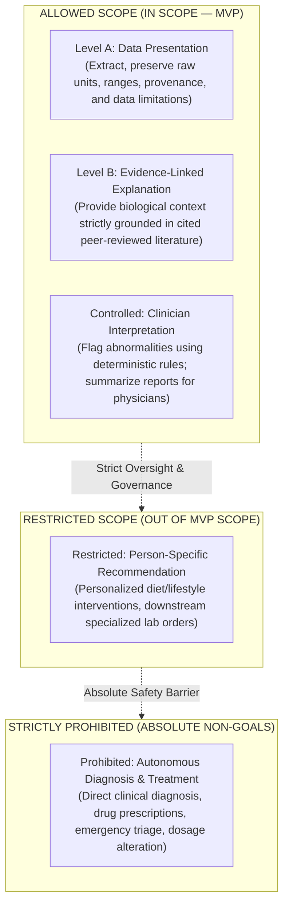
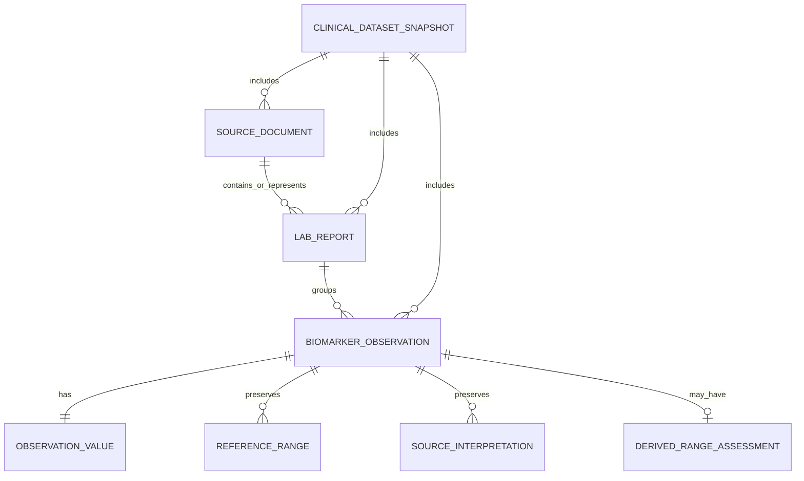
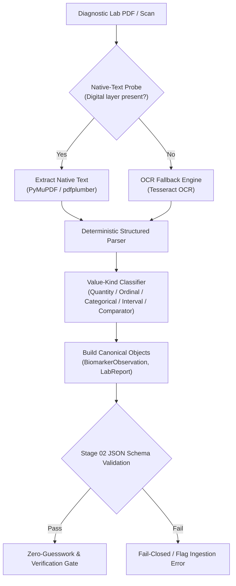
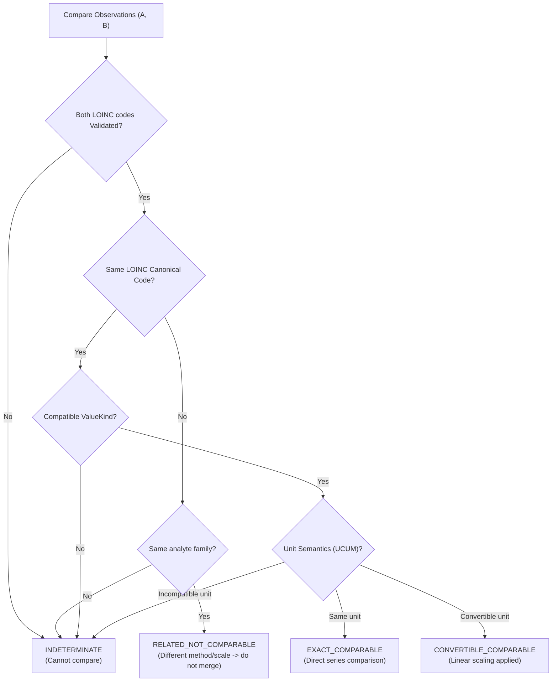
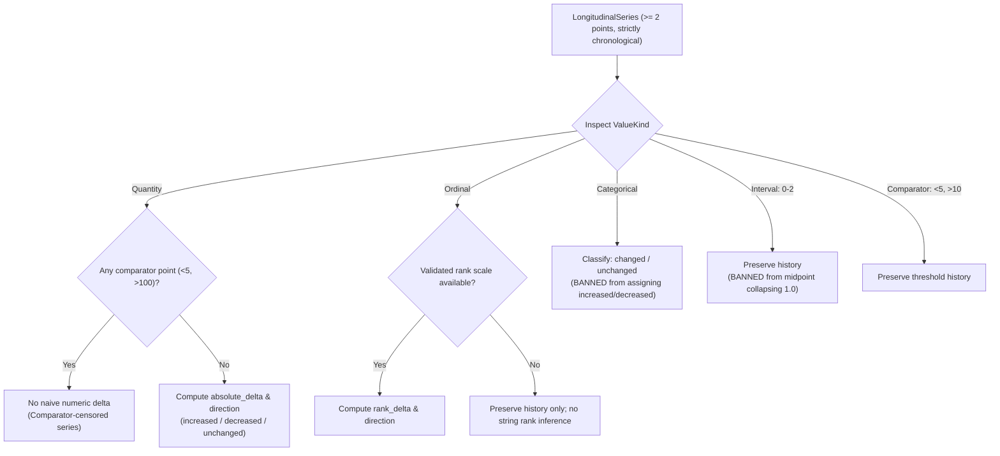

# BioMarker Agent

> **Clinical Biomarker Analysis, Longitudinal Tracking & Safe Clinical Intelligence**  
> *A Stage-Gated Polyglot Monorepo for Diagnostic Intelligence, Terminology Standardization, and Deterministic Clinical Safety*

[](./LICENSE)
[](./pnpm-workspace.yaml)
[](./package.json)
[](./experiments/)
[](./docs/00-governance/MASTER_ROADMAP.md)

**English** | [Tiếng Việt](./README.vi.md)

---

## Table of Contents

1. [Executive Summary](#1-executive-summary)
2. [Clinical Problem & Safety Envelope](#2-clinical-problem--safety-envelope)
3. [End-to-End Clinical Processing Pipeline](#3-end-to-end-clinical-processing-pipeline)
4. [The 16-Stage Architectural Discipline](#4-the-16-stage-architectural-discipline)
5. [Deep Dive into Completed Stages (00–05)](#5-deep-dive-into-completed-stages-0005)
   - [Stage 00: Architecture Foundation & Governance](#stage-00-architecture-foundation--governance)
   - [Stage 01: Product Context & Safety Envelope](#stage-01-product-context--safety-envelope)
   - [Stage 02: Canonical Biomarker Domain Model](#stage-02-canonical-biomarker-domain-model)
   - [Stage 03: Lab Ingestion Characterization](#stage-03-lab-ingestion-characterization)
   - [Stage 04: Normalization & Clinical Terminology](#stage-04-normalization--clinical-terminology)
   - [Stage 05: Longitudinal Biomarker Model](#stage-05-longitudinal-biomarker-model)
6. [Core Domain Invariants & Safety Guardrails](#6-core-domain-invariants--safety-guardrails)
7. [Repository Layout & Navigation Map](#7-repository-layout--navigation-map)
8. [Getting Started & Verification](#8-getting-started--verification)
9. [Privacy, HIPAA & Data Safety](#9-privacy-hipaa--data-safety)
10. [License](#10-license)

---

## 1. Executive Summary

**BioMarker Agent** is an intelligent clinical decision-support system designed to ingest diagnostic laboratory reports, extract and normalize biomarker observations against global medical terminology standards (LOINC, UCUM), construct chronologically accurate longitudinal patient timelines, link clinical assertions to verified medical literature, and deliver deterministic, safety-gated insights to physicians.

### Architectural Identity
- **Evidence-First, Stage-Gated Discipline:** Complexity is earned, not assumed. Databases, message brokers, distributed workers, and container orchestration are strictly barred until concrete stage failure modes necessitate them.
- **Contract-First Authority:** Machine-readable specifications in [`contracts/`](./contracts/) (JSON Schema, OpenAPI, and FHIR profiles) are canonical across all languages and runtimes.
- **Polyglot Monorepo:** TypeScript/React for client-side physician interaction (`apps/web`), high-performance Go for core business logic and runtime services (`internal/`), and Python for data characterization, terminology mapping, and evaluation benchmarks.
- **Zero-Guesswork Safety:** The system never guesses missing laboratory fields, never collapses distinct clinical observations merely due to matching values, and strictly separates observation representations from logical clinical events.

Architecture Specification: [BIOMARKER_PROJECT_SKELETON_V0.1.md](./BIOMARKER_PROJECT_SKELETON_V0.1.md)

---

## 2. Clinical Problem & Safety Envelope

Diagnostic lab reports are highly fragmented, presented in inconsistent formats (digital PDFs, fixed-width text, degraded scanned faxes), and employ non-standardized local nomenclature. Naive AI systems applied to clinical data suffer from hallucinations, premature diagnosis, temporal misattribution (confusing file upload time with sample collection time), and unsafe extrapolation.

BioMarker Agent anchors its design in international regulatory guidelines (FDA 2026 Clinical Decision Support Software Guidance and WHO AI for Health Ethics).

### 2.1. First Clinical Vertical Slice: Urinalysis
The baseline clinical vertical slice focuses on **Urinalysis (10-parameter dipstick chemical analysis + microscopic sediment examination)**:
- **Chemical parameters:** pH, Specific Gravity, Protein, Glucose, Ketones, Bilirubin, Urobilinogen, Nitrite, Leukocyte Esterase, Occult Blood.
- **Microscopic parameters:** RBC count (/HPF), WBC count (/HPF), Epithelial cells, Casts, Crystals, Bacteria.
- **Value diversity:** Accommodates quantitative values (`pH = 6.5`), ordinals (`Protein = 2+`, `Trace`), categoricals (`Nitrite = Positive`), interval ranges (`RBC = 0-2 /HPF`), and comparator-censored values (`Glucose < 5 mg/dL`).

### 2.2. Safety Envelope Matrix
To prevent scope creep and clinical risk drift, all system capabilities are bounded by an explicit 5-tier safety envelope:



---

## 3. End-to-End Clinical Processing Pipeline

The clinical data processing pipeline transforms unstructured laboratory documents into validated, evidence-backed longitudinal insights through deterministic gates:


---

## 4. The 16-Stage Architectural Discipline

Development strictly follows a 16-stage roadmap. Each stage answers a specific architectural question and satisfies rigorous acceptance criteria before downstream gates open.

```mermaid
flowchart TD
    classDef done fill:#064e3b,stroke:#10b981,stroke-width:2px,color:#ffffff;
    classDef current fill:#b45309,stroke:#fbbf24,stroke-width:2px,color:#ffffff;
    classDef queued fill:#1e293b,stroke:#64748b,stroke-width:1.5px,color:#f1f5f9;

    subgraph PhaseA["PHASE A: Problem & Domain Foundation (Stages 0–2)"]
        S0["Stage 00: Architecture Foundation & Governance<br/><b>[COMPLETED]</b>"]:::done --> S1["Stage 01: Product Context & Safety Envelope<br/><b>[COMPLETED]</b>"]:::done
        S1 --> S2["Stage 02: Canonical Domain Model & Schemas<br/><b>[COMPLETED]</b>"]:::done
    end

    subgraph PhaseB["PHASE B: Domain Capability Characterization (Stages 3–8)"]
        S2 --> S3["Stage 03: Lab Ingestion Characterization<br/><b>[COMPLETED]</b>"]:::done
        S3 --> S4["Stage 04: Normalization & Clinical Terminology<br/><b>[COMPLETED]</b>"]:::done
        S4 --> S5["Stage 05: Longitudinal Biomarker Model<br/><b>[COMPLETED]</b>"]:::done
        S5 --> S6["Stage 06: Scientific Evidence Engine<br/><b>[NEXT / IN PROGRESS]</b>"]:::current
        S6 --> S7["Stage 07: Reasoning & Clinical Safety<br/><i>Deterministic Risk Gates & Non-Goals</i>"]:::queued
        S7 --> S8["Stage 08: Evaluation & Quality Architecture<br/><i>Clinical Benchmarks & Red-Teaming</i>"]:::queued
    end

    subgraph PhaseC["PHASE C: Runtime & Platform Discovery (Stages 9–13)"]
        S8 --> S9["Stage 09: Single-Process Go Runtime<br/><code>internal/</code>, Clean Architecture"]:::queued
        S9 --> S10["Stage 10: State & Persistence Architecture<br/>PostgreSQL, Immutability, Transactions"]:::queued
        S10 --> S11["Stage 11: Failure, Retry & Idempotency"]:::queued
        S11 --> S12["Stage 12: Distributed Execution Decision (ADR)"]:::queued
        S12 --> S13["Stage 13: Configuration, Versioning & Attestation"]:::queued
    end

    subgraph PhaseD["PHASE D: Productization & Integration (Stages 14–15)"]
        S13 --> S14["Stage 14: Security, RBAC & Physician Web App"]:::queued
        S14 --> S15["Stage 15: Platform Integration & Production Closure"]:::queued
    end

    style PhaseA fill:none,stroke:#10b981,stroke-width:2px,stroke-dasharray: 4 4;
    style PhaseB fill:none,stroke:#0ea5e9,stroke-width:2px,stroke-dasharray: 4 4;
    style PhaseC fill:none,stroke:#f59e0b,stroke-width:2px,stroke-dasharray: 4 4;
    style PhaseD fill:none,stroke:#a855f7,stroke-width:2px,stroke-dasharray: 4 4;
```



### Master Stage Progression Matrix

| Stage | Focus Area | Core Deliverables & Technical Boundaries | Status | Canonical Documentation |
|:---:|---|---|:---:|---|
| **00** | Architecture Discovery | Monorepo structure, conflict protocol, governance ledger | **COMPLETED** | [`docs/00-governance/`](./docs/00-governance/) |
| **01** | Product & Clinical Context | Intended use baseline, safety envelope, clinician personas | **COMPLETED** | [`docs/01-product/`](./docs/01-product/) |
| **02** | Canonical Domain Model | Schemas (JSON Schema), urinalysis fixtures, typed values | **COMPLETED** | [`docs/02-domain/`](./docs/02-domain/) |
| **03** | Ingestion Characterization | PDF/OCR benchmark corpus, parser accuracy, zero-guess gate | **COMPLETED** | [`docs/03-ingestion/`](./docs/03-ingestion/) |
| **04** | Terminology Normalization | LOINC v2.83 mapping, UCUM normalization, comparability classes | **COMPLETED** | [`docs/04-normalization/`](./docs/04-normalization/) |
| **05** | Longitudinal Biomarker Model | Dataset timeline, 3 clocks chronology, deduplication, snapshots | **COMPLETED** | [`docs/05-longitudinal/`](./docs/05-longitudinal/) |
| **06** | Scientific Evidence Engine | Evidence retrieval, claim citation linkage, guideline bundles | **IN PROGRESS** | [`docs/06-evidence/`](./docs/00-governance/MASTER_ROADMAP.md#stage-6--scientific-evidence-engine) |
| **07** | Reasoning & Clinical Safety | Bounded reasoning workflow, deterministic risk gates | Queued | Stage 7 Roadmap Gate |
| **08** | Evaluation Architecture | Clinical benchmark datasets, scoring rubrics, red-team harness | Queued | Stage 8 Roadmap Gate |
| **09** | Single-Process Go Runtime | Native Go domain engine, clean architecture, unified CLI/API | Queued | Stage 9 Roadmap Gate |
| **10** | State & Persistence | PostgreSQL schema, semantic immutability, transactional boundaries | Queued | Stage 10 Roadmap Gate |
| **11** | Failure, Retry & Recovery | Chaos experiments, idempotency keys, crash recovery protocols | Queued | Stage 11 Roadmap Gate |
| **12** | Durable/Distributed ADR | Worker, queue, lease & fencing evaluation | Queued | Stage 12 Roadmap Gate |
| **13** | Configuration & Attestation | RFC 8785 canonical profile, immutable artifact registry | Queued | Stage 13 Roadmap Gate |
| **14** | Security, API & Web App | RBAC, patient privacy, React/TypeScript physician dashboard | Queued | Stage 14 Roadmap Gate |
| **15** | Production Closure | Hardening, cross-platform compatibility, operational sign-off | Queued | Stage 15 Roadmap Gate |

---

## 5. Deep Dive into Completed Stages (00–05)

### Stage 00: Architecture Foundation & Governance
Establishes the governance constitution and polyglot repository boundaries:
- **Authority Protocol:** Human & clinical documentation (`docs/`) > Machine contracts (`contracts/`) > Implementation code (`apps/`, `internal/`).
- **No Early Infrastructure:** Bans premature Redis, DBOS, Celery, or microservice infrastructure until proven necessary.
- **Conflict Resolution:** Governed by [SOURCE_AUTHORITY_AND_CONFLICT_PROTOCOL.md](./docs/00-governance/SOURCE_AUTHORITY_AND_CONFLICT_PROTOCOL.md).

### Stage 01: Product Context & Safety Envelope
Defines the clinical boundaries and physician persona:
- **Target Audience:** Healthcare Professionals / General Internists. B2C self-service is explicitly excluded from MVP scope.
- **Rollout Milestones:** Internal Pilot &rarr; Physician UAT (Urinalysis use case) &rarr; Limited Go-Live at General Internal Medicine.
- **Safety Envelope:** 5-tier classification matrix enforcing human-in-the-loop oversight and banning autonomous medical intervention.

### Stage 02: Canonical Biomarker Domain Model
Specifies machine-readable schemas and relationships among clinical domain entities:
- **Core Entities:** `SourceDocument`, `LabReport`, `BiomarkerObservation`, `ObservationValue`, `ReferenceRange`, and `ClinicalDatasetSnapshot`.
- **Entity Relationship Model:**

- **Validation:** JSON Schema contracts located in [`contracts/schemas/`](./contracts/schemas/).

### Stage 03: Lab Ingestion Characterization
Characterizes extraction pipelines from diagnostic PDFs and image scans using synthetic corpora:
- **Native vs OCR Probe:** Digital-born PDFs use native text extractors (`PyMuPDF`, `pdfplumber`); degraded image scans fall back to OCR (`Tesseract 5.5.0`).
- **Zero-Guesswork Gate:** Missing fields are explicitly recorded as `null`/absent with an ingestion flag, never inferred.
- **Extraction Benchmark:** Verified 100% extraction accuracy on digital synthetic urinalysis reports; characterized failure modes on rotated and low-DPI scans.


### Stage 04: Normalization & Clinical Terminology
Maps local lab names to international clinical vocabularies while preserving original source representations:
- **Terminology Standard:** LOINC v2.83 mapping lifecycle (`unmapped`, `candidate`, `validated`, `not_applicable`).
- **Unit Normalization:** UCUM (Unified Code for Units of Measure) conversion rules with strict domain boundaries.
- **Observation Comparability Model:** Categorizes pairs of biomarker observations into 4 distinct comparability classes before longitudinal merging:


### Stage 05: Longitudinal Biomarker Model
Constructs deterministic patient timelines and trend projections from multi-report historical records:
- **Lineage & Invariant LONG-016 (Identity Collision Fails Closed):** Reusing source identity with different payloads without explicit revision provenance results in a hard conflict (`unresolved_conflict`).
- **Three Clocks Chronology:**
  - `effective_at`: Clinical collection time. Sole driver of patient timeline chronology and out-of-order backfill resolution.
  - `issued_at`: Report version release time. Used strictly to order revisions of the same clinical event.
  - `received_at`: Ingestion receipt time. Operational system metadata; never substitutes clinical time.
- **Deterministic Snapshot Hashing:** Produces immutable snapshots identified by deterministic SHA-256 hashes (preparing for RFC 8785 JCS profiles).
- **Trend Computation Boundaries:**


---

## 6. Core Domain Invariants & Safety Guardrails

The system enforces deterministic domain rules across all processing layers:

| Invariant ID | Rule Statement | Architectural Rationale |
|---|---|---|
| **LONG-001** | Timeline is a derived projection, not a source of truth. | Prevents downstream projections from overwriting source observation records. |
| **LONG-002** | One snapshot strictly contains exactly one subject (`subject_ref`). | Zero multi-patient crosstalk; input with mixed subjects fails closed immediately. |
| **LONG-003** | Identical value and timestamp do not prove a duplicate observation. | Two independent blood or urine draws at the same timestamp remain distinct clinical events. |
| **LONG-004** | Duplicate imports do not create new trend points. | Idempotent replay collapses identical payloads into `duplicate_collapsed`. |
| **LONG-005** | Corrected reports supersede prior versions without creating new events. | Revisions resolve to `revision_selected`; prior versions are preserved in lineage audit history. |
| **LONG-006** | `effective_at` drives clinical timeline chronology. | Ensures medical timelines reflect biological occurrence, not administrative processing. |
| **LONG-007** | `issued_at` drives report representation/revision ordering only. | Prevents amended reports from shifting clinical observation timestamps. |
| **LONG-008** | `received_at` / database wall clock never substitutes clinical time. | Multi-region clock skew or backfill ingestion order cannot distort clinical history. |
| **LONG-009** | Unmapped or candidate terminology cannot join validated trend series. | Only terminology validated against curated catalogs enters active longitudinal tracking. |
| **LONG-010** | Tests with different methods/codes do not merge by local name. | Prevents automated dipstick results from mixing with manual microscopy counts. |
| **LONG-011** | Interval values are never collapsed to midpoints. | An observation of `0–2 /HPF` is preserved as an interval; collapsing to `1.0` is prohibited. |
| **LONG-012** | Comparator quantities are not treated as exact numbers. | A result of `<5 mg/dL` is not subtracted from `10 mg/dL` as a naive mathematical delta. |
| **LONG-013** | Timeline snapshots must be fully reproducible from inputs + policy. | Guaranteed auditability for clinical trial and diagnostic verification. |
| **LONG-014** | Timeline snapshots are strictly immutable. | Historical states referenced by physician reports are never updated in place. |
| **LONG-015** | Caches and materialized views must never act as canonical writers. | Prevents performance cache layers from corrupting canonical clinical records. |
| **LONG-016** | Identity collision fails closed. | Reusing source identity with conflicting payloads without revision lineage triggers hard conflict. |

---

## 7. Repository Layout & Navigation Map

```text
/workspace/projects/MialyzerAgent/
├── apps/                        # Deployable applications (Stage 14+)
│   └── web/                     # Physician-facing React / TypeScript web app
├── contracts/                   # Canonical Machine Contracts
│   ├── schemas/                 # JSON Schemas (biomarker observation, reports, timelines)
│   └── openapi/                 # OpenAPI 3.1 REST specifications
├── docs/                        # Human & Clinical Architectural Documentation
│   ├── 00-governance/           # Architecture rules, roadmap, conflict resolution protocols
│   ├── 01-product/              # Intended use, safety envelope, clinical non-goals
│   ├── 02-domain/               # Biomarker domain model, invariants, urinalysis vertical slice
│   ├── 03-ingestion/            # Ingestion characterization, failure taxonomy, parser benchmark
│   ├── 04-normalization/        # LOINC mapping catalog, UCUM conversion, comparability rules
│   └── 05-longitudinal/         # Timeline models, deduplication policies, chronology, snapshot hashing
├── evals/                       # Top-Level Evaluation & Quality Harness
│   ├── benchmarks/              # Golden clinical test datasets & evaluation rubrics
│   └── harnesses/               # Automated scoring engines & clinical red-teaming scripts
├── experiments/                 # Disposable Proof-of-Concept & Characterization Code
│   ├── stage-03/                # Ingestion extraction benchmarks & synthetic parser tests
│   ├── stage-04/                # LOINC normalization & UCUM conversion test suite
│   └── stage-05/                # Longitudinal lineage, chronology, and snapshot tests
├── internal/                    # Core Go Domain Implementations (Stage 09+)
│   ├── domain/                  # Pure business models and invariant checks (Zero 3rd-party dependencies)
│   ├── ports/                   # Inbound/outbound interfaces (Clean Architecture)
│   └── service/                 # Domain orchestration services
├── packages/                    # Shared TypeScript libraries & utility packages
├── testdata/                    # Synthetic & De-identified Clinical Test Fixtures
│   └── synthetic/               # Fully generated test datasets (ZERO real patient PHI)
├── AGENTS.md                    # Strict operational guidelines for AI coding agents
├── BIOMARKER_PROJECT_SKELETON_V0.1.md # Master architecture blueprint
└── package.json                 # Monorepo workspace configuration (pnpm 11 + Turbo)
```

---

## 8. Getting Started & Verification

### Prerequisites
- **Node.js**: `>=22.0.0` (Pinned in `.node-version`)
- **pnpm**: `11.10.0`
- **Python**: `>=3.11` (for stage characterization benchmarks)
- **Go**: `1.27+` (required from Stage 9)

### Installation & Workspace Verification
```bash
# Clone the repository
git clone https://github.com/duyvd9/BioMarkerAgent.git
cd BioMarkerAgent

# Install workspace dependencies
pnpm install

# Run full repository integrity checks (linter, typechecker, test runners)
pnpm check
```

### Running Stage-Gated Domain Tests
```bash
# Execute Python domain characterization test suites (Stages 03, 04, 05)
pytest experiments/
```

All 29 stage-gated domain tests execute in `<0.1s`:
```text
experiments/stage-03/tests/test_parser.py ......                         [ 20%]
experiments/stage-04/tests/test_normalization.py .........               [ 51%]
experiments/stage-05/tests/test_longitudinal.py ..............           [100%]
============================== 29 passed in 0.06s ==============================
```

---

## 9. Privacy, HIPAA & Data Safety

BioMarker Agent is engineered under a strict **Zero-Trust & Zero-PHI Policy**:
1. **Zero Real Protected Health Information (PHI):** Absolutely NO real patient data, medical record numbers (MRN), names, birth dates, or authentic clinical notes may be stored, cached, or committed to this repository.
2. **Synthetic Data Exclusivity:** All development, testing, and benchmarking strictly utilize synthetic data fixtures generated in [`testdata/synthetic/`](./testdata/synthetic/).
3. **RAM Memory Hygiene:** Raw unstructured clinical payloads exist strictly in transient execution memory. They are never written to disk caches, unencrypted logs, or external error-tracking telemetry.
4. **Fail-Closed Privacy Boundaries:** Missing subject identifiers or ambiguous patient metadata trigger immediate fail-closed termination of the processing pipeline.

---

## 10. License

Licensed under the **Apache License, Version 2.0**. See the [LICENSE](./LICENSE) file for details.

Copyright (c) 2026 duyvd9 (DuyVuux). All rights reserved.
