# BioMarker Agent

> **Clinical Biomarker Analysis, Longitudinal Tracking & Safe Clinical Intelligence**

**English** | [Tiếng Việt](./README.vi.md)

---

## 1. Overview

BioMarker Agent is a specialized system designed to ingest diagnostic laboratory reports, extract and normalize biomarker observations, maintain longitudinal patient timelines, retrieve medical evidence, and generate safe, clinically-grounded analyses.

This repository follows a **Stage-Gated Polyglot Monorepo** architecture (TypeScript/React for frontend, Go for backend services, canonical JSON Schemas/OpenAPI contracts, and first-class evaluation harnesses).

Current Architecture Specification: [BIOMARKER_PROJECT_SKELETON_V0.1.md](./BIOMARKER_PROJECT_SKELETON_V0.1.md)

---

## 2. Stage-Gated Evolution & Master Roadmap

BioMarker Agent is engineered following a strict **16-Stage Evidence-Based Discipline**. Complexity and infrastructure are never assumed upfront—they are incrementally earned through measured domain experiments, canonical contracts, and deterministic clinical safety gates.

### 2.1. 16-Stage Architectural Lifecycle Flow

```mermaid
flowchart TD
    classDef done fill:#064e3b,stroke:#10b981,stroke-width:2px,color:#ffffff;
    classDef current fill:#b45309,stroke:#fbbf24,stroke-width:2px,color:#ffffff;
    classDef queued fill:#1e293b,stroke:#64748b,stroke-width:1.5px,color:#f1f5f9;

    subgraph PhaseA["PHASE A: Problem & Domain Foundation (Stages 0–2)"]
        S0["Stage 00: Architecture Discovery Foundation<br/><b>[COMPLETED]</b>"]:::done --> S1["Stage 01: Product & Clinical Context<br/><b>[COMPLETED]</b>"]:::done
        S1 --> S2["Stage 02: Canonical Domain Model & Schemas<br/><b>[COMPLETED]</b>"]:::done
    end

    subgraph PhaseB["PHASE B: Domain Capability Characterization (Stages 3–8)"]
        S2 --> S3["Stage 03: Lab Ingestion Characterization<br/><b>[COMPLETED]</b>"]:::done
        S3 --> S4["Stage 04: Normalization & Clinical Terminology<br/><b>[COMPLETED]</b>"]:::done
        S4 --> S5["Stage 05: Longitudinal Biomarker Model<br/><b>[NEXT / IN PROGRESS]</b>"]:::current
        S5 --> S6["Stage 06: Scientific Evidence Engine<br/><i>Claim Grounding & Evidence Bundles</i>"]:::queued
        S6 --> S7["Stage 07: Reasoning & Clinical Safety<br/><i>Deterministic Risk Gates & Non-Goals</i>"]:::queued
        S7 --> S8["Stage 08: Evaluation & Quality Architecture<br/><i>Clinical Rubrics, Evals & Benchmarks</i>"]:::queued
    end

    subgraph PhaseC["PHASE C: Runtime & Platform Discovery (Stages 9–13)"]
        S8 --> S9["Stage 09: Single-Process Go Runtime<br/><code>internal/</code>, Clean Architecture"]:::queued
        S9 --> S10["Stage 10: State & Persistence Architecture"]:::queued
        S10 --> S11["Stage 11: Failure, Retry & Recovery"]:::queued
        S11 --> S12["Stage 12: Durable/Distributed Decision (ADR)"]:::queued
        S12 --> S13["Stage 13: Configuration, Versioning & Attestation"]:::queued
    end

    subgraph PhaseD["PHASE D: Productization & Integration (Stages 14–15)"]
        S13 --> S14["Stage 14: Security, API & Web Application<br/><code>apps/web/</code>, TypeScript / React"]:::queued
        S14 --> S15["Stage 15: Platform Integration & Production Closure"]:::queued
    end

    style PhaseA fill:none,stroke:#10b981,stroke-width:2px,stroke-dasharray: 4 4;
    style PhaseB fill:none,stroke:#0ea5e9,stroke-width:2px,stroke-dasharray: 4 4;
    style PhaseC fill:none,stroke:#f59e0b,stroke-width:2px,stroke-dasharray: 4 4;
    style PhaseD fill:none,stroke:#a855f7,stroke-width:2px,stroke-dasharray: 4 4;
```



---

### 2.2. Clinical Data Processing Pipeline


---

### 2.3. Master Stage Progression Matrix

| Stage | Focus Area | Core Question / Deliverable | Status |
|---|---|---|:---:|
| **Stage 00** | Architecture Discovery & Governance | Rules of engagement, canonical authority & project skeleton | **COMPLETED** |
| **Stage 01** | Product & Clinical Domain Context | Intended use, safety envelope, clinical non-goals | **COMPLETED** |
| **Stage 02** | Canonical Biomarker Domain Model | Core entities, JSON Schemas, urinalysis fixtures | **COMPLETED** |
| **Stage 03** | Lab Ingestion Characterization | PDF/OCR extraction corpus, parser benchmarks, zero-guess gate | **COMPLETED** |
| **Stage 04** | Normalization & Clinical Terminology | LOINC v2.83 mapping, UCUM unit normalization, observation comparability | **COMPLETED** |
| **Stage 05** | Longitudinal Biomarker Model | Dataset timeline, patient trend series, duplicate & chronology semantics | **NEXT / IN PROGRESS** |
| **Stage 06** | Scientific Evidence Engine | Evidence retrieval, claim citation linkage, guideline bundles | Queued |
| **Stage 07** | Reasoning & Clinical Safety | Deterministic safety gates, ungrounded claim rejection | Queued |
| **Stage 08** | Evaluation & Quality Architecture | Clinical benchmark datasets, scoring rubrics, red-team harness | Queued |
| **Stage 09** | Single-Process Runtime | Go domain core, clean architecture, native API | Queued |
| **Stage 10** | State & Persistence Architecture | Storage criteria, state inventory, transaction boundaries | Queued |
| **Stage 11** | Failure, Retry & Recovery | Chaos experiments, recovery protocols, idempotency | Queued |
| **Stage 12** | Durable/Distributed Decision | Worker, queue, lease & fencing evaluation (ADR) | Queued |
| **Stage 13** | Configuration & Attestation | Immutable artifacts, pinning, registry snapshots | Queued |
| **Stage 14** | Security, API & Web Interface | Patient privacy, React/TypeScript web app, RBAC | Queued |
| **Stage 15** | Production Architecture Closure | Production hardening, compatibility matrix, operational sign-off | Queued |

Detailed specifications and architectural gates are tracked in [MASTER_ROADMAP.md](./docs/00-governance/MASTER_ROADMAP.md) and Stage Handoffs in [docs/00-governance/](./docs/00-governance/).


---

## 3. Architecture Principles

1. **Earned Complexity**: Do not prematurely introduce databases, message queues, workers, or microservices until concrete stage requirements demonstrate their need.
2. **Polyglot Monorepo**: Managed via `pnpm` workspace + `turbo` for unified task execution, with a single root Go module (introduced at Stage 9).
3. **Contract-First**: Machine-readable schemas in `contracts/` serve as canonical source-of-truth across languages.
4. **Evaluation-First**: `evals/` is a top-level citizen measuring clinical correctness and AI performance, distinct from software unit tests.
5. **Clinical Safety First-Class**: Clinical safety (`docs/05-safety/`) is treated as a distinct concern from technical security (`docs/04-security/`).

---

## 4. Getting Started

### Prerequisites
- **Node.js**: `>=22.0.0` (Pinned in `.node-version`)
- **pnpm**: `11.10.0`
- **Go**: `1.27+` (required from Stage 9)

### Setup
```bash
# Install workspace dependencies
pnpm install

# Run workspace checks
pnpm check
```

---

## 5. Repository Guide

- [CONTRIBUTING.md](./CONTRIBUTING.md) — Contribution guidelines, branch policy, and verification workflows.
- [AGENTS.md](./AGENTS.md) — Mandatory guidance and operational boundaries for AI coding agents.
- [docs/00-governance/](./docs/00-governance/) — Architectural governance, decision protocols, and reference ledgers.
- [experiments/](./experiments/) — Disposable, technical investigations and proofs-of-concept.
- [evals/](./evals/) — Benchmark datasets, clinical rubrics, and automated evaluators.
- [testdata/](./testdata/) — Synthetic and de-identified clinical test fixtures.

---

## 6. License

This project is licensed under the Apache License, Version 2.0. See the [LICENSE](./LICENSE) file for the full license text.

Copyright (c) 2026 duyvd9 (DuyVuux). All rights reserved.

