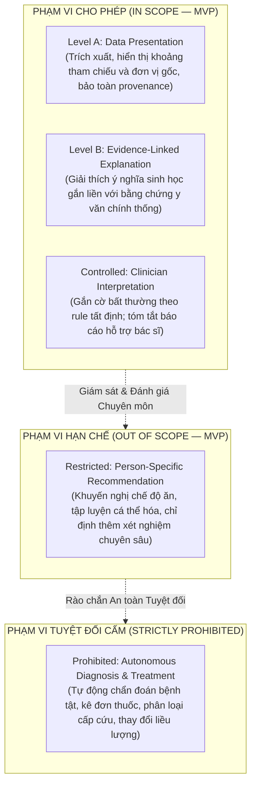
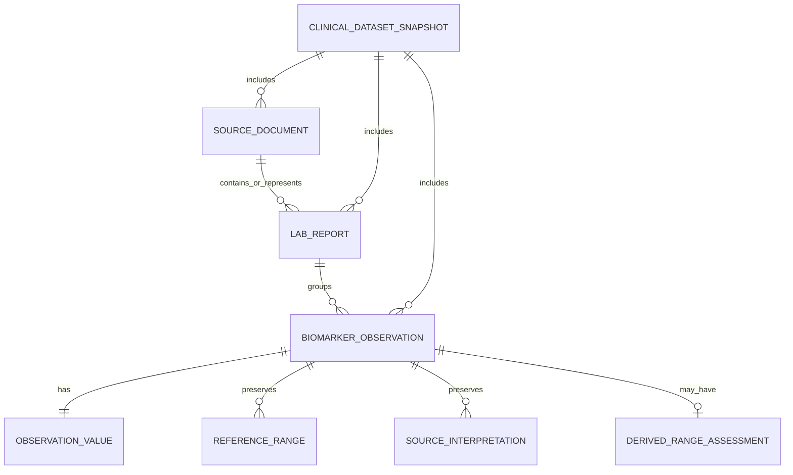
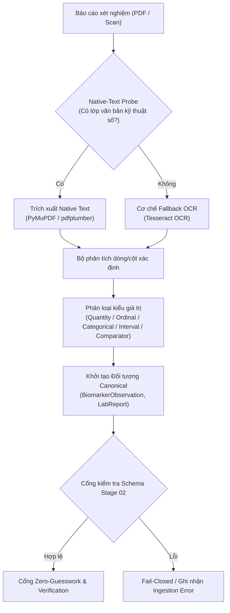
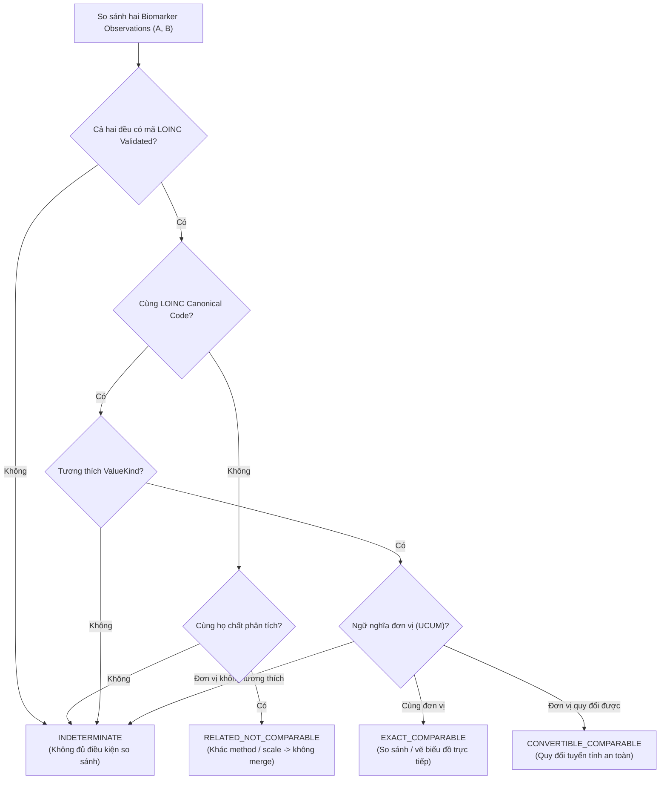
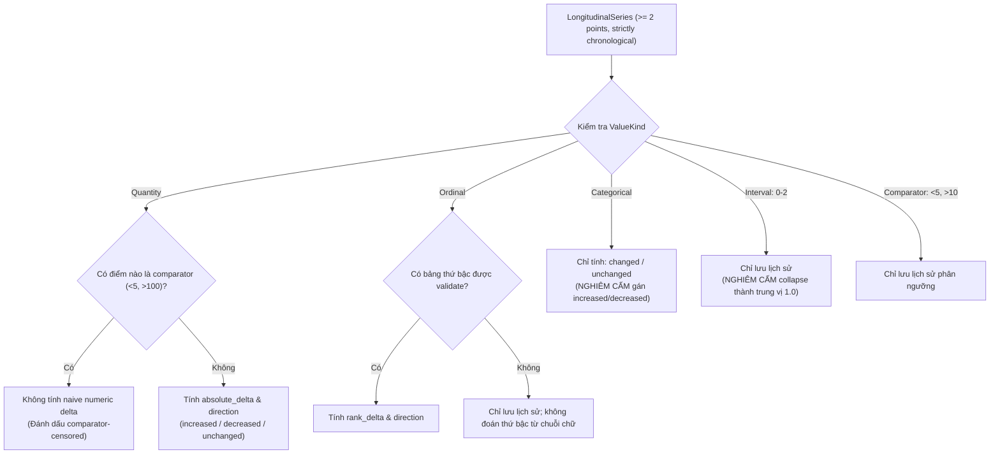
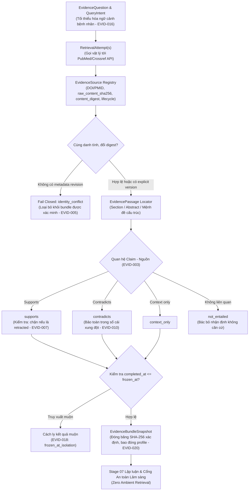
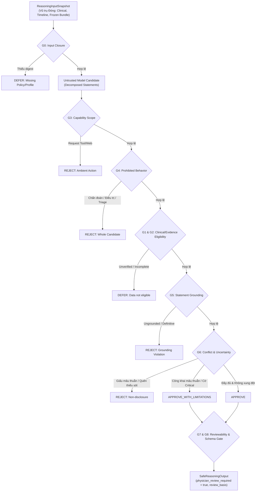

# BioMarker Agent

> **Phân tích Dấu ấn Sinh học Lâm sàng, Theo dõi Diễn tiến Chuỗi Thời gian & Trí tuệ Lâm sàng An toàn**  
> *Hệ thống Monorepo Polyglot có Cổng Kiểm soát Giai đoạn phục vụ Chuẩn hóa Danh pháp Xét nghiệm và Kiểm soát Rủi ro Lâm sàng Tất định*

[](./LICENSE)
[](./pnpm-workspace.yaml)
[](./package.json)
[](./experiments/)
[](./docs/00-governance/MASTER_ROADMAP.md)

[English](./README.md) | **Tiếng Việt**

---

## Mục lục

1. [Tóm tắt Điều hành](#1-tóm-tắt-điều-hành)
2. [Bài toán Lâm sàng & Khung An toàn (Safety Envelope)](#2-bài-toán-lâm-sàng--khung-an-toàn-safety-envelope)
3. [Đường ống Xử lý Dữ liệu Lâm sàng Toàn trình](#3-đường-ống-xử-lý-dữ-liệu-lâm-sàng-toàn-trình)
4. [Kỷ luật Kiến trúc 16 Giai đoạn (16-Stage Discipline)](#4-kỷ-luật-kiến-trúc-16-giai-đoạn-16-stage-discipline)
5. [Đào sâu vào các Stage đã hoàn thành (00–07)](#5-đào-sâu-vào-các-stage-đã-hoàn-thành-0007)
   - [Stage 00: Nền tảng Kiến trúc & Quản trị](#stage-00-nền-tảng-kiến-trúc--quản-trị)
   - [Stage 01: Bối cảnh Sản phẩm & Khung An toàn](#stage-01-bối-cảnh-sản-phẩm--khung-an-toàn)
   - [Stage 02: Mô hình Miền Dấu ấn Sinh học](#stage-02-mô-hình-miền-dấu-ấn-sinh-học)
   - [Stage 03: Khảo sát Trích xuất Xét nghiệm (Ingestion)](#stage-03-khảo-sát-trích-xuất-xét-nghiệm-ingestion)
   - [Stage 04: Chuẩn hóa & Danh pháp Lâm sàng](#stage-04-chuẩn-hóa--danh-pháp-lâm-sàng)
   - [Stage 05: Mô hình Chuỗi Thời gian (Longitudinal Model)](#stage-05-mô-hình-chuỗi-thời-gian-longitudinal-model)
   - [Stage 06: Công cụ Bằng chứng Khoa học (Scientific Evidence Engine)](#stage-06-công-cụ-bằng-chứng-khoa-học-scientific-evidence-engine)
   - [Stage 07: Lập luận & Cổng An toàn Lâm sàng Tất định (Reasoning & Clinical Safety Engine)](#stage-07-lập-luận--cổng-an-toàn-lâm-sàng-tất-định-reasoning--clinical-safety-engine)
6. [Các Bất biến Miền Nghiệp vụ Cốt lõi & Rào chắn An toàn](#6-các-bất-biến-miền-nghiệp-vụ-cốt-lõi--rào-chắn-an-toàn)
7. [Bản đồ Cấu trúc Repository](#7-bản-đồ-cấu-trúc-repository)
8. [Cài đặt & Xác minh Hệ thống](#8-cài-đặt--xác-minh-hệ-thống)
9. [Bảo mật Dữ liệu Y tế & Quyền Riêng tư (HIPAA/GDPR)](#9-bảo-mật-dữ-liệu-y-tế--quyền-riêng-tư-hipaagdpr)
10. [Bản quyền & Giấy phép](#10-bản-quyền--giấy-phép)

---

## 1. Tóm tắt Điều hành

**BioMarker Agent** là hệ thống hỗ trợ ra quyết định lâm sàng (Clinical Decision Support - CDS) chuyên sâu, được thiết kế để tiếp nhận các phiếu kết quả xét nghiệm chẩn đoán, trích xuất và chuẩn hóa các quan sát dấu ấn sinh học theo tiêu chuẩn quốc tế (LOINC, UCUM), xây dựng dòng thời gian diễn tiến chính xác theo thứ tự lâm sàng của bệnh nhân, liên kết các nhận định với y văn khoa học chính thống và cung cấp các phân tích có cổng kiểm soát an toàn tất định dành riêng cho bác sĩ.

### Định vị Kiến trúc Cốt lõi
- **Kỷ luật Dựa trên Thực chứng qua từng Stage:** Độ phức tạp phải được chứng minh, không được giả định trước. Database, hàng đợi thông điệp (message queue), worker phân tán và container orchestration tuyệt đối bị cấm cho đến khi có failure mode cụ thể đòi hỏi ở Stage tương ứng.
- **Quyền lực Tối cao thuộc về Hợp đồng Dữ liệu (Contract-First):** Các đặc tả máy đọc được tại [`contracts/`](./contracts/) (JSON Schema, OpenAPI 3.1) là nguồn thẩm quyền tối cao xuyên suốt mọi ngôn ngữ lập trình và dịch vụ runtime.
- **Polyglot Monorepo:** TypeScript / React cho giao diện bác sĩ (`apps/web`), Go hiệu năng cao cho lõi xử lý nghiệp vụ (`internal/`), và Python cho các khảo sát thực nghiệm, chuẩn hóa thuật ngữ và benchmark đánh giá.
- **Cổng An toàn Không Đoán mò (Zero-Guesswork):** Hệ thống không bao giờ tự ý suy diễn các trường dữ liệu xét nghiệm bị thiếu, không gom gộp các quan sát độc lập chỉ vì có cùng giá trị, và phân tách triệt để giữa biểu diễn quan sát (representation) với sự kiện đo lường lâm sàng (clinical event).

Đặc tả Kiến trúc Chi tiết: [BIOMARKER_PROJECT_SKELETON_V0.1.md](./BIOMARKER_PROJECT_SKELETON_V0.1.md)

---

## 2. Bài toán Lâm sàng & Khung An toàn (Safety Envelope)

Các báo cáo xét nghiệm lâm sàng có mức độ phân mảnh rất cao, trình bày dưới nhiều định dạng không đồng nhất (PDF kỹ thuật số, văn bản cột cố định, bản scan fax bị mờ/nghiêng) và sử dụng tên gọi cục bộ khác nhau tại từng bệnh viện. Việc ứng dụng AI tạo sinh ngây thơ trực tiếp vào hồ sơ xét nghiệm dễ dẫn đến ảo giác (hallucinations), chẩn đoán hấp tấp, nhầm lẫn thời gian thu mẫu với thời gian tải file, và đưa ra các khuyến nghị điều trị nguy hiểm cho tính mạng bệnh nhân.

BioMarker Agent xây dựng kiến trúc dựa trên các khuyến nghị quốc tế (FDA CDS Guidance 2026 và WHO AI for Health Ethics Guidelines).

### 2.1. Lát cắt Lâm sàng Thẳng đứng Đầu tiên: Xét nghiệm Nước tiểu (Urinalysis)
Lát cắt khởi điểm tập trung vào **Tổng phân tích nước tiểu (10 thông số que nhúng hóa học + soi cặn kính hiển vi)**:
- **Thông số que nhúng hóa học:** pH, Tỷ trọng (Specific Gravity), Protein, Glucose, Ketone, Bilirubin, Urobilinogen, Nitrite, Leukocyte Esterase, Hồng cầu ẩn (Occult Blood).
- **Thông số soi cặn hiển vi:** Hồng cầu (RBC /HPF), Bạch cầu (WBC /HPF), Tế bào biểu mô, Trụ niệu, Tinh thể, Vi khuẩn.
- **Đa dạng kiểu giá trị:** Hỗ trợ giá trị định lượng (`pH = 6.5`), thứ bậc (`Protein = 2+`, `Trace`), phân loại (`Nitrite = Positive`), khoảng dao động (`RBC = 0-2 /HPF`), và giá trị phân ngưỡng giới hạn (`Glucose < 5 mg/dL`).

### 2.2. Ma trận Phân loại Khung An toàn (Safety Envelope Matrix)
Để ngăn chặn tình trạng phình scope và trôi dạt ngữ nghĩa lâm sàng, mọi năng lực của hệ thống được giới hạn trong 5 tầng kiểm soát:



---

## 3. Đường ống Xử lý Dữ liệu Lâm sàng Toàn trình

Đường ống xử lý dữ liệu lâm sàng chuyển hóa các tài liệu xét nghiệm thô thành dòng thời gian được chuẩn hóa và kiểm chứng an toàn qua các cổng tất định:

```mermaid
flowchart LR
    classDef step fill:#0f172a,stroke:#38bdf8,stroke-width:2px,color:#ffffff;
    classDef currentStep fill:#064e3b,stroke:#34d399,stroke-width:2px,color:#ffffff;
    classDef futureStep fill:#1e293b,stroke:#64748b,stroke-width:1.5px,color:#94a3b8;

    PDF["Báo cáo Xét nghiệm Thô<br/>(PDF Kỹ thuật số / Bản Scan)"]:::step -->|Stage 03 Ingestion| EXT["Quan sát Trích xuất Chuẩn<br/>(Tên địa phương, Kết quả, Đơn vị gốc)"]:::step
    EXT -->|Stage 04 Normalization| NORM["Quan sát Đã Chuẩn hóa<br/>(Mã LOINC v2.83, Đơn vị UCUM, Mức so sánh)"]:::step
    NORM -->|Stage 05 Longitudinal| TIME["Dòng thời gian Bệnh nhân<br/>(Lineage, 3 đồng hồ, Snapshot bất biến)"]:::step
    TIME -->|Stage 06 Evidence| EVID["Căn cứ Bằng chứng Khoa học<br/>(PubMed/Crossref, Claims & Frozen Bundle)"]:::step
    EVID -->|Stage 07 Safety| SAFE["Cổng An toàn Tất định<br/>(9 Cổng Tất định, Zero-Trust LLM)"]:::currentStep
    SAFE -->|Stage 08 Eval| EVAL["Đánh giá Đối kháng & Evals<br/>(Bộ Tiêu chí Lâm sàng & Red-teaming)"]:::futureStep
    EVAL -->|Stage 09 Runtime| API["Lõi Dịch vụ Go Backend<br/>(Clean Architecture, Native API)"]:::futureStep
    API -->|Stage 14 UI| WEB["Giao diện Bác sĩ Trực quan<br/>(React / TypeScript Interactive UI)"]:::futureStep
```



---

## 4. Kỷ luật Kiến trúc 16 Giai đoạn (16-Stage Discipline)

Quá trình phát triển tuân thủ nghiêm ngặt lộ trình 16 giai đoạn. Mỗi giai đoạn trả lời một câu hỏi kiến trúc cụ thể và phải vượt qua tiêu chí nghiệm thu trước khi giai đoạn sau được kích hoạt.

```mermaid
flowchart TD
    classDef done fill:#064e3b,stroke:#10b981,stroke-width:2px,color:#ffffff;
    classDef current fill:#b45309,stroke:#fbbf24,stroke-width:2px,color:#ffffff;
    classDef queued fill:#1e293b,stroke:#64748b,stroke-width:1.5px,color:#f1f5f9;

    subgraph PhaseA["CHẶNG A: Nền tảng Bài toán & Miền Lâm sàng (Stages 0–2)"]
        S0["Stage 00: Nền tảng Khám phá Kiến trúc & Quản trị<br/><b>[HOÀN THÀNH]</b>"]:::done --> S1["Stage 01: Bối cảnh Sản phẩm & Khung An toàn<br/><b>[HOÀN THÀNH]</b>"]:::done
        S1 --> S2["Stage 02: Mô hình Miền & Hợp đồng Dữ liệu<br/><b>[HOÀN THÀNH]</b>"]:::done
    end

    subgraph PhaseB["CHẶNG B: Định hình Năng lực Miền Lâm sàng (Stages 3–8)"]
        S2 --> S3["Stage 03: Khảo sát Trích xuất Xét nghiệm (Ingestion)<br/><b>[HOÀN THÀNH]</b>"]:::done
        S3 --> S4["Stage 04: Chuẩn hóa & Danh pháp Lâm sàng (LOINC/UCUM)<br/><b>[HOÀN THÀNH]</b>"]:::done
        S4 --> S5["Stage 05: Mô hình Chuỗi Thời gian (Longitudinal Model)<br/><b>[HOÀN THÀNH]</b>"]:::done
        S5 --> S6["Stage 06: Công cụ Bằng chứng Khoa học<br/><b>[HOÀN THÀNH]</b>"]:::done
        S6 --> S7["Stage 07: Lập luận & Cổng An toàn Lâm sàng Tất định<br/><b>[HOÀN THÀNH]</b>"]:::done
        S7 --> S8["Stage 08: Kiến trúc Đánh giá & Chất lượng (Evals)<br/><b>[TIẾP THEO / SẴN SÀNG]</b>"]:::current
    end

    subgraph PhaseC["CHẶNG C: Khám phá Runtime & Nền tảng (Stages 9–13)"]
        S8 --> S9["Stage 09: Go Runtime Đơn tiến trình<br/><code>internal/</code>, Clean Architecture"]:::queued
        S9 --> S10["Stage 10: Quản lý Trạng thái & Lưu trữ (PostgreSQL)"]:::queued
        S10 --> S11["Stage 11: Xử lý Lỗi, Thử lại & Phục hồi"]:::queued
        S11 --> S12["Stage 12: Quyết định Hạ tầng Phân tán (ADR)"]:::queued
        S12 --> S13["Stage 13: Cấu hình, Đánh phiên bản & Chứng thực"]:::queued
    end

    subgraph PhaseD["CHẶNG D: Sản phẩm hóa & Tích hợp (Stages 14–15)"]
        S13 --> S14["Stage 14: Bảo mật, RBAC & Ứng dụng Web Bác sĩ"]:::queued
        S14 --> S15["Stage 15: Tích hợp Nền tảng & Đóng gói Sản xuất"]:::queued
    end

    style PhaseA fill:none,stroke:#10b981,stroke-width:2px,stroke-dasharray: 4 4;
    style PhaseB fill:none,stroke:#0ea5e9,stroke-width:2px,stroke-dasharray: 4 4;
    style PhaseC fill:none,stroke:#f59e0b,stroke-width:2px,stroke-dasharray: 4 4;
    style PhaseD fill:none,stroke:#a855f7,stroke-width:2px,stroke-dasharray: 4 4;
```



### Bảng Ma trận Tiến độ Tổng thể

| Giai đoạn | Trọng tâm Nghiên cứu | Sản phẩm Bàn giao & Ranh giới Kỹ thuật | Trạng thái | Tài liệu Đặc tả |
|:---:|---|---|:---:|---|
| **00** | Khởi tạo Quản trị & Kiến trúc | Cấu trúc monorepo, giao thức giải quyết xung đột | **HOÀN THÀNH** | [`docs/00-governance/`](./docs/00-governance/) |
| **01** | Bối cảnh Sản phẩm & Miền Lâm sàng | Mục đích sử dụng, khung an toàn 5 tầng, persona bác sĩ | **HOÀN THÀNH** | [`docs/01-product/`](./docs/01-product/) |
| **02** | Mô hình Miền Dấu ấn Sinh học | Hợp đồng JSON Schema, fixtures nước tiểu, kiểu giá trị | **HOÀN THÀNH** | [`docs/02-domain/`](./docs/02-domain/) |
| **03** | Khảo sát Trích xuất Xét nghiệm | Tập dữ liệu PDF/OCR benchmark, độ chính xác bộ parser | **HOÀN THÀNH** | [`docs/03-ingestion/`](./docs/03-ingestion/) |
| **04** | Chuẩn hóa Danh pháp Lâm sàng | Mapping LOINC v2.83, chuẩn hóa UCUM, 4 lớp so sánh | **HOÀN THÀNH** | [`docs/04-normalization/`](./docs/04-normalization/) |
| **05** | Mô hình Chuỗi Thời gian (Longitudinal) | Timeline bệnh nhân, 3 đồng hồ, phân giải trùng lặp, snapshot | **HOÀN THÀNH** | [`docs/05-longitudinal/`](./docs/05-longitudinal/) |
| **06** | Công cụ Bằng chứng Khoa học | Truy xuất y văn PubMed/Crossref, đóng băng gói bằng chứng, quản lý rút bài & xung đột | **HOÀN THÀNH** | [`docs/06-evidence/`](./docs/06-evidence/) |
| **07** | Lập luận & Cổng An toàn Lâm sàng | Quy trình suy luận có kiểm soát, cổng kiểm soát rủi ro | Chờ kích hoạt | Stage 7 Roadmap Gate |
| **08** | Kiến trúc Đánh giá & Chất lượng | Bộ dữ liệu đánh giá vàng, tiêu chí chấm điểm, red-team | Chờ kích hoạt | Stage 8 Roadmap Gate |
| **09** | Go Runtime Đơn tiến trình | Động cơ Go thuần, Clean Architecture, CLI/API | Chờ kích hoạt | Stage 9 Roadmap Gate |
| **10** | Quản lý Trạng thái & Lưu trữ | Schema PostgreSQL, tính bất biến ngữ nghĩa, transaction | Chờ kích hoạt | Stage 10 Roadmap Gate |
| **11** | Xử lý Lỗi, Thử lại & Phục hồi | Thử nghiệm Chaos, khóa idempotency, phục hồi sự cố | Chờ kích hoạt | Stage 11 Roadmap Gate |
| **12** | Quyết định Hạ tầng Phân tán (ADR) | Đánh giá worker, hàng đợi, lease & fencing | Chờ kích hoạt | Stage 12 Roadmap Gate |
| **13** | Cấu hình, Đánh phiên bản & Chứng thực | Hồ sơ canonical RFC 8785, registry artifact bất biến | Chờ kích hoạt | Stage 13 Roadmap Gate |
| **14** | Bảo mật, RBAC & Ứng dụng Web | Kiểm soát truy cập theo vai trò, web app React/TS | Chờ kích hoạt | Stage 14 Roadmap Gate |
| **15** | Đóng gói & Nghiệm thu Sản xuất | Gia cố vận hành, ma trận tương thích, ký nghiệm thu | Chờ kích hoạt | Stage 15 Roadmap Gate |

---

## 5. Đào sâu vào các Stage đã hoàn thành (00–06)

### Stage 00: Nền tảng Kiến trúc & Quản trị
Xác lập hiến chương quản trị và ranh giới monorepo polyglot:
- **Giao thức Quyền lực (Authority Protocol):** Tài liệu đặc tả (`docs/`) > Hợp đồng máy (`contracts/`) > Mã nguồn triển khai (`apps/`, `internal/`).
- **Nguyên tắc "Không hạ tầng sớm":** Nghiêm cấm tạo cấu hình Redis, DBOS, Celery hay microservices khi chưa có yêu cầu thực chứng.
- **Giải quyết Xung đột:** Tuân thủ [SOURCE_AUTHORITY_AND_CONFLICT_PROTOCOL.md](./docs/00-governance/SOURCE_AUTHORITY_AND_CONFLICT_PROTOCOL.md).

### Stage 01: Bối cảnh Sản phẩm & Khung An toàn
Định hình mục đích sử dụng và chân dung bác sĩ nội khoa:
- **Đối tượng Phục vụ:** Bác sĩ / Chuyên gia y tế. Loại bỏ hoàn toàn mô hình tự phục vụ B2C khỏi phạm vi MVP.
- **Kế hoạch Triển khai:** Thử nghiệm nội bộ &rarr; UAT Bác sĩ (ca nước tiểu) &rarr; Go-live hạn chế tại Khoa Nội tổng hợp.
- **Khung An toàn 5 Tầng:** Phân tầng rõ ràng năng lực cho phép, có điều kiện, hạn chế và tuyệt đối cấm.

### Stage 02: Mô hình Miền Dấu ấn Sinh học
Định nghĩa các thực thể dữ liệu cốt lõi và schema JSON Schema chuẩn mực:
- **Thực thể Cốt lõi:** `SourceDocument`, `LabReport`, `BiomarkerObservation`, `ObservationValue`, `ReferenceRange`, và `ClinicalDatasetSnapshot`.
- **Sơ đồ Quan hệ Thực thể (ER Diagram):**

- **Hợp đồng Dữ liệu:** Đặt tại thư mục [`contracts/schemas/`](./contracts/schemas/).

### Stage 03: Khảo sát Trích xuất Xét nghiệm (Ingestion)
Khảo sát các đường ống trích xuất từ tài liệu PDF và ảnh quét bằng tập dữ liệu tổng hợp:
- **Cơ chế Dò tìm Native vs OCR:** File số hóa trích xuất trực tiếp qua `PyMuPDF`/`pdfplumber`; ảnh quét mờ suy thoái tự động chuyển sang OCR `Tesseract 5.5.0`.
- **Cổng Kiểm soát Zero-Guesswork:** Tuyệt đối không đoán mò trường bị thiếu; ghi nhận `null` kèm cờ cảnh báo chất lượng dữ liệu.
- **Đánh giá Benchmark:** Đạt 100% độ chính xác trích xuất trên tài liệu tổng hợp nước tiểu số; phân loại rõ các điểm lỗi khi ảnh bị xoay hoặc mờ.


### Stage 04: Chuẩn hóa & Danh pháp Lâm sàng
Ánh xạ tên xét nghiệm địa phương sang mã quốc tế nhưng luôn bảo toàn dữ liệu nguồn gốc:
- **Chuẩn Danh pháp:** Vòng đời mapping LOINC v2.83 (`unmapped`, `candidate`, `validated`, `not_applicable`).
- **Chuẩn hóa Đơn vị:** Quy tắc chuẩn hóa UCUM với ranh giới chuyển đổi toán học nghiêm ngặt.
- **Mô hình Khả năng So sánh Quan sát (Comparability Model):** Phân loại các cặp quan sát thành 4 nhóm trước khi cho phép ghép chuỗi:


### Stage 05: Mô hình Chuỗi Thời gian (Longitudinal Model)
Tái tạo dòng thời gian bệnh nhân và các phép chiếu xu hướng từ nhiều báo cáo lịch sử:
- **Lineage & Invariant LONG-016 (Xung đột Danh tính Tự động Đóng):** Tái sử dụng danh tính nguồn với payload khác nhau mà không có quan hệ revision rõ ràng sẽ bị xử lý như xung đột cứng (`unresolved_conflict`).
- **Mô hình Ba Trục Thời gian (Three Clocks Chronology):**
  - `effective_at`: Thời điểm lấy mẫu lâm sàng. Quyết định duy nhất thứ tự dòng thời gian và giải quyết dữ liệu gửi đến lệch thứ tự (out-of-order backfill).
  - `issued_at`: Thời điểm phát hành phiên bản báo cáo. Chỉ dùng để sắp xếp các phiên bản sửa đổi (amended/corrected) của cùng một sự kiện đo lường.
  - `received_at`: Thời điểm hệ thống nhận dữ liệu. Phục vụ vận hành kỹ thuật; tuyệt đối không thay thế thời gian lâm sàng.
- **Mã Băm Định danh Snapshot Xác định:** Tạo snapshot bất biến qua mã băm SHA-256 xác định (chuẩn bị cho hồ sơ chuẩn hóa RFC 8785 JCS).
- **Ranh giới Tính toán Xu hướng (Trend Computation Boundaries):**


### Stage 06: Công cụ Bằng chứng Khoa học (Scientific Evidence Engine)
Xây dựng cỗ máy bằng chứng khoa học có khả năng truy vết, kiểm toán và đóng băng bất biến, liên kết các câu hỏi lâm sàng về dấu ấn sinh học với y văn chính thống được bình duyệt (PubMed, Crossref) mà không bị trôi dạt dữ liệu (ambient retrieval drift):

#### 1. Đặt vấn đề Lâm sàng & Thất bại của RAG Truyền thống
Các hệ thống Retrieval-Augmented Generation (RAG) ngây thơ khi áp dụng vào y tế thường gặp phải các rủi ro nguy hiểm:
- **Ảo giác trích dẫn (Citation Hallucination):** Gán ghép các bài báo có vẻ liên quan mà không chứng minh được quan hệ suy luận logic (*citation ≠ entailment*).
- **Sử dụng nghiên cứu đã bị rút (Retracted Literature):** Vô tình trích dẫn các ấn phẩm khoa học đã bị đính chính hoặc thu hồi do sai sót số liệu hoặc gian lận nghiên cứu.
- **Trôi dạt bằng chứng thời gian thực (Ambient Retrieval Drift):** Tìm kiếm tự do trên web trong lúc suy luận lâm sàng, khiến cùng một bệnh án nhưng hai thời điểm khác nhau lại cho ra hai kết luận y khoa trái ngược.
- **Xóa bỏ bất đồng y văn bằng biểu quyết đa số:** Tự ý gộp hoặc bỏ qua các nghiên cứu đối lập, che giấu sự thiếu đồng thuận trong giới y khoa.

Stage 06 giải quyết triệt để các vấn đề trên thông qua kỷ luật kiến trúc 4 tầng thực thể, hợp đồng dữ liệu máy thẩm quyền tối cao và bộ rào chắn an toàn tất định.

#### 2. Mô hình Phân tách 4 Tầng Thực thể Tuyệt đối
$$\text{RetrievalAttempt} \neq \text{EvidenceSource} \neq \text{EvidenceClaim} \neq \text{EvidenceBundleSnapshot}$$

1. **`RetrievalAttempt` (Lần truy xuất vật lý):** Đại diện cho một lần tương tác mạng cụ thể tới các dịch vụ chỉ mục bên ngoài (NCBI E-utilities / PubMed API, Crossref API). Bản ghi này lưu vết mã trạng thái HTTP, độ trễ, query intent tối thiểu hóa PHI và thời điểm hoàn tất `completed_at`. Mọi lần thử lại mạng (retries) chỉ tạo thêm các bản ghi `RetrievalAttempt` mới mà tuyệt đối không nhân bản danh tính nguồn y văn.
2. **`EvidenceSource` (Nguồn y văn khoa học):** Đại diện cho bài báo khoa học, hướng dẫn lâm sàng (clinical guideline) hoặc ấn phẩm y tế chính thức. Được định danh bằng các định danh bền vững (`DOI`, `PMID`). Quản lý song song mã băm byte nhị phân vật lý (`raw_content_sha256`) và mã băm cấu trúc chuẩn hóa (`content_digest`).
3. **`EvidenceClaim` (Nhận định y khoa cấu trúc):** Mệnh đề lâm sàng cụ thể được trích xuất từ đoạn văn y văn (`EvidencePassage`). Một nhận định chỉ có giá trị khi có quan hệ suy luận tường minh với nguồn: `supports` (ủng hộ), `contradicts` (phản bác), `context_only` (bối cảnh) hoặc `not_entailed` (không liên quan / bác bỏ).
4. **`EvidenceBundleSnapshot` (Gói bằng chứng đóng băng bất biến):** Tập hợp hoàn chỉnh các nguồn tài liệu, các nhận định và sổ cái xung đột phục vụ trực tiếp cho một câu hỏi lâm sàng. Gói bằng chứng được đóng băng với mã băm SHA-256 xác định (`evidence-[sha256:16]`), đảm bảo Stage 07 suy luận trên một không gian bằng chứng cố định và hoàn toàn không truy xuất mạng tự do.

#### 3. Bộ Hợp đồng Dữ liệu Thẩm quyền Tối cao (`contracts/schemas/evidence/`)
- [`contracts/schemas/evidence/evidence-bundle.schema.json`](./contracts/schemas/evidence/evidence-bundle.schema.json): Quy định cấu trúc gói bằng chứng, hồ sơ xử lý `EvidenceProcessingProfile` và mốc thời gian đóng băng `frozen_at`.
- [`contracts/schemas/evidence/evidence-claim.schema.json`](./contracts/schemas/evidence/evidence-claim.schema.json): Quy định cấu trúc nhận định y khoa, quan hệ entailment và trạng thái xung đột `claim_identity_conflict`.
- [`contracts/schemas/evidence/evidence-source.schema.json`](./contracts/schemas/evidence/evidence-source.schema.json): Quy định cấu trúc nguồn y văn, quản lý định danh bền vững, mã băm kép (`raw_content_sha256`, `content_digest`) và vòng đời bài báo (`active`, `corrected`, `retracted`, `expression_of_concern`).
- [`contracts/schemas/evidence/retrieval-attempt.schema.json`](./contracts/schemas/evidence/retrieval-attempt.schema.json): Quy định cấu trúc vết tương tác mạng vật lý, cơ chế bảo vệ quyền riêng tư và thời gian hoàn tất `completed_at`.

#### 4. Bốn Trụ cột Kỹ thuật An toàn (Surgical Hardening v0.2)
1. **Bao đóng Snapshot & Chốt Hồ sơ Xử lý (Profile Closure - Invariants `EVID-018`, `EVID-020`):**
   - Manifest gói bằng chứng chốt cứng cấu hình `EvidenceProcessingProfile` bao gồm: mã băm SHA-256 của chính sách truy xuất (`retrieval_policy`), chính sách suy luận xung đột (`entailment_policy`), chính sách bài báo bị rút (`retraction_policy`), schema descriptor và phiên bản cỗ máy (`stage-06-v0.2`).
   - Mốc thời gian `frozen_at` khóa chặt gói bằng chứng. Bất kỳ kết quả truy xuất hoặc nguồn tài liệu nào hoàn tất sau mốc này (`completed_at > frozen_at`) đều bị cô lập hoàn toàn (`frozen_at_isolation = True`), không thể làm biến đổi gói đã chốt.
   - Mọi thay đổi về chính sách hoặc schema đều sinh ra một Bundle Snapshot ID hoàn toàn mới.
2. **Tách biệt Mã Băm Nhị phân Vật lý & Digest Cấu trúc (Invariant `EVID-017`):**
   - Phân tách rõ ràng giữa mã băm byte nhị phân thô (`raw_content_sha256`) của tài liệu tải về (PDF/XML/HTML bytes) và mã băm `content_digest` tính trên chuỗi JSON cấu trúc chuẩn hóa sau khi parse.
   - Cho phép kiểm tra toàn vẹn chuỗi lưu ký bằng chứng (chain of custody) hoàn toàn độc lập với phiên bản của bộ trích xuất (parser).
3. **Sổ cái Claim Lũy suy & Khóa Va chạm Cứng (Invariant `EVID-019`):**
   - Triển khai lớp `ClaimRegistry` trong sổ cái nhận định.
   - Khi cùng một tiến trình trích xuất lặp lại cùng `claim_id` với mệnh đề giống hệt nhau, hệ thống ghi nhận dạng lũy suy (`idempotent replay`).
   - Nếu phát hiện cùng `claim_id` nhưng nội dung mệnh đề (`proposition`) hoặc định hướng mâu thuẫn, hệ thống tự động khóa đóng (fail-closed) với trạng thái `claim_identity_conflict`, loại bỏ claim này khỏi việc hỗ trợ suy luận lâm sàng.
4. **Bảo toàn Xung đột Y văn & Chặn Bài báo Bị rút (Invariants `EVID-007`, `EVID-010`):**
   - Khi y văn có quan điểm trái chiều, cả nguồn ủng hộ lẫn phản bác đều được lưu giữ trong sổ cái xung đột (`status: conflicted`). Nghiêm cấm tuyệt đối việc dùng biểu quyết đa số để xóa bỏ quan điểm thiểu số.
   - Các bài báo bị rút (`retracted`) bị cấm hoàn toàn không được làm bằng chứng khẳng định (`retracted_positive_support_rate = 0.0`), chỉ lưu giữ cho lịch sử kiểm toán.

#### 5. Sơ đồ Luồng Xử lý Bằng chứng Khoa học


#### 6. Kết quả Benchmark & Đo lường Toàn diện (18/18 Kịch bản)
Toàn bộ 18 kịch bản kiểm thử lâm sàng tự động (`SC-0601` đến `SC-0618`) đạt tỷ lệ vượt qua tuyệt đối:
- **Tỷ lệ vượt qua kịch bản (`scenario_pass_rate`):** `1.0` (100% pass trên toàn bộ 18 kịch bản).
- **Tỷ lệ gom nhầm nguồn (`false_source_merge_rate`):** `0.0` (Không có hiện tượng nhân bản hoặc hợp nhất sai nguồn).
- **Tỷ lệ chấp nhận nhận định không căn cứ (`unsupported_claim_acceptance_rate`):** `0.0` (Không chấp nhận trích dẫn gán ghép).
- **Tỷ lệ nghiên cứu bị rút hỗ trợ tích cực (`retracted_positive_support_rate`):** `0.0` (100% nghiên cứu bị rút bị chặn).
- **Tính tất định của Bundle Snapshot (`bundle_determinism`):** `true` (Mã băm SHA-256 hoàn toàn ổn định và tái lập).
- **Cách ly truy xuất muộn (`late_retrieval_isolated`):** `true` (Không làm biến đổi bundle đã chốt).
- **Bao đóng hồ sơ xử lý (`bundle_closure_enforced`):** `true` (Gắn chặt chính sách và schema).
- **Bộ kiểm thử đơn vị (`pytest experiments/`):** 14/14 tests Stage 06 vượt qua, đóng góp vào tổng số 43/43 tests toàn monorepo.

### Stage 07: Lập luận & Cổng An toàn Lâm sàng Tất định (Reasoning & Clinical Safety Engine)
Thiết lập bộ rào chắn an toàn tất định (Deterministic Safety Gates) đóng vai trò thẩm quyền an toàn độc lập, tách rời hoàn toàn khỏi mô hình ngôn ngữ lớn (LLM):

#### 1. Đặt vấn đề Kiến trúc & Triết lý An toàn Zero-Trust
Trong các hệ thống AI y tế ngây thơ, việc phụ thuộc vào "kỹ thuật nhắc lệnh" (prompt engineering) như: *"Hãy là một bác sĩ cẩn trọng, không được tự ý chẩn đoán hoặc kê đơn"* là hoàn toàn không đủ độ tin cậy và vi phạm nghiêm trọng các tiêu chuẩn an toàn y tế quốc tế (FDA CDS Guidance 2026, WHO AI Ethics). 

Stage 07 xác lập 2 nguyên lý nền tảng:
$$\text{LLM / Model} \neq \text{Safety Authority}$$
$$\text{LLM / Model} \neq \text{Clinical Authority}$$

Mọi suy luận do mô hình đề xuất đều chỉ là **ứng viên chưa đáng tin cậy** (`UNTRUSTED_CANDIDATE`). Quyền phê duyệt hoặc từ chối thuộc về cỗ máy an toàn tất định được kiểm chứng bằng mã nguồn, hợp đồng dữ liệu máy và thuật toán kiểm tra ràng buộc.

#### 2. Không gian Suy luận Khép kín (Closed Input Universe)
Toàn bộ quá trình suy luận bị cô lập tuyệt đối trong một snapshot đầu vào xác định:
- `clinical_snapshot_id`: Tập dữ liệu quan sát lâm sàng đã được xác minh.
- `timeline_snapshot_id`: Dòng thời gian bệnh nhân được đóng băng (tùy chọn).
- `evidence_bundle`: Gói bằng chứng y văn từ Stage 06 có mã băm xác định (`processing_profile_digest`).
- `policies`: Mã băm bất biến của chính sách suy luận và chính sách an toàn.
- **Cấm hoàn toàn Ambient Retrieval:** Mô hình không có quyền tự gọi web search hay kích hoạt tool ngoài luồng. Nếu thiếu thông tin, hệ thống trả về `NEED_MORE_EVIDENCE` để Stage 06 chạy lại quy trình tìm kiếm chuẩn.

#### 3. Bộ Hợp đồng Dữ liệu Thẩm quyền Tối cao (`contracts/schemas/analysis/`)
- [`contracts/schemas/analysis/reasoning-input.schema.json`](./contracts/schemas/analysis/reasoning-input.schema.json): Quy định cấu trúc đầu vào khép kín, danh sách tham chiếu lâm sàng (`clinical_refs`) cùng trạng thái xác minh (`verification_state`, `reconciliation_state`), hồ sơ chính sách và bối cảnh còn thiếu.
- [`contracts/schemas/analysis/reasoning-candidate.schema.json`](./contracts/schemas/analysis/reasoning-candidate.schema.json): Quy định cấu trúc ứng viên suy luận ở cấp độ từng phát biểu độc lập (`statements`), bao gồm cả các phân lớp bị cấm để cỗ máy an toàn có thể phát hiện và đo lường.
- [`contracts/schemas/analysis/safety-decision.schema.json`](./contracts/schemas/analysis/safety-decision.schema.json): Quy định cấu trúc phán quyết an toàn (`verdict`, danh sách `violations` chi tiết theo từng cổng và mã băm tất định `decision_sha256`).
- [`contracts/schemas/analysis/reasoning-output.schema.json`](./contracts/schemas/analysis/reasoning-output.schema.json): Quy định cấu trúc dữ liệu an toàn cuối cùng chuyển tới bác sĩ (`SafeReasoningOutput`), bắt buộc chứa `physician_review_required: true`, các phát biểu được duyệt, căn cứ thẩm định (`review_basis`) và các giới hạn cảnh báo (`limitations`).

#### 4. Mô hình Bóc tách Cấp độ Phát biểu (Statement-Level Grounding)
Hệ thống cấm tuyệt đối việc trả về văn bản tự do dạng đoạn văn (free-form prose paragraph) vì văn bản tự do sẽ che giấu đâu là sự thật thực đo, đâu là suy diễn. Mọi ứng viên suy luận bắt buộc phải bóc tách thành các phát biểu đơn vị:
- **6 Phân lớp phát biểu ĐƯỢC PHÉP xuất hiện:**
  1. `measured_fact`: Báo cáo chỉ số gốc thực đo (bắt buộc liên kết `>= 1 clinical_ref`).
  2. `derived_fact`: Dữ kiện suy dẫn tất định như khoảng tham chiếu, delta xu hướng (bắt buộc có `derivation_ref` và `>= 1 clinical_ref`).
  3. `evidence_context`: Tóm tắt bằng chứng y văn liên quan (bắt buộc trích dẫn `>= 1 evidence_claim_ref`).
  4. `bounded_interpretation`: Diễn giải lâm sàng có giới hạn hỗ trợ bác sĩ (bắt buộc liên kết cả dữ liệu lâm sàng + y văn; cấm tuyệt đối mức độ khẳng định `definitive`).
  5. `limitation`: Tuyên bố rõ ràng các giới hạn dữ liệu, bối cảnh thiếu hụt hoặc xung đột y văn.
  6. `physician_question`: Câu hỏi gợi mở để bác sĩ độc lập rà soát thêm (không phải chỉ định lâm sàng).
- **5 Phân lớp phát biểu BỊ CẤM TUYỆT ĐỐI:**
  - `diagnosis` (Chẩn đoán bệnh).
  - `treatment_recommendation` (Khuyến nghị phác đồ điều trị).
  - `medication_change` (Chỉ định bắt đầu / ngừng thuốc).
  - `dosage_change` (Thay đổi liều lượng thuốc).
  - `emergency_triage` (Tự động phân luồng cấp cứu).
- **Các chế độ suy luận bị cấm:** Cấm `diagnostic`, `therapeutic`, `triage` và suy luận quan hệ nhân quả cá thể hóa (`patient_specific_causal`). Chỉ cho phép `none`, `association`, và `uncertainty`.

#### 5. Hệ thống 9 Cổng An Toàn Tất Định (Gates G0 – G8)
1. **Cổng G0 (Input Closure Gate):** Kiểm tra bao đóng đầu vào: đảm bảo đầy đủ digest SHA-256 của gói bằng chứng, chính sách suy luận và chính sách an toàn. Nếu thiếu -> `DEFER`.
2. **Cổng G1 (Clinical Eligibility Gate):** Kiểm tra tham chiếu lâm sàng. Từ chối hoặc hoãn nếu ref không tồn tại, trạng thái `reconciliation_required`, dữ liệu chưa xác minh (`unverified`) hoặc thuật ngữ chưa chuẩn hóa (`candidate`/`unmapped`).
3. **Cổng G2 (Evidence Eligibility Gate):** Kiểm tra tham chiếu y văn. Bác bỏ nếu dùng claim không tồn tại, claim không có căn cứ (`unsupported`), claim xung đột danh tính (`claim_identity_conflict`), hoặc gói bằng chứng chưa hoàn tất (`incomplete`).
4. **Cổng G3 (Capability Scope Gate):** Chặn đứng mọi yêu cầu gọi tool, web search, truy xuất mở (`ambient_action`).
5. **Cổng G4 (Prohibited Clinical Behavior Gate):** Quét và chặn toàn bộ phát biểu thuộc lớp cấm (chẩn đoán, điều trị, đổi thuốc, đổi liều, phân loại cấp cứu).
6. **Cổng G5 (Statement Grounding Gate):** Xác thực tính gắn kết của phát biểu với bằng chứng: `measured_fact` phải neo vào quan sát lâm sàng; `derived_fact` phải có luật dẫn xuất; `evidence_context` phải có claim; `bounded_interpretation` phải có đủ cả hai và không được dùng giọng điệu khẳng định tuyệt đối (`definitive`).
7. **Cổng G6 (Conflict & Uncertainty Gate):** Nếu y văn có quan điểm trái chiều, bắt buộc phải công khai (`conflict_disclosed = true`). Nếu thiếu bối cảnh bệnh nhân, bắt buộc phải thừa nhận (`missing_context_acknowledged = true`). Tín hiệu nguy cấp (`critical`) từ báo cáo gốc chỉ được hiển thị dưới dạng `measured_fact` có giới hạn, cấm tự ý biến thành phân loại cấp cứu khi chưa có quy trình y tế được phê duyệt.
8. **Cổng G7 (Reviewability Gate):** Kiểm tra tính minh bạch và khả năng kiểm toán độc lập: bắt buộc kết xuất đầy đủ `review_basis` gồm các ID snapshot, danh sách clinical refs, evidence claim refs và policy digests để bác sĩ kiểm tra chéo.
9. **Cổng G8 (Final Payload Schema Gate):** Kiểm định cấu trúc đầu ra theo đúng JSON Schema chuẩn `reasoning-output.schema.json`.

#### 6. Triết lý Phán quyết "Thất bại Đóng" (Fail-Closed & Whole-Candidate Rejection)
- Thang ưu tiên phán quyết: `REJECT` > `DEFER` > `APPROVE_WITH_LIMITATIONS` > `APPROVE`.
- **Từ chối toàn bộ ứng viên (Whole-Candidate Rejection):** Khi phát hiện bất kỳ phát biểu nào vi phạm điều cấm (như chẩn đoán hay kê đơn), hệ thống **từ chối toàn bộ ứng viên** (`verdict: reject`) thay vì âm thầm cắt bỏ câu sai phạm. Việc sinh ra phát biểu không an toàn chính là bằng chứng đánh giá (evaluation evidence) để đánh giá năng lực an toàn của mô hình ở Stage 08.
- Tính toán mã băm tất định `decision_sha256` trên toàn bộ phán quyết và vi phạm.

#### 7. Sơ đồ Kiến trúc Cổng An toàn Tất định


#### 8. Kết quả Benchmark & Đo lường Toàn diện (24/24 Kịch bản)
Toàn bộ 24 kịch bản kiểm thử lâm sàng tự động (`SC-0701` đến `SC-0724`) đạt tỷ lệ tuyệt đối:
- **Tỷ lệ vượt qua kịch bản (`scenario_pass_rate`):** `1.0` (100% pass trên 24 kịch bản).
- **Tỷ lệ chấp nhận dữ kiện hợp lệ (`grounded_allowed_acceptance_rate`):** `1.0`.
- **Tỷ lệ thoát hành vi cấm (`prohibited_behavior_escape_rate`):** `0.0` (Chặn đứng 100% chẩn đoán, kê đơn, đổi liều, cấp cứu).
- **Tỷ lệ chấp nhận nhận định không căn cứ (`unsupported_statement_acceptance_rate`):** `0.0`.
- **Tỷ lệ thoát hành động ngoại vi (`ambient_action_escape_rate`):** `0.0` (Chặn đứng 100% yêu cầu web search / tool call).
- **Tỷ lệ che giấu mâu thuẫn (`conflict_nondisclosure_acceptance_rate`):** `0.0`.
- **Tỷ lệ vi phạm chính sách cấp cứu (`critical_policy_escape_rate`):** `0.0`.
- **Tỷ lệ lọt dữ kiện chưa xác minh (`unverified_clinical_fact_escape_rate`):** `0.0`.
- **Tính đầy đủ của căn cứ kiểm tra bác sĩ (`approved_output_review_basis_complete`):** `true`.
- **Tính tất định của quyết định an toàn (`safety_decision_determinism`):** `true`.
- **Bộ kiểm thử đơn vị (`pytest experiments/`):** 22/22 tests Stage 07 vượt qua, nâng tổng số tests toàn monorepo lên **65/65 passed**.

---

## 6. Các Bất biến Miền Nghiệp vụ Cốt lõi & Rào chắn An toàn

| Mã Invariant | Nội dung Quy tắc | Cơ sở Rào chắn An toàn |
|---|---|---|
| **LONG-001** | Timeline là hình chiếu suy dẫn, không phải nguồn thẩm quyền gốc. | Ngăn ngừa việc phép chiếu xu hướng ghi đè dữ liệu quan sát gốc. |
| **LONG-002** | Một snapshot chỉ chứa duy nhất một đối tượng bệnh nhân (`subject_ref`). | Cách ly tuyệt đối; phát hiện dữ liệu lẫn lộn bệnh nhân sẽ fail-closed ngay lập tức. |
| **LONG-003** | Cùng giá trị và thời gian không chứng minh đó là dữ liệu trùng lặp. | Hai lần lấy máu hoặc nước tiểu độc lập tại cùng thời điểm vẫn là hai sự kiện riêng biệt. |
| **LONG-004** | Nhập lặp lại cùng một báo cáo không tạo điểm xu hướng mới. | Cơ chế Idempotent replay gom payload giống hệt nhau thành `duplicate_collapsed`. |
| **LONG-005** | Báo cáo sửa đổi thay thế báo cáo cũ mà không tạo thêm sự kiện đo lường mới. | Giải quyết thành `revision_selected`; giữ bản cũ trong lịch sử lineage provenance. |
| **LONG-006** | `effective_at` dẫn dắt trình tự thời gian lâm sàng. | Đảm bảo dòng thời gian phản ánh diễn tiến sinh học, không phải trình tự hành chính. |
| **LONG-007** | `issued_at` chỉ điều khiển thứ tự các phiên bản sửa đổi. | Ngăn việc báo cáo đính chính làm xáo trộn mốc thời gian lấy mẫu của bệnh nhân. |
| **LONG-008** | `received_at` / đồng hồ máy chủ không bao giờ thay thế thời gian lâm sàng. | Lệch đồng hồ phân tán hay việc nhập bổ sung dữ liệu cũ không bóp méo lịch sử bệnh. |
| **LONG-009** | Thuật ngữ candidate/unmapped không được tự ý gia nhập chuỗi xu hướng. | Chỉ danh pháp đã được validate với catalog thẩm định mới được tính toán xu hướng. |
| **LONG-010** | Khác phương pháp/mã xét nghiệm không được gom chung bằng tên hiển thị. | Ngăn ngừa việc trộn lẫn kết quả que nhúng tự động với kết quả đếm kính hiển vi. |
| **LONG-011** | Giá trị dạng khoảng (Interval) không bao giờ bị gộp thành điểm trung vị. | Kết quả `0–2 /HPF` phải giữ nguyên là khoảng dao động; nghiêm cấm ép thành `1.0`. |
| **LONG-012** | Giá trị phân ngưỡng (Comparator) không được xử lý như số học thông thường. | Kết quả `<5 mg/dL` không được trừ cho `10 mg/dL` như một phép trừ số học đơn thuần. |
| **LONG-013** | Timeline snapshot bắt buộc phải tái tạo được từ input + chính sách. | Đảm bảo khả năng kiểm toán tuyệt đối cho nghiên cứu lâm sàng và chẩn đoán. |
| **LONG-014** | Timeline snapshot có tính chất bất biến hoàn toàn. | Dữ liệu lịch sử đã được bác sĩ ký duyệt không bao giờ bị sửa đổi đè tại chỗ. |
| **LONG-015** | Cache và materialized view không bao giờ trở thành bên ghi chính thống. | Ngăn chặn việc tầng đệm hiệu năng làm sai lệch cơ sở dữ liệu lâm sàng chuẩn. |
| **LONG-016** | Xung đột danh tính nguồn tự động đóng (Fail-closed). | Tái sử dụng danh tính với payload khác nhau mà không có quan hệ revision là xung đột cứng. |
| **EVID-001** | `RetrievalAttempt` ≠ `EvidenceSource`. | Thử lại mạng không làm nhân bản danh tính khoa học của bài báo. |
| **EVID-002** | `EvidenceSource` ≠ `EvidenceClaim`. | Một ấn phẩm không đồng nhất với các nhận định rút ra từ ấn phẩm đó. |
| **EVID-003** | `EvidenceClaim` yêu cầu quan hệ nguồn tường minh trước khi dùng. | Bác bỏ việc trích dẫn gán ghép hoặc các nhận định không có căn cứ y văn. |
| **EVID-004** | URL đơn thuần không đủ làm danh tính nguồn bằng chứng. | Ưu tiên định danh ổn định (DOI, PMID, locator chính thức). |
| **EVID-005** | Cùng danh tính + khác digest không có version giải trình sẽ fail-closed. | Ngăn chặn việc nội dung bị biến dạng ngầm hoặc cập nhật không kiểm soát. |
| **EVID-006** | Thử lại không làm nhân bản nguồn canonical. | Nhiều lần tương tác vật lý đều gom về một nguồn chuẩn duy nhất. |
| **EVID-007** | Bài báo bị rút không được phép âm thầm hỗ trợ claim tích cực. | Triệt tiêu thông tin y khoa sai lệch từ các nghiên cứu đã bị rút lại. |
| **EVID-008** | Thứ hạng tìm kiếm không phải là độ chắc chắn bằng chứng. | Mức độ ưu tiên tìm kiếm không đồng nghĩa với thẩm quyền y khoa. |
| **EVID-009** | Loại hình xuất bản không phải là độ chắc chắn GRADE. | Nhãn Systematic Review không mặc nhiên đảm bảo độ chắc chắn cao. |
| **EVID-010** | Xung đột bằng chứng bắt buộc phải được bảo toàn. | Giữ nguyên quan điểm trái chiều; nghiêm cấm xóa bỏ bằng biểu quyết đa số. |
| **EVID-011** | Gói bằng chứng đã đóng băng không được tìm kiếm tự do bên ngoài. | Loại bỏ hiện tượng trôi dạt bằng chứng và đảm bảo khả năng kiểm toán. |
| **EVID-012** | Định danh gói bằng chứng có tính tất định. | JSON chuẩn hóa có sắp xếp + băm SHA-256 không phụ thuộc thứ tự đầu vào. |
| **EVID-013** | Thay đổi chính sách tìm kiếm sẽ sinh ra gói snapshot mới. | Thay đổi tham số chính sách dẫn đến một bản ghi snapshot độc lập. |
| **EVID-014** | Lưu vết snapshot dòng thời gian khi trả lời câu hỏi diễn tiến. | Neo giữ tìm kiếm bằng chứng vào trạng thái dòng thời gian cụ thể của bệnh nhân. |
| **EVID-015** | Kết quả tìm kiếm cục bộ không được âm thầm đưa vào bundle đã xác minh. | Các lần tìm kiếm bị lỗi hoặc ngắt quãng được đánh dấu `incomplete` và cách ly. |
| **EVID-016** | Truy vấn gửi ra ngoài phải tối thiểu hóa dữ liệu bệnh nhân. | Tuân thủ tuyệt đối chuẩn HIPAA/GDPR về bảo mật thông tin sức khỏe cá nhân. |
| **EVID-017** | Mã băm file thô ≠ digest nội dung chuẩn hóa. | Băm byte nhị phân (`raw_content_sha256`) bảo toàn tính nguyên vẹn vật lý; `content_digest` cấu trúc xác minh nội dung chuẩn hóa. |
| **EVID-018** | Kết quả truy xuất muộn sau khi đóng băng không được vào snapshot. | Các attempt hoặc source hoàn tất sau `frozen_at` sẽ bị fail-closed và không thể sửa đổi gói đã chốt. |
| **EVID-019** | Xung đột danh tính nhận định tự động khóa (Fail-closed). | Trích xuất trùng lặp claim ID nhưng khác nội dung mệnh đề sẽ bị cô lập ở trạng thái `claim_identity_conflict`. |
| **EVID-020** | Bao đóng hồ sơ xử lý (Processing Profile Closure). | Mã băm chính sách, mã băm schema và phiên bản engine được chốt cứng bên trong manifest của bundle. |
| **SAFE-001** | Đầu ra của AI không phải là thẩm quyền lâm sàng. | Bác sĩ là người chịu trách nhiệm chuyên môn cuối cùng; mọi output đều yêu cầu bác sĩ duyệt (`physician_review_required = true`). |
| **SAFE-002** | Ứng viên suy luận của mô hình là không đáng tin cậy cho tới khi vượt qua các cổng tất định. | Ngăn chặn việc ngộ nhận LLM là cơ quan thẩm quyền an toàn (Safety Authority). |
| **SAFE-003** | Stage 07 không được phép tìm kiếm tự do ngoài luồng (Ambient Retrieval). | Loại bỏ trôi dạt bằng chứng và bảo toàn khả năng tái lập kết quả suy luận. |
| **SAFE-004** | Tham chiếu lâm sàng hoặc bằng chứng không xác định tự động đóng (Fail-closed). | Bác bỏ ngay lập tức các nhận định tham chiếu tới mã ref hoặc claim ID không tồn tại. |
| **SAFE-005** | Bằng chứng không được hỗ trợ (`unsupported`) không được hỗ trợ suy luận. | Triệt tiêu hoàn toàn việc dùng y văn không liên quan để bảo vệ lập luận. |
| **SAFE-006** | Xung đột y văn bắt buộc phải được công khai, không được che giấu. | Ngăn chặn việc mô hình thiên kiến một chiều khi y văn có quan điểm trái ngược. |
| **SAFE-007** | Xung đột danh tính claim (`claim_identity_conflict`) không được dùng để suy luận. | Bảo vệ suy luận khỏi các nhận định bị lỗi phiên bản hoặc va chạm mệnh đề. |
| **SAFE-008** | Dữ liệu lâm sàng cần đối soát (`reconciliation_required`) hoãn suy luận cá thể hóa. | Chuyển sang trạng thái DEFER cho tới khi con người đối soát xong mâu thuẫn dữ liệu. |
| **SAFE-009** | Thuật ngữ candidate/unmapped không được nâng cấp qua suy luận của mô hình. | Ngăn ngừa việc LLM tự ý đoán mã danh pháp chuẩn hóa cho dữ liệu chưa được map. |
| **SAFE-010** | Nghiêm cấm tuyệt đối hành vi chẩn đoán bệnh tật trong MVP hiện tại. | Tránh vi phạm quy định pháp lý về thiết bị y tế và đảm bảo an toàn tính mạng bệnh nhân. |
| **SAFE-011** | Nghiêm cấm tuyệt đối chỉ định điều trị, kê đơn, đổi thuốc và đổi liều. | AI CDS chỉ cung cấp bối cảnh thông tin y khoa, không can thiệp phác đồ điều trị. |
| **SAFE-012** | Nghiêm cấm tự động phân luồng cấp cứu khi chưa có quy trình y tế được phê duyệt. | AI không được tự bịa ngưỡng nguy kịch (panic values) khi chưa có hội đồng lâm sàng ký duyệt. |
| **SAFE-013** | Phát biểu dữ kiện thực đo (`measured_fact`) bắt buộc phải trích dẫn nguồn lâm sàng. | Đảm bảo tính truy vết 100% về chỉ số xét nghiệm cụ thể trong bệnh án. |
| **SAFE-014** | Phát biểu dữ kiện suy dẫn (`derived_fact`) bắt buộc trích dẫn nguồn và quy tắc dẫn xuất. | Khả năng kiểm toán công thức tính toán khoảng tham chiếu hoặc delta xu hướng. |
| **SAFE-015** | Phát biểu bối cảnh bằng chứng (`evidence_context`) bắt buộc trích dẫn EvidenceClaim. | Ngăn chặn các nhận định khoa học chung chung không gắn với y văn cụ thể. |
| **SAFE-016** | Diễn giải có giới hạn (`bounded_interpretation`) bắt buộc có cả căn cứ lâm sàng và y văn. | Đảm bảo diễn giải luôn có cơ sở khoa học và neo vào dữ liệu bệnh nhân thực tế. |
| **SAFE-017** | Bối cảnh lâm sàng còn thiếu bắt buộc phải được hiển thị rõ ràng. | Cảnh báo bác sĩ các xét nghiệm hoặc tiền sử còn thiếu trước khi đưa ra nhận định. |
| **SAFE-018** | Sử dụng bằng chứng có xung đột yêu cầu tuyên bố xung đột tường minh. | Buộc mô hình phải cảnh báo bác sĩ về các tranh cãi khoa học hiện hành. |
| **SAFE-019** | Đầu ra cuối cùng bắt buộc phải hợp lệ tuyệt đối theo JSON Schema. | Đảm bảo tính toàn vẹn dữ liệu cho các tầng xử lý và giao diện người dùng tiếp theo. |
| **SAFE-020** | Đầu ra cuối cùng bắt buộc phải kết xuất cơ sở thẩm định (`review_basis`). | Cung cấp đầy đủ snapshot ID, refs và policy digest để bác sĩ độc lập kiểm tra. |
| **SAFE-021** | Văn bản chỉ dẫn hoặc nguồn dữ liệu chỉ là dữ liệu, không có thẩm quyền chỉ thị. | Miễn nhiễm trước các tấn công prompt injection lồng trong kết quả xét nghiệm. |
| **SAFE-022** | Phiên bản và mã băm chính sách an toàn bắt buộc phải được chốt cứng (Pinned). | Đảm bảo tính bất biến và khả năng kiểm toán hồi cứu của quyết định an toàn. |

---

## 7. Bản đồ Cấu trúc Repository

```text
/workspace/projects/MialyzerAgent/
├── apps/                        # Các ứng dụng triển khai độc lập (Stage 14+)
│   └── web/                     # Ứng dụng web React / TypeScript cho bác sĩ
├── contracts/                   # Hợp đồng Máy Thẩm quyền Tối cao
│   ├── schemas/                 # JSON Schemas (quan sát biomarker, báo cáo, timeline, evidence, analysis)
│   │   ├── clinical/            # Schema báo cáo xét nghiệm, quan sát, timeline
│   │   ├── evidence/            # Schema evidence bundle, claim, source, retrieval attempt
│   │   └── analysis/            # Schema suy luận, cổng an toàn, phát biểu lâm sàng, đầu ra bác sĩ
│   └── openapi/                 # Đặc tả REST API chuẩn OpenAPI 3.1
├── docs/                        # Tài liệu Kiến trúc & Miền Lâm sàng
│   ├── 00-governance/           # Quy tắc quản trị, lộ trình, văn bản bàn giao stage, giao thức xung đột
│   ├── 01-product/              # Bối cảnh sản phẩm, khung an toàn, ranh giới cấm
│   ├── 02-domain/               # Mô hình miền, bất biến, lát cắt nước tiểu
│   ├── 03-ingestion/            # Khảo sát trích xuất, phân loại lỗi, benchmark parser
│   ├── 04-normalization/        # Danh mục ánh xạ LOINC, chuyển đổi UCUM, luật so sánh
│   ├── 05-longitudinal/         # Mô hình timeline, chính sách dedup, 3 đồng hồ, mã băm
│   ├── 06-evidence/             # Cỗ máy bằng chứng, chính sách truy xuất, rút bài, entailment, xếp hạng
│   └── 07-reasoning-safety/     # Kiến trúc suy luận, 9 cổng an toàn tất định, mô hình phát biểu, rào chắn
├── evals/                       # Hệ thống Đánh giá Chất lượng Hạng nhất
│   ├── benchmarks/              # Bộ dữ liệu lâm sàng chuẩn vàng & tiêu chí chấm điểm
│   └── harnesses/               # Động cơ chấm điểm tự động & kịch bản red-teaming
├── experiments/                 # Mã Thực nghiệm & Thăm dò Kỹ thuật
│   ├── stage-03/                # Benchmark trích xuất PDF & bộ parser tổng hợp
│   ├── stage-04/                # Bộ kiểm thử chuẩn hóa LOINC & chuyển đổi UCUM
│   ├── stage-05/                # Bộ kiểm thử lineage, trật tự thời gian và snapshot
│   ├── stage-06/                # Bộ kiểm thử sổ cái bằng chứng, va chạm danh tính và bundle
│   └── stage-07/                # Cỗ máy an toàn tất định, đánh giá ứng viên suy luận & benchmark an toàn
├── internal/                    # Triển khai Miền Lõi bằng Go (Stage 09+)
│   ├── domain/                  # Mô hình nghiệp vụ thuần túy (Không phụ thuộc bên thứ ba)
│   ├── ports/                   # Giao diện Inbound/Outbound (Clean Architecture)
│   └── service/                 # Dịch vụ điều phối nghiệp vụ
├── packages/                    # Các thư viện tiện ích TypeScript dùng chung
├── testdata/                    # Dữ liệu Kiểm thử Lâm sàng Tổng hợp
│   └── synthetic/               # Bộ dữ liệu nhân tạo tuyệt đối (KHÔNG CHỨA PHI THẬT)
│       ├── stage-02/            # Fixture dữ liệu nước tiểu chuẩn hóa
│       ├── stage-03/            # Tập tin kiểm thử PDF đa định dạng & scan mờ
│       ├── stage-04/            # Ca kiểm thử chuẩn hóa và chuyển đổi đơn vị
│       ├── stage-05/            # Ca kiểm thử trật tự thời gian và trùng lặp
│       ├── stage-06/            # Ca kiểm thử truy xuất bằng chứng, rút bài và va chạm
│       └── stage-07/            # Ca kiểm thử ứng viên suy luận, vi phạm hành vi cấm & rào chắn
├── AGENTS.md                    # Hướng dẫn bắt buộc dành cho AI Coding Agents
├── BIOMARKER_PROJECT_SKELETON_V0.1.md # Bản thiết kế kiến trúc khung tổng thể
└── package.json                 # Cấu hình workspace Monorepo (pnpm 11 + Turbo)
```

---

## 8. Cài đặt & Xác minh Hệ thống

### Yêu cầu Tiên quyết
- **Node.js**: `>=22.0.0` (Ghim chính xác trong `.node-version`)
- **pnpm**: `11.10.0`
- **Python**: `>=3.11` (cho các bộ kiểm thử thực nghiệm)
- **Go**: `1.27+` (bắt buộc từ Stage 9)

### Thiết lập Workspace & Kiểm tra Toàn vẹn
```bash
# Clone repository
git clone https://github.com/duyvd9/BioMarkerAgent.git
cd BioMarkerAgent

# Cài đặt các gói phụ thuộc
pnpm install

# Chạy kiểm tra toàn bộ workspace (lint, typecheck, test)
pnpm check
```

### Chạy Kiểm thử Miền Nghiệp vụ qua từng Stage
```bash
# Thực thi toàn bộ test suite thực nghiệm (Stages 03, 04, 05, 06, 07)
pytest experiments/
```

Toàn bộ 65 test case miền nghiệp vụ hoàn thành trong `<0.1s`:
```text
experiments/stage-03/tests/test_parser.py ......                         [  9%]
experiments/stage-04/tests/test_normalization.py .........               [ 23%]
experiments/stage-05/tests/test_longitudinal.py ..............           [ 44%]
experiments/stage-06/tests/test_evidence.py ..............               [ 66%]
experiments/stage-07/tests/test_safety.py ......................         [100%]
============================== 65 passed in 0.09s ==============================
```

---

## 9. Bảo mật Dữ liệu Y tế & Quyền Riêng tư (HIPAA/GDPR)

BioMarker Agent được thiết kế theo triết lý **Zero-Trust & Tuyệt đối Không Dữ liệu Bệnh nhân Thật (Zero-PHI)**:
1. **Tuyệt đối Không Có Dữ liệu Bệnh nhân Thật (No Real PHI):** Nghiêm cấm lưu trữ, đưa vào bộ đệm (cache) hoặc commit vào git bất kỳ dữ liệu bệnh nhân thật nào (mã bệnh án MRN, tên, ngày sinh, ghi chú lâm sàng thật).
2. **Dữ liệu Nhân tạo Độc quyền (Synthetic Only):** Mọi hoạt động phát triển, kiểm thử và benchmark chỉ được sử dụng dữ liệu tổng hợp nhân tạo tại [`testdata/synthetic/`](./testdata/synthetic/).
3. **An toàn Bộ nhớ RAM:** Dữ liệu xét nghiệm thô chỉ được tồn tại tạm thời trên RAM trong phiên xử lý; không ghi xuống file tạm unencrypted hoặc telemetry phân tích bên ngoài.
4. **Cơ chế Tự động Đóng (Fail-Closed):** Mọi hiện tượng mơ hồ về danh tính bệnh nhân sẽ kích hoạt cơ chế dừng xử lý ngay lập tức để bảo vệ an toàn.

---

## 10. Bản quyền & Giấy phép

Dự án được phân phối dưới giấy phép **Apache License, Version 2.0**. Xem tệp [LICENSE](./LICENSE) để biết thêm chi tiết.

Bản quyền (c) 2026 duyvd9 (DuyVuux). Mọi quyền được bảo lưu.
