# BioMarker Agent

> **Phân tích Dấu ấn Sinh học Lâm sàng, Theo dõi Diễn tiến Chuỗi Thời gian & Trí tuệ Lâm sàng An toàn**

[English](./README.md) | **Tiếng Việt**

---

## 1. Tổng quan

**BioMarker Agent** là hệ thống chuyên sâu được thiết kế để tiếp nhận các báo cáo xét nghiệm chẩn đoán y khoa, trích xuất và chuẩn hóa các quan sát dấu ấn sinh học (biomarkers), duy trì dòng thời gian diễn tiến của bệnh nhân, truy xuất bằng chứng y văn chính thống, và đưa ra các phân tích lâm sàng an toàn, có căn cứ vững chắc.

Dự án tuân theo kiến trúc **Polyglot Monorepo có cổng kiểm soát theo giai đoạn (Stage-Gated Monorepo)**:
- **Frontend:** TypeScript / React dành cho giao diện người dùng.
- **Backend:** Go (từ Stage 9) cho các dịch vụ runtime hiệu năng cao và an toàn miền nghiệp vụ.
- **Hợp đồng dữ liệu (Machine Contracts):** JSON Schema và OpenAPI chuẩn hóa tại `contracts/`.
- **Hệ thống đánh giá lâm sàng (Evaluation Harness):** Bộ tiêu chí và benchmark độc lập tại `evals/`.

Tài liệu đặc tả kiến trúc: [BIOMARKER_PROJECT_SKELETON_V0.1.md](./BIOMARKER_PROJECT_SKELETON_V0.1.md)

---

## 2. Quá trình Tiến hóa qua từng Stage & Lộ trình Tổng thể

BioMarker Agent được phát triển theo **Kỷ luật 16 Giai đoạn Dựa trên Thực chứng (16-Stage Evidence-Based Discipline)**. Mọi độ phức tạp và hạ tầng công nghệ (database, message queue, worker, microservices) **không bao giờ được giả định trước** — chúng chỉ được kích hoạt khi các thí nghiệm thực nghiệm chứng minh sự cần thiết và vượt qua các cổng kiểm soát an toàn (*Safety Gates*).

### 2.1. Sơ đồ Vòng đời Kiến trúc qua 16 Stage

```mermaid
flowchart TD
    classDef done fill:#064e3b,stroke:#10b981,stroke-width:2px,color:#ffffff;
    classDef current fill:#b45309,stroke:#fbbf24,stroke-width:2px,color:#ffffff;
    classDef queued fill:#1e293b,stroke:#64748b,stroke-width:1.5px,color:#f1f5f9;

    subgraph PhaseA["CHẶNG A: Nền tảng Bài toán & Miền Lâm sàng (Stages 0–2)"]
        S0["Stage 00: Khám phá Kiến trúc Ban đầu<br/><b>[HOÀN THÀNH]</b>"]:::done --> S1["Stage 01: Bối cảnh Sản phẩm & Phạm vi An toàn<br/><b>[HOÀN THÀNH]</b>"]:::done
        S1 --> S2["Stage 02: Mô hình Miền & Hợp đồng Dữ liệu<br/><b>[HOÀN THÀNH]</b>"]:::done
    end

    subgraph PhaseB["CHẶNG B: Định hình Năng lực Miền Lâm sàng (Stages 3–8)"]
        S2 --> S3["Stage 03: Khảo sát Trích xuất Xét nghiệm (Ingestion)<br/><b>[HOÀN THÀNH]</b>"]:::done
        S3 --> S4["Stage 04: Chuẩn hóa Danh pháp Lâm sàng (LOINC/UCUM)<br/><b>[HOÀN THÀNH]</b>"]:::done
        S4 --> S5["Stage 05: Mô hình Diễn tiến Chuỗi Thời gian<br/><b>[TIẾP THEO / ĐANG THỰC HIỆN]</b>"]:::current
        S5 --> S6["Stage 06: Công cụ Bằng chứng Khoa học (Evidence Engine)<br/><i>Truy xuất Y văn & Hướng dẫn</i>"]:::queued
        S6 --> S7["Stage 07: Lập luận & Cổng An toàn Lâm sàng<br/><i>Rào chắn Rủi ro & Bác bỏ Suy đoán</i>"]:::queued
        S7 --> S8["Stage 08: Kiến trúc Đánh giá & Chất lượng (Evals)<br/><i>Bộ Tiêu chí Lâm sàng & Red-teaming</i>"]:::queued
    end

    subgraph PhaseC["CHẶNG C: Khám phá Runtime & Nền tảng (Stages 9–13)"]
        S8 --> S9["Stage 09: Go Runtime Đơn tiến trình<br/><code>internal/</code>, Clean Architecture"]:::queued
        S9 --> S10["Stage 10: Quản lý Trạng thái & Lưu trữ"]:::queued
        S10 --> S11["Stage 11: Xử lý Lỗi, Thử lại & Phục hồi"]:::queued
        S11 --> S12["Stage 12: Quyết định Hạ tầng Phân tán (ADR)"]:::queued
        S12 --> S13["Stage 13: Cấu hình, Đánh phiên bản & Chứng thực"]:::queued
    end

    subgraph PhaseD["CHẶNG D: Sản phẩm hóa & Tích hợp (Stages 14–15)"]
        S13 --> S14["Stage 14: Bảo mật, API & Ứng dụng Web (React)"]:::queued
        S14 --> S15["Stage 15: Tích hợp Nền tảng & Đóng gói Sản xuất"]:::queued
    end

    style PhaseA fill:none,stroke:#10b981,stroke-width:2px,stroke-dasharray: 4 4;
    style PhaseB fill:none,stroke:#0ea5e9,stroke-width:2px,stroke-dasharray: 4 4;
    style PhaseC fill:none,stroke:#f59e0b,stroke-width:2px,stroke-dasharray: 4 4;
    style PhaseD fill:none,stroke:#a855f7,stroke-width:2px,stroke-dasharray: 4 4;
```



---

### 2.2. Đường ống Xử lý Dữ liệu Lâm sàng (Clinical Pipeline)

```mermaid
flowchart LR
    classDef step fill:#0f172a,stroke:#38bdf8,stroke-width:2px,color:#ffffff;
    classDef currentStep fill:#064e3b,stroke:#34d399,stroke-width:2px,color:#ffffff;

    PDF["Báo cáo Xét nghiệm Thô<br/>(PDF, Bản quét Scan, Kỹ thuật số)"]:::step -->|Stage 03: Ingestion| EXT["Quan sát Trích xuất Chuẩn<br/>(Tên địa phương, Kết quả, Đơn vị gốc)"]:::step
    EXT -->|Stage 04: Normalization| NORM["Quan sát Đã Chuẩn hóa<br/>(Mã LOINC, Đơn vị UCUM, Mức so sánh)"]:::currentStep
    NORM -->|Stage 05: Longitudinal| TIME["Dòng thời gian Bệnh nhân<br/>(Chuỗi Theo dõi, Phân tích Xu hướng)"]:::step
    TIME -->|Stage 06: Evidence| EVID["Căn cứ Bằng chứng Khoa học<br/>(Trích dẫn Y văn, Hướng dẫn Y khoa)"]:::step
    EVID -->|Stage 07: Safety| SAFE["Cổng An toàn Xác định<br/>(Giới hạn Rủi ro, Phân tích Được Kiểm chứng)"]:::step
    SAFE -->|Stage 08–09: Runtime| API["Lõi Dịch vụ Go Backend<br/>(API Xử lý Lâm sàng)"]:::step
    API -->|Stage 14: UI| WEB["Giao diện Bệnh nhân Trực quan<br/>(React / TypeScript Dashboard)"]:::step
```



---

### 2.3. Bảng Ma trận Tiến độ 16 Stage

| Giai đoạn | Trọng tâm | Câu hỏi Cốt lõi / Sản phẩm Bàn giao | Trạng thái |
|---|---|---|:---:|
| **Stage 00** | Khởi tạo Quản trị & Kiến trúc | Quy tắc cộng tác, nguồn quyền lực tối cao & bộ khung dự án | **HOÀN THÀNH** |
| **Stage 01** | Bối cảnh Sản phẩm & Miền Lâm sàng | Mục đích sử dụng, phạm vi an toàn & các giới hạn cấm | **HOÀN THÀNH** |
| **Stage 02** | Mô hình Miền Dấu ấn Sinh học | Thực thể dữ liệu cốt lõi, hợp đồng JSON Schema, fixtures mẫu | **HOÀN THÀNH** |
| **Stage 03** | Khảo sát Trích xuất Xét nghiệm | Tập dữ liệu PDF/OCR benchmark, độ chính xác bộ parser, cấm đoán mò | **HOÀN THÀNH** |
| **Stage 04** | Chuẩn hóa Danh pháp Lâm sàng | Mapping LOINC v2.83, chuẩn hóa UCUM, phân loại khả năng so sánh | **HOÀN THÀNH** |
| **Stage 05** | Mô hình Chuỗi Thời gian (Longitudinal) | Cấu trúc timeline, chuỗi tương thích, ngữ nghĩa dữ liệu trùng lặp | **TIẾP THEO / ĐANG THỰC HIỆN** |
| **Stage 06** | Công cụ Bằng chứng Khoa học | Truy xuất tài liệu y văn, liên kết trích dẫn với nhận định lâm sàng | Chờ kích hoạt |
| **Stage 07** | Lập luận & Cổng An toàn Lâm sàng | Cổng kiểm tra rủi ro tất định, cơ chế từ chối khẳng định không căn cứ | Chờ kích hoạt |
| **Stage 08** | Kiến trúc Đánh giá & Chất lượng | Bộ dữ liệu đánh giá vàng, tiêu chí chấm điểm, kiểm thử red-team | Chờ kích hoạt |
| **Stage 09** | Go Runtime Đơn tiến trình | Lõi nghiệp vụ Go, kiến trúc sạch (Clean Architecture), API nội bộ | Chờ kích hoạt |
| **Stage 10** | Quản lý Trạng thái & Lưu trữ | Tiêu chuẩn kho lưu trữ, kiểm kê trạng thái, ranh giới giao dịch | Chờ kích hoạt |
| **Stage 11** | Xử lý Lỗi, Thử lại & Phục hồi | Thử nghiệm hỗn loạn (Chaos), quy trình phục hồi, tính lũy kế (idempotency) | Chờ kích hoạt |
| **Stage 12** | Quyết định Hạ tầng Bền vững | Đánh giá nhu cầu worker, hàng đợi, lease & fencing (tài liệu ADR) | Chờ kích hoạt |
| **Stage 13** | Cấu hình & Chứng thực Bất biến | Cấu hình bất biến, ghim phiên bản, ảnh chụp snapshot registry | Chờ kích hoạt |
| **Stage 14** | Bảo mật, Quyền riêng tư & Web App | Bảo vệ dữ liệu cá nhân (Zero-PHI), ứng dụng web React, RBAC | Chờ kích hoạt |
| **Stage 15** | Đóng gói Kiến trúc Sản xuất | Làm cứng bảo mật sản xuất, ma trận tương thích, nghiệm thu vận hành | Chờ kích hoạt |

Chi tiết toàn bộ 16 giai đoạn được quy định tại [MASTER_ROADMAP.md](./docs/00-governance/MASTER_ROADMAP.md) và các biên bản bàn giao tại [docs/00-governance/](./docs/00-governance/).

---

## 3. Các Nguyên tắc Kiến trúc Cốt lõi

1. **Độ phức tạp Phải Được Chứng minh (Earned Complexity):** Không đưa cơ sở dữ liệu, message queue, worker hay microservice vào hệ thống một cách vội vã khi các Stage chưa chứng minh được nhu cầu thực sự.
2. **Polyglot Monorepo Tinh gọn:** Quản lý không gian làm việc bằng `pnpm` workspace + `turbo` cho các tác vụ tổng thể; tích hợp Go module độc lập tại Stage 9.
3. **Ưu tiên Hợp đồng (Contract-First):** Các schema máy đọc tại `contracts/` là nguồn sự thật tối thượng, chi phối toàn bộ mã nguồn triển khai ở mọi ngôn ngữ.
4. **Ưu tiên Đánh giá (Evaluation-First):** Thư mục `evals/` là thành phần công dân hạng nhất, đo lường tính đúng đắn lâm sàng và độ an toàn của AI tách biệt hoàn toàn với unit test phần mềm.
5. **An toàn Lâm sàng là Hàng đầu:** An toàn y khoa (`docs/05-safety/`) được coi là mối quan tâm chuyên biệt, tách rời khỏi an toàn an ninh mạng kỹ thuật (`docs/04-security/`). Tuyệt đối tuân thủ chính sách **Zero-PHI** (không commit dữ liệu bệnh nhân thực tế).

---

## 4. Bắt đầu Nhanh

### Yêu cầu môi trường
- **Node.js**: `>=22.0.0` (Được ghim tại `.node-version`)
- **pnpm**: `11.10.0`
- **Go**: `1.27+` (bắt đầu cần từ Stage 9)
- **Python**: `>=3.11` (phục vụ các bộ thử nghiệm Stage 3 & 4)

### Cài đặt & Kiểm tra
```bash
# Cài đặt dependencies cho monorepo
pnpm install

# Chạy toàn bộ kiểm tra tính toàn vẹn của repo
pnpm check

# Chạy kiểm thử đơn vị cho Stage 04
python3 -m unittest discover -s experiments/stage-04/tests -v

# Chạy benchmark thực nghiệm Stage 04
python3 experiments/stage-04/run_benchmark.py --repo-root .
```

---

## 5. Hướng dẫn Điều hướng Thư mục

- [CONTRIBUTING.md](./CONTRIBUTING.md) — Quy tắc đóng góp, phân nhánh git và quy trình kiểm chứng.
- [AGENTS.md](./AGENTS.md) — Quy định và giới hạn an toàn bắt buộc dành cho AI Coding Agents.
- [docs/00-governance/](./docs/00-governance/) — Quản trị kiến trúc, biên bản bàn giao từng Stage và lộ trình tổng thể.
- [docs/04-normalization/](./docs/04-normalization/) — Các mô hình và chính sách chuẩn hóa danh pháp lâm sàng.
- [experiments/](./experiments/) — Không gian thực nghiệm khoa học và mã nguồn kiểm thử giải thuật.
- [contracts/](./contracts/) — Định nghĩa schema chuẩn hóa (JSON Schema, OpenAPI).
- [testdata/](./testdata/) — Dữ liệu kiểm thử tổng hợp (Synthetic Fixtures), tuân thủ 100% Zero-PHI.

---

## 6. Bản quyền & Giấy phép

Dự án được phát hành theo Giấy phép Apache License 2.0. Xem chi tiết tại tệp [LICENSE](./LICENSE).

Bản quyền (c) 2026 duyvd9 (DuyVuux). Mọi quyền được bảo lưu.
