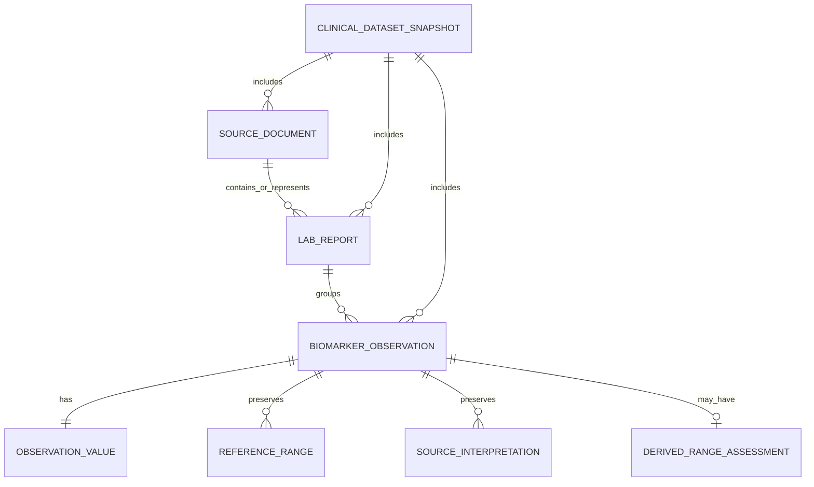

# BioMarker Agent — Canonical Domain Model

> **Status:** PROPOSED CANONICAL DOMAIN BASELINE v0.1  
> **Stage:** 02 — Canonical Biomarker Domain Model & Schemas  
> **Primary MVP user:** Healthcare Professional / Physician  
> **First clinical vertical slice:** Urinalysis  
> **Important:** Đây là mô hình semantic của BioMarker. Nó **không phải database schema**, không phải FHIR profile, và không quyết định runtime framework.

## 1. Mục tiêu

Stage 01 đã khóa product intent: hệ thống hỗ trợ bác sĩ đọc kết quả xét nghiệm, tóm tắt, gắn cờ theo dữ liệu nguồn và giải thích có evidence; AI không trở thành clinical authority và không tự chẩn đoán/điều trị.

Stage 02 phải trả lời:

> **Hệ thống cần biểu diễn “sự thật dữ liệu xét nghiệm” như thế nào để các Stage sau có thể extraction, normalize, reason và evaluate mà không làm mất nguồn gốc?**

Canonical language bắt buộc phân biệt:

```text
Raw Document
≠ Diagnostic Report
≠ Observation
≠ Reference Range
≠ Source Interpretation
≠ Derived Range Assessment
≠ Clinical Claim
```

## 2. Mental model

Một file PDF chỉ là **vật mang thông tin**. Một report xét nghiệm là **một report/event có clinical context**. Một observation là **một atomic result** trong report.

```text
PDF
└── Urinalysis Report
    ├── Glucose → Negative
    ├── Leukocyte esterase → 1+
    ├── pH → 6.0
    └── RBC → 0–2 /HPF
```

Bốn result trên không cùng kiểu dữ liệu. Vì vậy canonical model không được giả định `Observation.value = float`.

## 3. Core domain objects

### 3.1 SourceDocument

Đại diện artifact nguồn: PDF, image hoặc structured clinical export.

Core fields:

```text
document_id
media_type
content_sha256
source_system_label
received_at
retention_class
external_locator?
```

`external_locator` chỉ là locator, không phải authorization credential.

### 3.2 LabReport

Đại diện một diagnostic report có context:

```text
report_id
subject_ref
source_document_id
report_type
status
effective/collection time
issued time
diagnostic service
specimen context
observation IDs
source conclusion if present
```

Stage 02 fixture có thể dùng 1 document → 1 report, nhưng identity hai concept không được đồng nhất.

### 3.3 BiomarkerObservation

Atomic result phải giữ đồng thời:

```text
local/source test name
source result
source unit
reference range from source
source interpretation/flag
specimen/method/time context
canonical terminology mapping state
verification/data-quality state
source provenance
```

### 3.4 ObservationValue

Là tagged union với các variant:

```text
quantity
interval
ordinal
categorical
text
```

**Quantity** giữ số, comparator và unit nếu có. `<5` không được biến thành `5`.

**Interval** giữ low/high. `0–2` không được biến thành midpoint.

**Ordinal** giữ `source_text` và optional `normalized_code/rank`; rank chỉ xuất hiện khi mapping đã được xác minh.

**Categorical** giữ category như `Negative`, `Present`, `Clear` mà không tự giả định order.

**Text** là fallback có kiểm soát cho source narrative chưa normalize an toàn.

### 3.5 ReferenceRange

Reference range preserve source form trước:

```text
raw source range
→ optional parsed representation
```

Không parse rồi overwrite raw source. Parsed form có thể là numeric interval, categorical expected values hoặc textual guidance.

### 3.6 SourceInterpretation

Flag/interpretation do source report cung cấp, ví dụ `H`, `L`, `Abnormal`, `Critical`, `Positive`.

```text
source flag ≠ system-derived assessment
```

### 3.7 DerivedRangeAssessment

Artifact deterministic ở Stage sau khi hệ thống so structured result với source reference range đã xác minh.

Candidate status:

```text
below
within
above
indeterminate
not_applicable
```

Stage 02 chỉ định nghĩa boundary, không implement comparison.

### 3.8 ClinicalDatasetSnapshot

Canonical bundle cho downstream consumption:

```text
SourceDocument(s)
LabReport(s)
BiomarkerObservation(s)
```

Có identity riêng:

```text
dataset_snapshot_id
subject_ref
created_at
verification_status
```

Snapshot không phải longitudinal timeline; Stage 05 định nghĩa quan hệ nhiều report/snapshot qua thời gian.

## 4. Relationship graph



## 5. Identity model

`document_id`, `report_id`, `observation_id`, `dataset_snapshot_id`, `subject_ref` là opaque identifiers. Possession của ID không chứng minh access permission.

Observation luôn giữ `local_test_name`. Canonical mapping optional:

```text
canonical_test:
  system
  code
  display
  version
```

Mapping state:

```text
unmapped
candidate
validated
not_applicable
```

Candidate mapping không được downstream xem như fact.

## 6. Time model

Tách tối thiểu:

```text
document received time
report effective/collection time
report issued time
observation effective time override
```

Không dùng file upload time làm clinical test time khi source không support.

## 7. Specimen and method

Urinalysis cho thấy cùng display name có thể khác semantics theo specimen, method, scale và unit. Stage 02 giữ `specimen.source_text` và `method.source_text`; canonical coding defer Stage 04.

## 8. State ownership ở mức semantic

| Concept | Semantic owner |
|---|---|
| raw artifact identity | SourceDocument |
| report-level clinical context | LabReport |
| atomic result | BiomarkerObservation |
| original reference context | BiomarkerObservation.ReferenceRange |
| source flag | BiomarkerObservation.SourceInterpretation |
| deterministic range comparison | DerivedRangeAssessment |
| verified data bundle | ClinicalDatasetSnapshot |
| diagnosis | NOT OWNED by Stage 02 |
| evidence claim | Stage 06 |
| AI summary | Stage 07+ |
| longitudinal relationship | Stage 05 |

## 9. Domain invariants

```text
SourceDocument ≠ LabReport
LabReport ≠ BiomarkerObservation
Observation ≠ diagnosis
Missing observation ≠ normal observation
Unknown context remains unknown
Source flag ≠ derived range assessment
Local test identity survives canonical mapping
Source unit survives unit normalization
Downstream snapshot must trace to source
```

## 10. FHIR relationship

FHIR R5 được dùng như semantic reference:

```text
BioMarker LabReport ~ DiagnosticReport semantics
BioMarker BiomarkerObservation ~ Observation semantics
BioMarker ReferenceRange ~ Observation.referenceRange concepts
```

Nhưng:

```text
BioMarker schema ≠ FHIR resource clone
```

Future adapter direction:

```text
External clinical format
→ adapter
→ BioMarker canonical model
→ adapter
→ FHIR/API/runtime
```

## 11. Cố ý không chứa

Không có diagnosis, treatment recommendation, medication direction, evidence bundle, database type, JSONB, queue metadata hoặc runtime state trong Stage 02 model.

## 12. Exit condition

Model đủ tốt khi biểu diễn được mixed-type urinalysis; source value/range/flag không mất; mapping uncertainty explicit; provenance trace được; report/observation/document không bị trộn; schema validate được synthetic fixtures; và model không phụ thuộc runtime/database/platform implementation.
