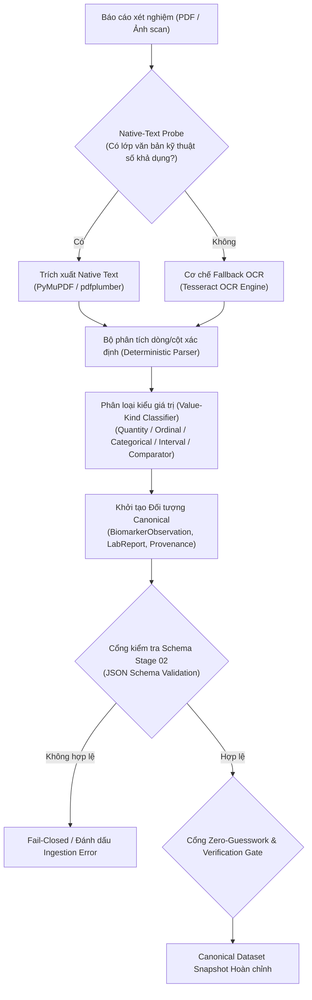

# BioMarker Agent — Lab Ingestion Characterization

> **Status:** CANDIDATE CHARACTERIZATION v0.1  
> **Stage:** 03 — Lab Ingestion Characterization  
> **Primary vertical slice:** Synthetic Urinalysis  
> **Scope:** Experimental ingestion only — no production parser/runtime.

---

## 1. Câu hỏi của Stage 03

Stage 02 đã định nghĩa canonical model:

```text
SourceDocument
→ LabReport
→ BiomarkerObservation
→ typed result / range / source flag / provenance
```

Stage 03 hỏi:

> Một lab report thực tế đi từ PDF/image sang canonical data bằng những bước nào, failure xảy ra ở đâu, và field nào cần được đo riêng?

Stage này **không** chọn production OCR vendor hay production parser.

---

## 2. Experimental pipeline



Candidate ingestion pipeline được characterization:

```text
Input PDF
   ↓
Native-text probe
   ├── text available → native text extraction
   └── no usable text → OCR fallback
   ↓
Deterministic structured parser
   ↓
Value-kind classification
   ↓
Canonical object builder
   ↓
Stage-02 JSON Schema validation
   ↓
Field-level benchmark
   ↓
Verification requirement
```

Điểm quan trọng:

```text
Schema-valid
≠
Semantically correct
```

Một OCR error vẫn có thể tạo JSON hợp lệ.

---

## 3. Corpus

Stage 03 chỉ dùng synthetic data.

Corpus gồm bốn report có **cùng clinical semantics** nhưng khác representation:

| Case | Representation | Mục tiêu |
|---|---|---|
| `digital_pipe` | Digital-born PDF, pipe-delimited rows | Baseline native text |
| `digital_fixed` | Digital-born PDF, fixed-width columns | Test layout representation |
| `scan_clean` | Image-only PDF generated from synthetic report | Native extraction must fail; OCR needed |
| `scan_degraded` | Downscaled + rotated + blurred synthetic image PDF | Characterize OCR degradation |

Không file nào chứa dữ liệu bệnh nhân thật.

---

## 4. Backends được thử

Experimental adapters:

```text
PyMuPDF 1.26.7
pypdf 5.9.0
pdfplumber 0.11.9
Tesseract 5.5.0
pytesseract 0.3.13
```

Các version này phản ánh **environment của experiment**, không phải production dependency decision.

Backends:

```text
pymupdf_native
pypdf_native
pdfplumber_native
tesseract_ocr
hybrid_auto
```

`hybrid_auto`:

```text
if native text is usable:
    use PyMuPDF native text
else:
    render page
    run Tesseract OCR
```

---

## 5. Những field được đo riêng

Không dùng một metric “OCR accuracy” chung.

Stage 03 đo:

### Report metadata

```text
subject
specimen
collection time
issued time
status
```

### Observation fields

```text
local test name
result source text
unit
source reference range
source flag
value kind
comparator
```

### Completeness

```text
expected row count
parsed row count
```

### Provenance

Mỗi parsed row phải giữ:

```text
page
raw source line
extraction mode
```

---

## 6. Actual findings

Kết quả đầy đủ nằm trong:

```text
docs/03-ingestion/EXTRACTION_BENCHMARK_RESULTS.md
experiments/stage-03/results/
```

Các finding quan trọng:

1. Digital-born PDFs có machine text cho phép native extraction rất tốt trên controlled layout.
2. Image-only PDFs trả native text rỗng; OCR fallback là requirement thật, không phải optimization.
3. OCR sạch có thể đọc observation rows tốt nhưng vẫn làm hỏng timestamp character, ví dụ ký tự timezone.
4. Degraded scan làm xuất hiện lỗi identity/row structure dù output vẫn có vẻ đọc được.
5. Một structured JSON có thể pass schema nhưng vẫn chứa semantic OCR error.
6. Vì vậy confidence threshold cố định không được invent ở Stage 03; deterministic completeness + field-level verification phải tồn tại trước.

---

## 7. Candidate architecture implication

Stage 03 đề xuất, chưa production-approve:

```text
Native-first
→ OCR fallback
→ deterministic parser
→ canonical schema validation
→ semantic completeness checks
→ human verification when uncertain
```

Không đề xuất:

```text
PDF → LLM → canonical JSON
```

làm ingestion authority.

LLM có thể được nghiên cứu như bounded extraction helper sau này, nhưng canonical facts phải giữ source provenance và được eval độc lập.

---

## 8. Stage boundary

Stage 03 **không tạo**:

- production API;
- production Go parser;
- React UI;
- database;
- queue;
- worker;
- clinical reasoning;
- terminology auto-mapper.

Mọi experiment code nằm trong:

```text
experiments/stage-03/
```

---

## 9. Exit criteria

Stage 03 đạt candidate gate khi:

- synthetic corpus reproducible;
- native vs OCR failure mode đo được;
- field metrics tách riêng;
- parser output map được Stage 02 schema;
- negative/failure cases được document;
- no real patient data;
- chưa có silent threshold/production claim.
