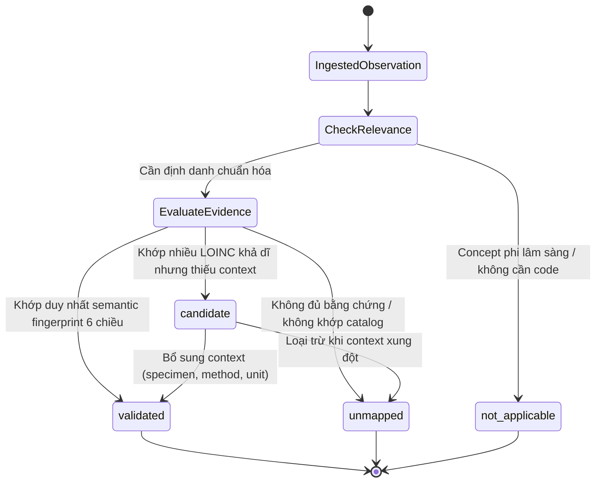

# BioMarker Agent — Normalization & Clinical Terminology Characterization

> **Status:** CANDIDATE CHARACTERIZATION v0.1  
> **Stage:** 04 — Normalization & Clinical Terminology  
> **Primary vertical slice:** Urinalysis  
> **Scope:** terminology/unit/comparability experiments only; no production terminology service.

---

## 1. Câu hỏi của Stage 04

Stage 03 đã đưa dữ liệu từ document về canonical observations có:

```text
local test name
raw result
value kind
source unit
source range
source flag
specimen/method khi có
provenance
verification/data-quality state
```

Stage 04 hỏi:

> Khi nào một local observation được phép gắn với một canonical clinical identity, đơn vị nào được normalize/convert an toàn, và khi nào hai observations thực sự comparable?

Đây không phải bài toán đổi tên field.

---

## 2. Normalization không được xóa source

Pipeline chuẩn:

```text
source representation
        ↓
normalization evidence
        ↓
canonical representation
```

Source luôn còn lại.

Ví dụ:

```text
unit_source = "/HPF"
unit_ucum   = "/[HPF]"
```

Không được biến thành:

```text
unit = "/[HPF]"
```

rồi mất source unit.

---

## 3. Test identity không chỉ là tên

Một test identity có thể phụ thuộc:

```text
Component
Property
Time
System / specimen
Scale
Method
```

Ví dụ `Leukocyte esterase` bằng test strip thường và automated test strip có các LOINC khác nhau. RBC microscopy theo HPF cũng khác hoàn toàn với một test presence/automated pathway.

Do đó:

```text
local_test_name
≠
canonical identity
```

Tên local chỉ là một signal.

---

## 4. Mapping lifecycle



Stage 04 giữ bốn trạng thái Stage 02:

```text
unmapped
candidate
validated
not_applicable
```

### unmapped

Không có đủ evidence để đưa ra mã ứng viên đáng tin.

### candidate

Có một hoặc nhiều terminology candidates nhưng thiếu context để chọn duy nhất.

### validated

Trong experiment, semantic fingerprint khớp duy nhất với catalog đã curate:

```text
component/alias
+
specimen/system
+
scale/value semantics
+
method
+
unit context khi cần
```

**Quan trọng:** `validated` trong synthetic experiment không có nghĩa mapping production đã được clinical/terminology governance approve.

### not_applicable

Concept không cần canonical test code trong context đó.

---

## 5. LOINC findings dùng trong experiment

LOINC hiện tại được sử dụng ở version `2.83` trong experiment catalog.

Các concept mẫu:

```text
5803-2   pH of Urine by Test strip
50560-2  pH of Urine by Automated test strip
5811-5   Specific gravity of Urine by Test strip
5802-4   Nitrite [Presence] in Urine by Test strip
5799-2   Leukocyte esterase [Presence] in Urine by Test strip
60026-2  Leukocyte esterase [Presence] in Urine by Automated test strip
25428-4  Glucose [Presence] in Urine by Test strip
50555-2  Glucose [Presence] in Urine by Automated test strip
5804-0   Protein [Mass/volume] in Urine by Test strip
13945-1  Erythrocytes [#/area] in Urine sediment by Microscopy high power field
5821-4   Leukocytes [#/area] in Urine sediment by Microscopy high power field
5778-6   Color of Urine
```

Catalog này phục vụ characterization, không phải full terminology database.

---

## 6. Unit normalization

Stage 04 chia hai bài toán:

```text
lexical normalization
≠
value conversion
```

### Lexical normalization

Ví dụ:

```text
mg/dl   → mg/dL
/HPF    → /[HPF]
/LPF    → /[LPF]
pH      → [pH]
```

### Exact linear conversion

Chỉ thực hiện khi conversion rule không cần clinical/analyte-specific assumption.

Experiment có:

```text
mg/dL ↔ g/L
```

vì đây là conversion mass concentration tuyến tính thuần đơn vị.

Không tự convert:

```text
mg/dL ↔ mmol/L
```

nếu chưa có analyte/molecular-weight rule được approve.

---

## 7. Observation comparability

Hai observations không comparable chỉ vì display name giống nhau.

Stage 04 định nghĩa bốn class:

```text
EXACT_COMPARABLE
CONVERTIBLE_COMPARABLE
RELATED_NOT_COMPARABLE
INDETERMINATE
```

### EXACT_COMPARABLE

- validated same canonical code;
- compatible value semantics;
- same canonical unit hoặc unitless semantics.

### CONVERTIBLE_COMPARABLE

- validated same canonical code;
- units có exact approved linear conversion.

### RELATED_NOT_COMPARABLE

Có liên hệ analyte/component nhưng khác method/property/scale/code khiến trend merge không an toàn.

### INDETERMINATE

Một bên mapping chỉ candidate/unmapped hoặc thiếu context.

---

## 8. Measured synthetic results

Experiment thực sự chạy trên Stage 04 synthetic terminology cases và một Stage 03 canonical output.

Kết quả chi tiết:

```text
experiments/stage-04/results/benchmark.json
experiments/stage-04/results/benchmark.csv
experiments/stage-04/results/RUN_REPORT.md
```

Synthetic gold benchmark đạt:

```text
mapping status accuracy          = 1.00
validated-code exact accuracy    = 1.00
false-validation rate            = 0.00
unit normalization accuracy      = 1.00
safe conversion accuracy         = 1.00
comparability classification     = 1.00
Stage-03 unknown-label no-guess  = PASS
```

Các con số trên chỉ chứng minh experiment logic với curated synthetic cases; chúng không phải production terminology accuracy.

---

## 9. Architecture implication

Candidate normalization boundary:

```text
Canonical Observation from ingestion
        ↓
Terminology Normalizer
        ├── alias/component candidate discovery
        ├── semantic fingerprint filtering
        ├── mapping status
        └── mapping provenance/version
        ↓
Unit Normalizer
        ├── lexical UCUM normalization
        └── explicit safe conversion only
        ↓
Comparability Evaluator
        ↓
Normalized Observation
```

Stage 04 không xây terminology server, cache, database hay API.

---

## 10. Exit condition

Stage 04 đạt candidate gate khi:

- ambiguous mapping không bị auto-validated;
- method/specimen/scale làm thay đổi mapping outcome;
- source unit vẫn được preserve;
- unsafe conversion bị từ chối;
- comparability không dựa vào display name;
- Stage 03 unknown synthetic names không bị mapper đoán bừa;
- no production runtime/infrastructure được tạo.
