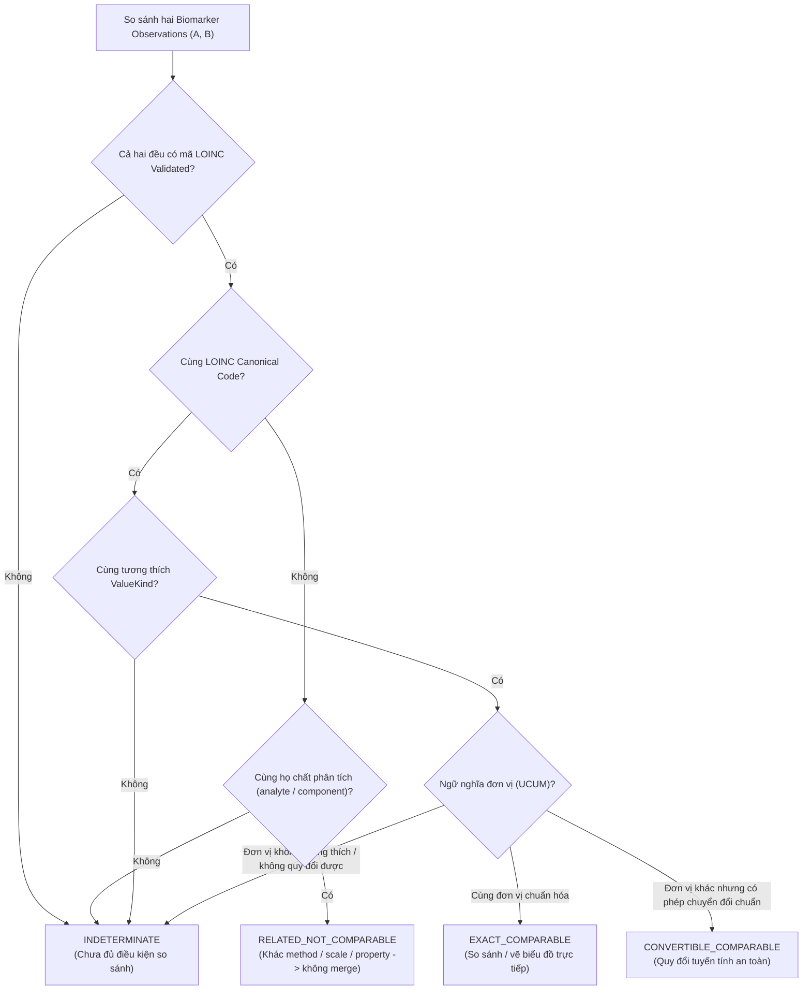

# Observation Comparability Model

> **Status:** PROPOSED v0.1  
> **Stage:** 04

---

## 1. Vì sao comparability cần model riêng?

Stage 05 sẽ phân tích longitudinal trend.

Nếu Stage 04 chỉ normalize tên mà không xác định comparability, Stage 05 dễ nối các điểm không cùng semantics.

---

## 2. Four classes



### EXACT_COMPARABLE

```text
same validated canonical code
+
same normalized unit semantics
+
compatible value kind
```

### CONVERTIBLE_COMPARABLE

```text
same validated canonical code
+
units connected by approved exact conversion
+
compatible value kind
```

### RELATED_NOT_COMPARABLE

Có liên hệ concept nhưng khác method/property/scale/code.

Ví dụ:

```text
Leukocyte esterase by Test strip
vs
Leukocyte esterase by Automated test strip
```

Conservative Stage 04 policy: không merge trend mặc định.

### INDETERMINATE

Mapping candidate/unmapped hoặc thiếu context.

---

## 3. Same name is insufficient

```text
RBC
```

có thể là:

```text
presence
#/volume
#/area HPF
automated count
manual microscopy
```

Do đó display name không phải comparability key.

---

## 4. Same component is insufficient

```text
Glucose urine presence
```

khác:

```text
Glucose urine mass concentration
```

về property/scale.

Không đưa lên cùng numeric trend.

---

## 5. Unit conversion does not fix semantic mismatch

Ngay cả khi hai values có units convert được, nếu canonical identity khác:

```text
NOT COMPARABLE
```

Identity first, conversion second.

---

## 6. Stage 05 handoff

Stage 05 chỉ được tạo longitudinal series khi comparability evaluator trả:

```text
EXACT_COMPARABLE
or
CONVERTIBLE_COMPARABLE
```

Mọi class khác cần tách series hoặc explicit review.
