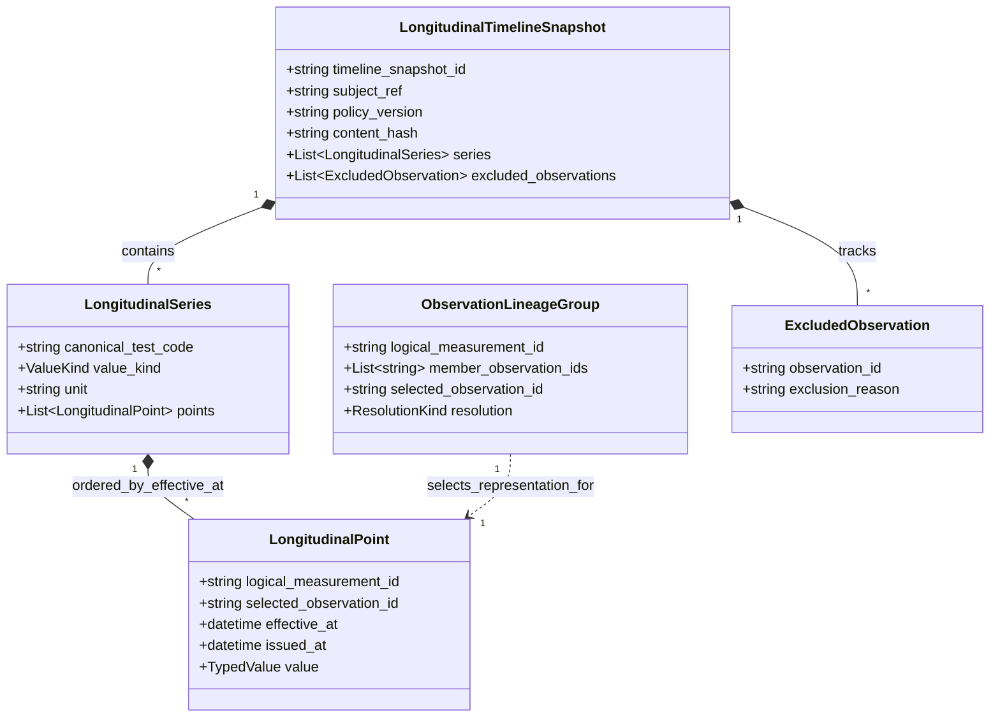
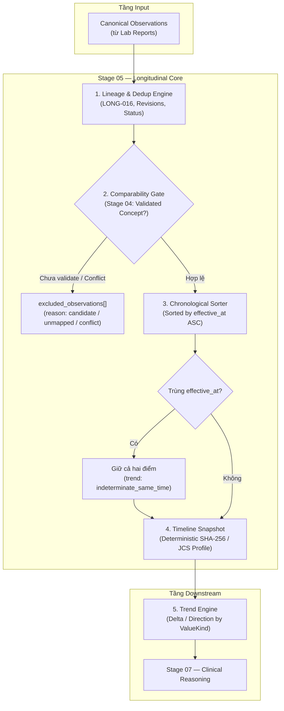

# BioMarker Agent — Longitudinal Biomarker Model

> **Status:** PROPOSED CANONICAL LONGITUDINAL BASELINE v0.2  
> **Stage:** 05 — Longitudinal Biomarker Model  
> **Primary user:** Healthcare Professional / Physician  
> **First clinical vertical slice:** Urinalysis  
> **Important:** Timeline là **derived projection** từ canonical observations, không phải clinical source of truth mới.

---

## 1. Bài toán

Một report đơn lẻ chỉ trả lời:

```text
Điều gì được đo ở một thời điểm?
```

Longitudinal analysis phải trả lời câu khó hơn:

```text
Đây có thật sự là cùng một measurement concept qua nhiều lần xét nghiệm không?
Điểm nào là measurement mới?
Điểm nào chỉ là duplicate import?
Điểm nào là corrected/amended representation của cùng một measurement?
Thứ tự thời gian nào là clinically relevant?
Có được phép tính trend hay chỉ được hiển thị history?
```

Nếu giải sai các câu này, một biểu đồ trông rất đẹp vẫn có thể sai về clinical semantics.

---

# 2. Core distinction

```text
Observation representation
≠
Logical clinical measurement
≠
Longitudinal series
≠
Trend interpretation
```

### Observation representation

Một canonical observation được ingest từ một report/version cụ thể.

### Logical clinical measurement

Một event đo lâm sàng duy nhất.

Một logical measurement có thể xuất hiện nhiều lần trong hệ thống vì:

```text
same report imported twice
corrected report
re-processing
re-normalization
```

Những lần xuất hiện đó không tự động tạo measurement mới.

### Longitudinal series

Một chuỗi logical measurements đã vượt qua comparability gate của Stage 04.

### Trend interpretation

Derived statement về thay đổi theo thời gian.

Trend không phải raw clinical fact.

---

# 3. Longitudinal domain objects

## 3.1 ObservationLineageGroup

Nhóm các observation representations được xác định là cùng logical measurement hoặc có quan hệ duplicate/revision rõ.

Fields conceptual:

```text
logical_measurement_id
member_observation_ids[]
selected_observation_id?
resolution
evidence_basis
```

Resolution:

```text
unique
duplicate_collapsed
revision_selected
unresolved_conflict
reconciliation_required
source_invalidated
```

---

## 3.2 LongitudinalSeries

Một series gồm các logical measurements có semantics đủ comparable.

Identity baseline:

```text
subject
+
validated canonical test identity
+
compatible value kind
+
normalized unit semantics when quantity
```

Display/local test name không phải series identity.

---

## 3.3 LongitudinalPoint

Một point là selected representation của một logical clinical measurement.

```text
logical_measurement_id
selected_observation_id
effective_at
issued_at?
source_dataset_snapshot_id
typed value
```

---

## 3.4 LongitudinalTimelineSnapshot

Snapshot là immutable derived projection:

```text
subject
source dataset snapshot IDs
policy version
lineage decisions
series
excluded observations
content hash
```

## 3.5 Longitudinal Object Relationship



---

# 4. Authority model & Longitudinal Pipeline



```text
Source clinical document
        ↓
Canonical report / observation
        ↓
Normalization / comparability
        ↓
Longitudinal timeline snapshot
        ↓
Trend features
        ↓
Future reasoning
```

Authority giảm dần khi đi xuống.

Không được reverse:

```text
trend says X
→ rewrite source observation to fit trend
```

---

# 5. Same-subject invariant

Một timeline snapshot chỉ có đúng một:

```text
subject_ref
```

Nếu input chứa nhiều subject:

```text
FAIL CLOSED
```

Không:

```text
group silently
pick first subject
merge by test name
```

Subject isolation ở Stage 05 là domain-integrity invariant; authorization enforcement vẫn thuộc Stage 14.

---

# 6. Observation series eligibility

Stage 04 đã khóa:

```text
EXACT_COMPARABLE
CONVERTIBLE_COMPARABLE
RELATED_NOT_COMPARABLE
INDETERMINATE
```

Stage 05 chỉ merge vào cùng series khi semantics tương ứng:

```text
validated canonical identity
+
compatible value kind
+
safe unit semantics
```

Nếu mapping:

```text
candidate
unmapped
```

thì observation không được dùng để tạo canonical trend series.

Nó được giữ ở:

```text
excluded_observations
```

với reason rõ.

---

# 7. Timeline chronology

Clinical ordering dùng:

```text
effective_at
```

không dùng:

```text
received_at
```

Report `issued_at` dùng để phân biệt version/revision của cùng clinical event.

Document receipt time chỉ mô tả ingestion order.

Mental model:

```text
effective_at = when measurement is clinically relevant
issued_at    = when this representation/version became available
received_at  = when our system received it
```

Ba clock khác nhau.

FHIR R5 cũng tách `Observation.effective[x]` là clinically relevant time và `Observation.issued` là thời điểm version được made available.

---

# 8. Out-of-order arrival & Chronology

Input:

```text
March measurement arrives first
January measurement arrives later
February measurement arrives last
```

Timeline phải tạo:

```text
January
February
March
```

Không sort theo upload/processing order (`received_at`).

### Status: Handled at Domain Model Level
- **Out-of-order clinical backfilling** là bài toán đã được giải quyết trọn vẹn ở tầng Domain Model của Stage 05 thông qua `effective_at` và việc rebuild deterministic snapshot.
- **Multi-region clock & database wall clock**: Thời gian vật lý của database hay cụm server không bao giờ thay thế thời gian lâm sàng `effective_at`. Bài toán tối ưu hóa chỉ mục/cache khi recompute dữ liệu backfill thuộc về Stage 10/11, không làm thay đổi ngữ nghĩa domain của Stage 05.

---

# 9. Duplicate rule & Identity Collision (LONG-016)

Hai observations không được deduplicate chỉ vì:

```text
same subject
same test
same value
same timestamp
```

Đó có thể là hai measurements độc lập.

Ngược lại, từ bài học hệ thống thực tế (*ai-studio*), sự tái sử dụng danh tính nguồn (Source Identity) đòi hỏi kỷ luật nghiêm ngặt:

### Invariant LONG-016 — Identity Collision Fails Closed

```text
(source_system, external_observation_id) / source identity
must identify one semantic representation.

Same identity + same canonical payload
→ duplicate / idempotent replay (duplicate_collapsed)

Same identity + different canonical payload
+ no explicit revision lineage
→ ClinicalIdentityConflict (hard conflict / unresolved_conflict)

Unless:
explicit revision/correction lineage proves
that the new representation supersedes the old one.
```

*Lưu ý quan trọng:* Không đưa ràng buộc `UNIQUE(...)` của PostgreSQL vào Stage 05 vì Stage 05 chưa có database. Ràng buộc vật lý thuộc về Stage 10; Stage 05 khóa semantic domain invariant.

---

# 10. Revision/correction rule

Nếu source cho biết hai representations cùng một clinical result event và có version chronology:

```text
same source_event_key / external identity
+
different report/result versions
+
issued_at orders versions
+
explicit revision/correction status (corrected, amended, superseded)
```

thì timeline chọn representation mới nhất đủ hợp lệ (`revision_selected`).

Previous representation vẫn nằm trong lineage history. Không xóa provenance.

---

# 11. Report status & Reconciliation Required

Statuses như:

```text
corrected
amended
entered_in_error
cancelled
reconciliation_required
```

có ý nghĩa lifecycle rõ rệt.

### Trạng thái "Reconciliation Required"
Nếu dữ liệu nguồn ở trạng thái chưa hoàn thiện hoặc mơ hồ:
- LIS response bị cắt giữa chừng (truncated message) → không chắc bundle đầy đủ.
- Partial message → danh tính quan sát có nhưng payload không chắc complete.
- Chuỗi source correction bị thiếu bản ghi tiền nhiệm (missing predecessor).

thì:
```text
resolution: reconciliation_required
→ exclude from active longitudinal series
```
cho đến khi được reconcile hoàn tất. Không gom mù quáng vào `unresolved_conflict` hay cố gắng suy diễn điểm dữ liệu thiếu.

Nếu latest source state là invalidated (`entered_in_error`, `cancelled`):
```text
logical event excluded from active series
resolution: source_invalidated
```

---

# 12. Trend boundary by value kind

## Quantity

Có thể compute numeric delta nếu:

- >= 2 points;
- comparable canonical identity;
- units exact/approved-convertible;
- no comparator-censored value;
- unique clinical timestamps.

Stage 05 **không compute clinical risk**.

## Ordinal

Có thể compute direction nếu:

```text
validated rank semantics exist
```

Không infer order từ string.

## Categorical

Có thể compute:

```text
changed / unchanged
```

Không gọi là increased/decreased.

## Interval

Stage 05 chỉ giữ history.

Không collapse:

```text
0–2
```

thành midpoint để tính trend.

## Comparator quantity

```text
<5
```

là censored value.

Không compute naïve delta với exact numeric point.

---

# 13. Same-time measurements

Hai distinct logical measurements có cùng `effective_at`:

```text
do not deduplicate
do not invent arbitrary temporal order
```

Series được giữ, nhưng trend state:

```text
indeterminate_same_time
```

nếu computation cần strict chronology.

---

# 14. Snapshot immutability & Canonicalization Profile

Timeline snapshot identity được derived từ canonical serialized content:

```text
source logical inputs
+
lineage resolution
+
policy version
+
series projection
```

### Deterministic Experimental Identity vs Production Profile
- **Stage 05 baseline:** Thực nghiệm sử dụng `json.dumps(obj, sort_keys=True, separators=(",", ":")) -> SHA-256` để chứng minh tính xác định (deterministic experimental identity) trong môi trường thử nghiệm.
- **Yêu cầu chuẩn hóa sản xuất (Production Canonicalization Requirement):** Timeline snapshot identity **BẮT BUỘC** phải tuân theo một hồ sơ chuẩn hóa chính thức (*Canonical Clinical Payload Profile*) trước khi đưa vào production:
  - Tuân thủ RFC 8785 (JSON Canonicalization Scheme - JCS).
  - Nghiêm cấm duplicate keys (pre-scan JSON).
  - Kiểm soát miền số theo RFC 7493 (I-JSON number domain).
  - Chuẩn hóa định dạng chuỗi thời gian (RFC 3339 / ISO 8601 UTC).
- **Phân kỳ lộ trình:**
  - Stage 05: Đặt ra yêu cầu chuẩn hóa và chứng minh tính xác định ở mức domain logic.
  - Stage 13: Khóa chặt đặc tả kỹ thuật Canonical Clinical Payload Profile cho toàn bộ hợp đồng sản xuất.

---

# 15. Why policy version matters

Longitudinal policy có thể thay đổi:

```text
dedup rule
comparability rule
conversion allowlist
trend eligibility
```

Do đó output phải pin:

```text
policy_version
```

Nếu cùng clinical inputs nhưng policy thay đổi, output có thể thay đổi hợp lệ.

---

# 16. Domain invariants

```text
LONG-001  Timeline is derived, not source authority.
LONG-002  One snapshot contains one subject.
LONG-003  Same value/time does not prove duplicate.
LONG-004  Duplicate import does not create a new trend point.
LONG-005  Corrected representation does not create a new clinical measurement.
LONG-006  effective_at drives clinical chronology.
LONG-007  issued_at drives representation/version chronology only.
LONG-008  received_at never substitutes clinical time.
LONG-009  Candidate/unmapped terminology cannot silently join validated series.
LONG-010  Different canonical method/code does not merge by local name.
LONG-011  Interval values are not collapsed to midpoint.
LONG-012  Comparator quantities are not treated as exact values.
LONG-013  Snapshot must be reproducible from inputs + policy.
LONG-014  Old snapshots are immutable.
LONG-015  Cache/materialized view must never become canonical writer.
LONG-016  Identity collision fails closed: reuse of source identity with different payload without explicit revision lineage is a hard conflict.
```

---

# 17. What Stage 05 does not decide (Deferred & Rejected)

### Hoãn lại (Deferred)
- **PostgreSQL trigger immutability**: Hoãn sang Stage 10. Stage 05 chưa có database; tính bất biến ngữ nghĩa (semantic immutability) được bảo đảm ở domain. Việc cài đặt trigger DB không phải quy định bắt buộc của HIPAA/GDPR cho ứng dụng tại Việt Nam.
- **Immutable object store cho raw lab**: Hoãn sang Stage 10. BioMarker không tự phong làm kho lưu trữ văn bản gốc có thẩm quyền duy nhất (theo D-101/Stage 01).
- **Production persistence schema, JSONB index, background recomputation, production caching**: Thuộc Stage 10/11.
- **Canonical Clinical Payload Profile (JCS / I-JSON)**: Hoãn việc chốt implementation RFC 8785 chi tiết sang Stage 13.
- **Clinical risk thresholds & early-disease warning**: Thuộc Stage 07+.

### Loại bỏ khỏi Domain Stage 05 (Rejected)
- **Lease / fencing / DBOS / worker dispatch**: Loại bỏ hoàn toàn khỏi mô hình nghiệp vụ Stage 05. Đây là các mối quan tâm thuần túy về runtime concurrency và distributed execution (sẽ xem xét tại Stage 11/12 nếu có nhu cầu).
- **Dedup theo giá trị/thời gian thuần túy (Weak similarity)**: Đã bị bác bỏ (R-501).
- **Dùng database clock thay cho clinical clock**: Bị bác bỏ hoàn toàn; `effective_at` lâm sàng luôn là thẩm quyền tối cao.
