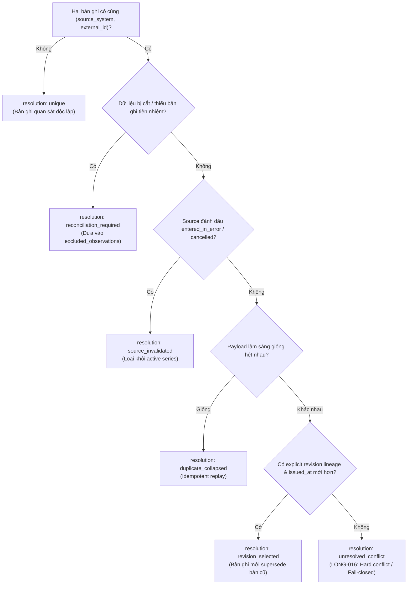

# Observation Lineage & Deduplication Model

> **Status:** PROPOSED v0.2  
> **Stage:** 05 — Longitudinal Biomarker Model

---

## 1. Tại sao duplicate nguy hiểm?

Nếu cùng một lab result bị import hai lần:

```text
30 mg/dL
30 mg/dL
```

và timeline coi đó là hai measurement:

- trend frequency sai;
- chart sai;
- downstream reasoning tưởng có thêm evidence.

Ngược lại, deduplicate quá mạnh cũng nguy hiểm:
Hai lần đo thật có cùng giá trị vẫn là hai clinical events độc lập.

---

# 2. Evidence hierarchy

## Strong explicit evidence
Ưu tiên:
```text
(source_system, external_observation_id)
source_result_id
source_event_key
explicit replaces/correction relation
```

## Strong exact-import evidence
```text
same source artifact fingerprint
+
same source locator
+
same extracted content
```

## Weak evidence — insufficient alone
```text
same value
same effective time
same local test name
same canonical code
```
Weak similarity không đủ để collapse.

---

# 3. Logical measurement identity & Invariant LONG-016

Experiment baseline hỗ trợ ưu tiên:
1. `(source_system, external_observation_id)`
2. `source_event_key`
3. `source_fingerprint`
4. `observation_id`

### Invariant LONG-016 — Identity Collision Fails Closed
Dựa trên kiến trúc hệ thống trưởng thành (*ai-studio*), sự tái sử dụng danh tính nguồn được kiểm soát chặt chẽ:

```text
(source_system, external_observation_id) / source identity
must identify one semantic representation.

Same identity + same canonical payload
→ duplicate / idempotent replay (resolution: duplicate_collapsed)

Same identity + different canonical payload
+ no explicit revision lineage
→ ClinicalIdentityConflict (hard conflict / resolution: unresolved_conflict)

Unless:
explicit revision/correction lineage proves
that the new representation supersedes the old one.
```

### Sơ đồ Cây quyết định Lineage & Deduplication (LONG-016)



---

# 4. Trạng thái "Reconciliation Required"

Khi một bản ghi quan sát có danh tính nguồn nhưng ngữ nghĩa chưa đầy đủ hoặc mơ hồ:
- LIS response bị cắt giữa chừng (truncated message / partial payload).
- Thông điệp không chắc chắn về tính toàn vẹn của bundle kết quả.
- Chuỗi source correction thiếu bản ghi tiền nhiệm (missing predecessor).

thì lineage giải quyết:
```text
resolution: reconciliation_required
→ exclude from active longitudinal series
```
Tất cả các bản ghi trong nhóm này được đưa vào `excluded_observations` với lý do `reconciliation_required` và không tham gia vào chuỗi tính trend cho đến khi được đối soát (reconcile) đầy đủ. Điều này ngăn chặn việc nhồi nhét mơ hồ vào `unresolved_conflict` hoặc suy diễn thiếu căn cứ.

---

# 5. Revision selection

Within one explicit event lineage:

```text
version A issued at t1
version B issued at t2
```

if:
```text
t2 > t1
AND
explicit revision status (corrected, amended, superseded) exists
```
then B is selected representation (`revision_selected`). A remains lineage member.

Nếu không có explicit source key/provenance:
```text
do not infer revision from matching time/value
```

---

# 6. Invalidated source

If source explicitly marks latest version:

```text
entered_in_error
cancelled
```

current experiment excludes that logical event from active timeline (`resolution: source_invalidated`).
This is a conservative technical baseline, not universal clinical-system semantics.
Integration Stage must verify actual upstream lifecycle semantics.

---

# 7. Reprocessing is not a measurement

Future examples:

```text
OCR v1
OCR v2
normalization v1
normalization v2
LLM extraction v2
```

These are processing representations/attempts. They must not create new logical measurements.
This mirrors a mature systems principle:

```text
logical identity
≠
physical processing attempt
```

---

# 8. Needed source fields discovered by Stage 05

Stage 05 reveals a likely additive provenance need:

```text
source_report_key?
source_result_key?
source_event_key?
source_version_key?
```

Stage 02 did not require these because synthetic extraction did not yet prove need.
Stage 05 does **not** silently edit Stage 02 schema. Instead:

```text
record schema feedback
→ verify source availability
→ add contract intentionally later (Stage 10)
```
