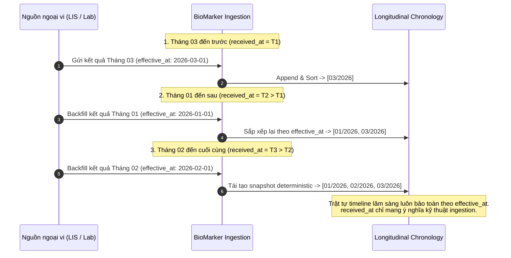

# Timeline Chronology Policy

> **Status:** PROPOSED v0.2  
> **Stage:** 05 — Longitudinal Biomarker Model

---

## 1. Three clocks

### Clinical clock
```text
effective_at
```
When the observation is clinically relevant. Primary timeline ordering.

### Publication/version clock
```text
issued_at
```
When this representation/version became available. Used for revision ordering.

### Ingestion clock
```text
received_at
```
When BioMarker received data. Operational only.

### Invariant: Clinical Chronology ≠ Database Wall Clock
Thời gian vật lý của database, cụm máy chủ hoặc multi-region clock không bao giờ được dùng để sắp xếp timeline lâm sàng.
Các thuộc tính như `created_at`, database transaction time, lease/fencing clock chỉ phục vụ hạ tầng runtime (Stage 10/11), tuyệt đối không can thiệp vào ngữ nghĩa dòng thời gian lâm sàng.

---

## 2. Ordering rule & Out-of-Order Backfill

```text
series.points
→ sort by effective_at ascending
```

### Out-of-Order Backfill Handled at Domain Model Level
Hệ thống cho phép nhập dữ liệu bổ sung ngược thời gian (backfilling: tháng 3 đến trước, tháng 1 đến sau, tháng 2 đến cuối cùng).
Domain model tự động khôi phục đúng trật tự thời gian lâm sàng (`Jan → Feb → Mar`) thông qua `effective_at` và tái tạo deterministic snapshot.



Tie handling:

```text
same effective_at
+ distinct logical measurement
→ preserve both
→ no arbitrary clinical order (trend status: indeterminate_same_time)
```

---

## 3. Missing clinical time

If effective time cannot be established:

```text
exclude from longitudinal trend
reason = missing_effective_time
```

Observation can still exist in canonical dataset.

---

## 4. Report time inheritance

An observation may use resolved report-level effective time only when source semantics justify inheritance.
Stage 05 consumes:

```text
resolved effective_at
```

It does not invent the inheritance rule.

---

## 5. Timezone

Timestamp must retain or resolve timezone semantics before strict chronology.
Stage 05 synthetic corpus uses UTC.
Production policy must handle local source timestamps explicitly.

---

## 6. Why issued_at is not timeline time

Corrected report example:

```text
measurement: 01 Jan
original issued: 01 Jan
correction issued: 03 Jan
```

There is still one clinical measurement point on 01 Jan.
03 Jan is representation version time, not a second measurement.
