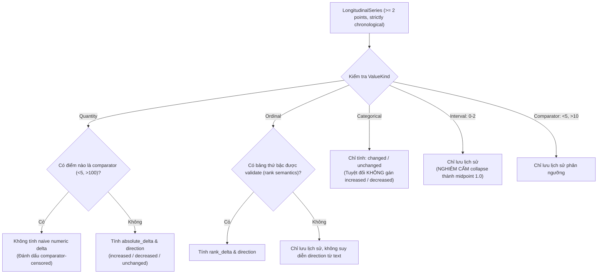

# Trend Computation Boundary

> **Status:** PROPOSED v0.1  
> **Stage:** 05

---

## 1. Trend is derived data

```text
observation history
→ deterministic trend feature
```

Trend feature is not diagnosis.

Stage 05 does not produce:

```text
disease risk
screening outcome
clinical warning
```



---

## 2. Quantity trend

Eligible only when:

```text
validated same identity
compatible/convertible unit
>= 2 logical measurements
strict clinical chronology
no comparator-censored points
```

Output baseline:

```text
first_value
last_value
absolute_delta
direction:
  increased
  decreased
  unchanged
```

No percent change baseline because:

- zero denominator;
- scale semantics vary;
- not needed for domain proof.

---

## 3. Ordinal trend

Eligible only with explicit validated rank.

Example structural order:

```text
Negative
Trace
1+
2+
3+
```

The system cannot derive that order merely from display strings.

Output:

```text
rank_delta
direction
```

---

## 4. Categorical history

Allowed:

```text
changed
unchanged
```

Not:

```text
increased
decreased
```

unless category order is separately validated.

---

## 5. Interval result

Example:

```text
0–2 /HPF
2–4 /HPF
```

Stage 05 does not calculate midpoint trend.

Output:

```text
history_only
```

---

## 6. Censored quantity

Example:

```text
<5
10
```

Do not compute:

```text
10 - 5 = 5
```

because `<5` is not exactly 5.

Output:

```text
not_computed_censored_value
```

---

## 7. Same-time ambiguity

Distinct measurements at identical effective timestamp remain distinct.

If a trend requires ordering them:

```text
indeterminate_same_time
```

---

## 8. Future clinical trend

Stage 05 only supplies safe deterministic features.

Stage 07/08 may decide how these features support:

```text
summary
risk discussion
early-warning research
```

under clinical/evaluation controls.
