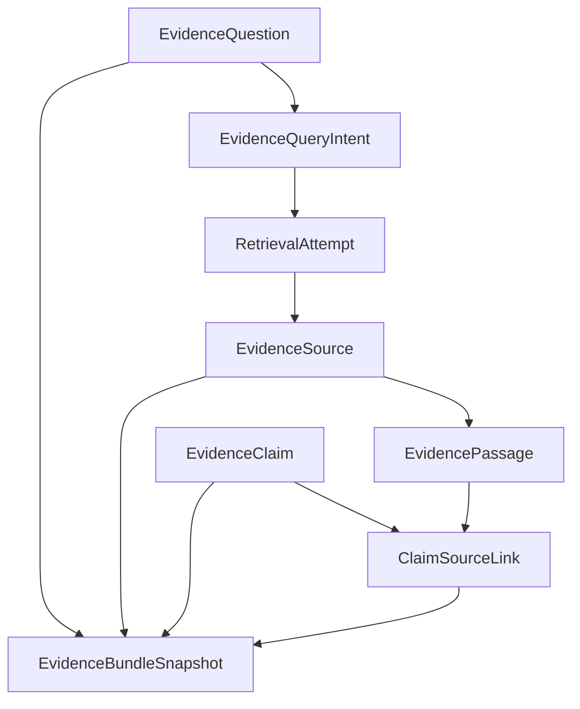

# Evidence Entity Model

> **Status:** PROPOSED v0.1

---

## 1. Entity graph



---

## 2. Logical vs physical

```text
QueryIntent
= logical retrieval objective

RetrievalAttempt
= physical execution
```

Retry/failover creates another attempt.

The selected source identity remains stable.

---

## 3. Source identity

Recommended identity resolution order:

```text
official canonical ID/version
DOI
PMID
publisher locator
content-addressed fallback for unregistered source
```

Do not merge solely on title similarity.

---

## 4. Source aliases

A source may expose:

```text
doi
pmid
publisher URL
```

Aliases belong to one canonical source only after validated reconciliation.

---

## 5. Source version

Version is explicit where available.

Examples:

```text
guideline edition/version
corrected article
updated living review
publisher update
```

Retrieval timestamp is not source version.

---

## 6. Passage locator

A passage locator may be:

```text
abstract
section heading
paragraph index
table
figure
publisher fragment
structured proposition in synthetic fixture
```

The source and passage digest should remain traceable.

---

## 7. Claim identity

Claim identity should be based on normalized proposition semantics plus scope.

Two differently worded claims can still be the same logical proposition.

Stage 06 synthetic experiment uses explicit proposition keys rather than NLP similarity.

Production claim normalization remains a later implementation decision.
